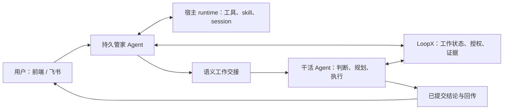

# RFC：强能力 Agent 管家与语义工作交接（v0）

- **RFC 状态：** Draft，待维护者审阅
- **交付成熟度：** 提案；已有基础见第 4 节
- **作者 / 责任人：** LoopX 维护者、管家工程负责人
- **创建 / 最近规范修订：** 2026-09-13
- **实现基线：** `7eb4b7bb1661bd5eff63a8725a33169792d5964b`
- **语言镜像：** [English](capable-manager-semantic-handoff-v0.md)
- **相关契约：** [Effect interpreter](agent-loop-effect-interpreter-v0.zh-CN.md)、[管家连续性](../../reference/protocols/manager-evidence-and-continuity-v0.md)、[Goal Vision/Replan](../../reference/protocols/goal-vision-replan-contract-v0.md)、[桌面入口](desktop-execution-frontends-v0.zh-CN.md)、[共享权威](shared-goal-authority-state-provider-v0.zh-CN.md)、[共享目标对齐/修订](shared-goal-alignment-and-governed-amendment-v0.zh-CN.md)、[TS 迁移](typescript-control-plane-migration-v0.zh-CN.md)

## 文档地图与维护约定

第 1–3、5–12 节是拟议的规范、设计与验收要求。第 4 节是源码核验的基线事实，不代表本机部署情况。附录保存依据和决策历史；附录 C 区分 Grok Bot 官方文档、实现未知与 LoopX 设计裁决。中英文互为语义镜像。本文命名的工具、类型、权限和迁移，不因此成为已实现能力。

本文拟成为 **Manager evidence and continuity v0** 分阶段设计的产品主线后继。旧协议保留实现事实与迁移参考，直到各里程碑实际替换其中的限制。把 [#4312](https://github.com/huangruiteng/loopx/pull/4312) 中待合并的 same-Goal handoff 设计作为迁移输入吸收，而不是新架构约束。相应细化 Desktop Frontends、Goal Channel 的管家部分，保留用户直接与干活 Agent 对话的路径；不替换 effect interpreter、Goal Vision/Replan 和共享权威 RFC。 纳入 #4094 已合并的[显式接续 Stage A](cross-session-memory-substrate-v0.zh-CN.md)，作为已有 CLI/所有权转移 adapter；替代路径验收前保留其有界契约（§5.13）。

## 1. 决策摘要

把管家做成**运行在用户主机上的强能力、持久 Agent**：在用户的持续授权内使用已有运行时的普通工具和 skill，自主调查、判断、完成适当范围的工作、协调干活 Agent。本机文件、Git 或已有 API 工具能解决的仓库阅读，不应先要求增加管家专用的仓库协议。

把 handoff 做成**带语义状态的工作续接**，而不只是转发一句话或生成 Todo 修改。保留目的、背景、已作决策、约束、证据、当前承诺和期望回报。保留 LoopX 的真实工作语义，同时把实现重构为清晰一致的 collaboration 边界。当前模块位置、文件布局、管家专用协议是迁移输入，不是设计上限。

比较对象是持久 **Grok Bot** 产品，不只是 X 上的 `@grok`。**常驻不等于长程。** 前者让 Agent 随时可达，后者让目标经历执行、取证、重规划、中断和验收仍持续推进。LoopX 的架构优势是用持久任务与续接语义，把接入的 Agent 转化为长程 Agent，而不要求每个 runtime 自行发明这套机制。本 RFC 把这个优势贯彻到管家与交接。Grok Bot 文档证明常驻与异步协作；所读资料不足以证明同等的目标续接保证，也不能因此断言它做不了长任务。附录 C 给出比较依据，第 5.11 节和验收项把 LoopX 的主张具体化。

职责划分：

- Agent 判断如何调查、找谁协作、证据意味着什么。
- LoopX 保存被接受的 Goal/Todo/Vision/claim/evidence 变化，保证协调可恢复。
- 运行时负责工具执行、会话持久化和真实主机权限。
- 前端、飞书是同一管家服务的对话和反馈入口，按受众隔离。

对于已配置可信主机的已认证主人，目标默认是：在现有授权内充分自主，普通可逆工作不反复确认。保留受限或共享受众模式。消息或 capability 开关不自动扩大操作系统、provider 或受众权限。本文提出默认行为变化，不立即开启它。

## 2. 问题与动机

用户让管家 review 一项改动，连续补充约束，再协调实施、自动汇报。目前每一步都可能单独失效：

| 摩擦 | 架构归因 | 应当改变什么 |
| --- | --- | --- |
| 强模型反复说看不到本机工具能取得的 PR diff | 只读 planner 指令和狭窄投影限制了实际能力上限 | 给普通、被允许的调查工具和足够上下文 |
| 明确要求执行，却变成需要再确认的预览 | Chat 提案模式与用户已经授权的意图混淆 | 匹配现有授权后执行或委托；只询问真正缺失的决策 |
| 目录漏掉正确的干活 Agent | 把发现目录当成固定职责白名单 | 发现注册的活跃 Agent，读职责和在做的事，尽力选对 |
| 接收方只拿到“看上面几点”，却没有那几点 | 保留原句不等于保留对话语义 | 原始输入与相关上下文及来源一起交接 |
| 说“已交给”，实际对方还未判断 | 混淆消息投递、理解、工作和回报 | 分开保存事实，自动返回有用结论 |
| 完整答案被格式错误通知替代 | 展示正文和控制输出共用脆弱解码、投递链路 | 分离控制效果、已保存答案和传输恢复 |

这些不是同一个问题。更强模型能改善调查和路由，却不能保证投递，也不能恢复根本没有交接的上下文。更稠密的包也无法补偿“运行时禁止读取包所引用证据”。两个前提必须一起落实、一起验收。

### 不变量

1. 每种工作状态只有一个权威 owner，管家不另存一份可编辑的真实进度。
2. 复用持续授权，真实缺失的权限才需要明确处理。
3. 能读、能做、能把结果告诉谁，是不同的权限事实。
4. 收到、判断、改计划、完成工作、送达答案，不能互相冒充。
5. 接收方掌握自己的计划和已接受承诺；交接不悄悄打断或提高优先级。
6. 未解决请求在重启、压缩上下文后仍存在；失败须有可行动的反馈。

## 3. 范围与非目标

包含全局管家对话、本机工具调查、普通授权操作、职责发现、语义交接、接收方重规划、自动回报、跨入口可见与恢复。以管家→worker、worker→worker 为同一交接语义的两个真实消费者。

不重造 Agent runtime、第二套调度器、外部 Agent 市场、新仓库 API、通用工作流 DSL 或任务数据库。明确允许对现有管家、协作和 adapter 边界大幅重构；保住现有代码体积或模块名字不是验收目标。本地交接正确性不依赖 OpenViking、在线共享数据库或 A2A。每个请求不携带私人推理轨迹和完整历史。复杂金融等垂域效果继续归各 capability 和执行 adapter。

## 4. 当前系统：已核对的基线事实

已有大量基础应该复用：

| 现有 owner | 源码 / 事实 | 含义 |
| --- | --- | --- |
| 管家身份与配置 | `loopx/chat_manager.py`：`open_manager_session`、`manager_workspace`、`manager_model_config` | 稳定全局角色、按受众派生的私人工作区、`resume_latest`；Codex 默认 `gpt-6-astra` / `high` |
| 宿主执行 | `loopx/chat_agent.py`：`_turn_prompt`、`CodexChatAgentSession.start`；`loopx/chat_runtime.py` 的 adapter 创建与恢复 | 已有 app-server start/resume；planning 使用 read-only sandbox、never approval；该路径仅额外注入 manager read 动态工具 |
| 管家行为限制 | `MANAGER_AGENT_OBJECTIVE` 和 planning prompt | 限制 shell、任意仓库阅读和写操作；除意图委托之外，持久修改走 preview/apply 提案 |
| 会话恢复 | `loopx/chat_runtime.py` | 兼容时恢复保存的 upstream 身份；上下文版本、受众变化可迫使新建线程。不能据此宣称每次线上请求都成功 resume |
| 证据读取 | `manager_context/inspection.py`、`ssh_evidence.py`、global-manager CLI | 已有 Core portfolio/Todo/delivery、分页、主机来源；初始投影不是外部产物全文 |
| 上下文转交 | `manager_context/__init__.py` | 已有原始 ingress 来源、精确接收方、请求摘要、inbox、接收 hook；当前记录为 `loopx_manager_context_entry_v1` |
| [#4094](https://github.com/huangruiteng/loopx/pull/4094) 显式 Todo 接续 | `coordination/todo_continuation.ts`、`local_authority_runtime.ts` | 已有 promoted-local 路径，限当前无 lease Todo 与同机注册 Agent；不是通用 pre-Todo/cross-Goal/带 lease 交接 |
| 回报 | `manager_context/tracking.py`、`roundtrip.py` | 已有 read、acknowledge、canonical Todo/evidence 链接、不可变回复与回传；替换实现时保留这些事实，不保留重复转移 owner |
| 工作语义 | Goal Vision/Replan 协议与 typed control plane | Agent 方向、验收、path delta、Todo、证据、claim 已超出简单状态标签 |
| UI | `apps/presentation/dashboard/src/data/chat.ts`、`chat-model.ts`、capability settings/workbench | 通过已有对话、配置投影展示更完整的运行态与交接 |

另一项待合并的 [#4312](https://github.com/huangruiteng/loopx/pull/4312)，head 为 `13085665a9377f160025ec6c01885e889f0df5c9`，增加 same-Goal agent handoff。其拟议 `agent_handoff.py` 保存基于 Todo/from/to 的 dispatch 身份以及 dispatched/read/claim 回执；这些不在上述 main 基线中。同 Goal、未 claim Todo、独立 review 等条件仅代表该特定派发路径，不是所有工作请求的通用规则。新方向被接受后，应将其 `same-goal-agent-handoff-inbox-v0` RFC 吸收为历史 adapter/迁移参考。

已审阅的 [PR #4306](https://github.com/huangruiteng/loopx/pull/4306) 提出了有版本约束、分页、typed 错误和路由规则的 GitHub 专用 reader，随后已关闭，见附录 B。其最新形态是先读再交接，不能把它误述成单纯转发 unknown 的补丁。但普通主机调查不应依赖再加一层按资源定制的管家工具。第 6 节不采纳这条产品实现路线，保留有价值的回归要求。

### 4.1 跨 RFC 实现检查点

2026-09-13 重新核对 `origin/main`，版本为上述实现基线。以下是源码/历史事实，不是新一轮部署验收。RFC 成熟度和已落地切片分开报告；旧目录或已合并重构标题不足以证明完成。

| 契约 | 此基线已核验的基础 | 仍不属于本文的交付声明 |
| --- | --- | --- |
| **TS 迁移** | Accepted；Stage 1/2A 基础与进行中的 Stage 2B 事务切换。`todos/public_update.ts`、`coordination/todo_update.ts`、`todo_monitor_poll.ts` 和结构化消费者已拥有大量语义规则。 | T0–T4 是持续执行路线，不是全部完成。原生字段/lease/monitor 支持仍有边界。planner 搬到 TS 不等于 commit 也搬了。 |
| **共享权威** | Draft，已有实现基础。`AuthorityStore` 定义条件式持久 state/events/receipt commit、读回和 scan。[#4280](https://github.com/huangruiteng/loopx/pull/4280)、[#4283](https://github.com/huangruiteng/loopx/pull/4283)、[#4287](https://github.com/huangruiteng/loopx/pull/4287) 收敛事务、展示和 retained-journal 语义；已有 File/NoKV 及 SQLite/PostgreSQL 候选路径。 | provider 实现不代表默认晋级或共享服务。D1 投影、D2 profile 资格/soak、D3 有写入隔离的切换，保留各自证据与批准条件。 |
| **共享目标对齐/修订** | Draft，已有 Stage 1/2 基础：`goals/shared_goal_alignment.{py,ts}` 读取当前工作基线；`goal_amendment_proposal.{py,ts}` 校验/保留提案，没有 canonical effect。晋级后 source basis 包含 canonical Todo/lease revision。 | 完整 Goal-intent 版本、Stage 3 受控提交、verifier/lease 影响处理及验收，不由提案准入提供。事件序号或 Todo provider revision 不是完整 Goal revision。 |
| **管家与交接（#4330）** | 现有 manager inbox/context/tracking/return 是迁移来源；第 4 节已列 owner。 | 强能力 profile 晋级、通用 collaboration 事务、A1–A16 仍为提案。本文消费其他 owner，不重新实现它们。 |

补充核验至 `6b337bcbde8457bc3268ec7d2780367ace3c6147`：#4286 已于 `c0b572d2d508bb10c32701057dd71ff4f8eb663c` 合并，`coordination/command_receipt.ts` 成为 canonical Todo 命令共享 recovery owner，归档事务拆至 `todo_archive.ts`。其 File/SQLite/PostgreSQL/NoKV conformance matrix 是 M2 可复用基础，不重新设计。请求/工作提交对账复用原 operation 的 ambiguous recovery 语义。此项删除重复 TS 事务规则，不代表 Python writer、T1/T2 缺口或 D1–D3 晋级条件已完成。

### 4.2 四个问题，四条归属边界

- **#4330：** 用户如何把工作交给强能力管家，另一个 Agent 如何续接其意义，结论如何回来？
- **对齐/修订：** 哪个共享目标和验收仍有效，Agent 何时可改自己的路线，哪些共享改变能被提交？
- **共享权威：** 哪个状态变化确实提交了，谁持有当前 lease，如何恢复原回执和唯一可写来源？
- **TS 迁移：** 这些语义决策与完整事务由哪里实现，哪些 adapter 保留，旧规则/writer 何时可删？

四者互补。管家不是 Goal-amendment authority；collaboration 账本不是 Todo authority；数据库不是 Agent planner；换语言不等于 provider 晋级。下述衔接规则优先于“看到新模块名，就把四件事交给同一个 owner”的解释。

## 5. 设计

### 5.1 持久而有能力的管家



保留中性的私人管家工作区，避免继承某个项目的身份。这是指令所在位置，不是知识范围的围栏。提供主机、项目目录，让 runtime 使用主人授权的仓库、文档、工具和已配置主机。进入项目工作时加载该项目规范；本地仓库存在不代表其 HEAD 等于远端 PR HEAD。

直接使用安装好的 runtime 的文件、shell、Git/`gh`、web 和适当 connector。结构化状态复用 LoopX CLI/skill；`loopx_manager_read` 仍是优质便捷投影，但不再是唯一知识来源。垂域 skill 教方法，不替每个普通工具再造一层包装。缓存取不到，就使用另一个被允许的权威源，而不是循环输出笼统免责声明；真正的权限或策略拒绝不能伪装成缓存故障来规避。

管家自己完成短调查和普通可逆工作；持续、专业或已有责任人的工作交给 worker，也可以先咨询而不移交所有权。必要时说明判断依据。既不能因为叫管家就把所有事都转走，也不能吞掉所有工程任务成为瓶颈。

会话启动时提供实际主机、模型/effort、可访问资源类别、工具可用性、相关持续授权和指令版本。配置偏好与运行时已验证能力分开。现有 Codex adapter 保留强模型默认，其他 provider 使用明确的等价 profile；不要求提供隐藏推理轨迹来证明智能。

### 5.2 目标边界：围绕工作重构，不围绕管家堆实现

目标分成三个产品/技术 owner：

1. **管家 Agent 应用：** 负责对话连续性、调查、判断、委托、综合和用户反馈。AGENTS/skill 教它使用 LoopX 状态发现与协作；普通工具来自 host runtime。不独占另一份 handoff 账本，也不替每句用户需求发明底层工作流步骤。
2. **Core collaboration 有界上下文：** 负责通用工作请求身份、版本化语义背景、评估/结果关联、移交/取消请求和不可变回执。把通用转移从 `manager_context` 移到已有 TS 控制面，保持一个请求转移 owner。拟议 `control_plane/collaboration` 是设计位置，不是现有 CLI，也不是替代 authority/store。Goal/Todo/Vision/lease owner 各自提交所属对象的变化；collaboration 调用并记录其回执。第 5.12 节定义事务和存储边界。
3. **Runtime 与通道 adapter：** 负责发现/注册 Agent 地址、在支持的 loop 边界呈现请求、保存传输意图、把 provider 事件映射成回执。Codex、CLI、managed Turn、飞书、前端消费同一协作语义；传输记账不等于拥有工作完成状态。

工作请求是一级对象，**可以先于 Todo 存在**。咨询可以用判断和证据完成；采纳的实施工作可以关联一个或多个新/旧 Todo。交接可以同 Goal、跨 Goal、到已注册主机。`同 Goal`、`Todo 未被 claim`、`source excluded`、安装某个垂域 capability，都不是通用准入条件；它们只用于实际需要该规则的效果，例如独立 review 的任务认领。

工作请求以来源和不可变 request ID/revision 标识。不能只用 `(goal, todo, from, to)` 作通用身份：同 Todo 第二轮 review 是新工作，重试同一轮不是。更换接收者记录 reassignment/dispatch attempt，旧尝试仍能对账。咨询、委托工作、转移责任是同一契约中不同意图，不是三份分离 inbox 实现。

管家短小本机操作，有当前 request/Turn 和已接受 effect receipt 就可能足够。不要为了读文件、回答问题、记录普通笔记强造 Todo、target-capability、repo identity 和 validation command。持久实施工作仍应有任务、范围、验证；垂域 capability 检查归真正需要它的效果，注册 capability 不是思考和调查的通用许可证。

持久语义上下文由小型 typed 身份/控制头、版本化可读 brief、可解析工作/工件引用构成。头部用于路由和合法转移，brief 承载开放的领域含义，Core 不把每句话硬分成固定 schema。这是通用工作稠密状态，不是序列化模型隐藏思维；runtime session 换掉后也能续接。

优先一次内聚替换，不用兼容包装长期保留两套判断。盘点所有 producer/reader，无损迁移、切换单 writer、删除被替代规则。必须复用有效契约和数据，不必复用每个类、JSON 目录和 prompt。

### 5.3 让工作真正能推进的授权

基于已认证主体、来源/受众、资源范围和请求效果解析意图，匹配现有持续授权。范围内跨回合、重启复用，直到撤销、到期或超出范围。被授权的委托可以携带真实持续授权的收窄引用，handoff 不应天然没有行动能力。接收方验证授权链、目标/动作范围和自身宿主权限，既不信模型写的权限字符串，也不要求用户重复批准同一范围内的工作。只读发现、直接可逆操作、受保护操作维持各自真实权限语义；不能因为入口是聊天就额外要求一次确认。

主人私有管家使用主人已配置的普通主机 Agent 工具 profile。共享或不可信受众使用能真正约束资源和工具的独立上下文。**先让拥有广泛权限的私人进程读取所有内容，再只过滤输出，不构成隔离。** 群中经过认证的主人请求，在持续策略允许时，可以触发私人工作，再按独立受众权限返回；其他群成员不继承此权限。

即便经 shell 发起，LoopX 状态也必须经既有 typed command 修改；不绕过控制面直接编辑 registry/authority。仓库修改沿用项目 worktree/review 实践。合并、部署等具体授权可复用，但不能由此推导支付或交易权限。

若需要 approval bridge，它展示具体操作与已有授权的差额，等待真实答案。非交互 `approvalPolicy=never` 的拒绝，不能显示成用户拒绝。宿主策略、provider 拒绝、应用自身限制应分开诊断；本设计不尝试绕过上游安全决定。

### 5.4 语义稠密：保留会改变下一步判断的信息

LoopX 不是只有任务队列。交接应让接收方结合权威状态和持久材料，恢复**为什么做、什么已知、什么仍未知、哪些可以改变**。稠密是决策关系有用，不是文本越长越好，也不是堆满一个巨型 schema。

交接读模型组合以下内容；这是语义槽位，不要求每行新建一个持久字段：

| 槽位 | 含义 / owner |
| --- | --- |
| 身份与因果 | 稳定请求、对话/来源事件、父请求、交接版本、精确发送/接收方和回报路径；由宿主/控制面产生 |
| 意图与期待结果 | 原始用户输入、忠实的工作摘要和完成问题；标明来源，不产生新授权 |
| 相关对话背景 | 被引用消息/文档、后续纠正、来源/摘要哈希及摘要来源；排除无关历史 |
| 当前工作与承诺 | 引用已知版本的 Goal、Agent Vision、Todo、依赖、claim/lease、已接受里程碑 |
| 决策背景 | 相关备选、已排除路线、约束、假设、未知和理由摘要；作者、置信度、证据分开 |
| 证据与读取 | 可解析位置、来源版本/时间、已核验或仅记录声明、权限与读取状态；哈希不能冒充可读取工件 |
| 希望改变什么 | 新信息要求重新考虑什么、哪些必须保留；区分希望的紧迫性和已授权优先级修改 |
| 回报契约 | 需要的决策/工作/产物、可见受众、延期条件、谁最终欠一个答复 |

复用不可变原消息、当前工作对象与工件引用。已有状态没表达的信息才写成精炼、带版本和来源的 semantic brief。机器权限来自被接受的 typed command；引用文本、模型摘要不是授权令牌。用户要求与其引用的第三方指令也要区分。

不要把整套交接硬塞进 Goal Vision 的有界摘要，也不要按原始材料体积放大每轮 TurnEnvelope。prompt 投影保持精炼、随任务调整，保留 brief 和未解决约束，并提供真正能访问全文的下钻入口。说明投影遗漏；超限明确拒绝或通过已有 artifact owner 外置，不能静默丢掉用户约束。本文不修改现有字段预算。

### 5.5 职责发现与接收方重规划

在已授权主机范围发现所有注册的活跃 Goal 和 Agent。默认排除停止的 Goal，用户明确询问时可读。能发现、能读、能投递上下文、能执行，是四种不同事实。best effort 指管家认真检查职责、当前工作、仓库和可用性；不是群发私人背景或猜身份。

优先用户指定接收方；否则基于当前状态选合适责任人。缺少便捷 routing profile 不应让一个已知、已授权的 worker 变得不存在。不能把固定请求目录当唯一职责模型。多个接收者适合时，先选一个评估负责人并说明依据；仅在歧义实质影响权限或结果时询问。没有合适 worker，则自己做允许的工作，或报告真实能力缺口；不偷偷新建用户任务或唤醒已停止 Goal。

在宿主支持的安全交互边界给接收方投影。已有 turn-start hook 是基线；附着运行时可以在下一安全续接点及时送入。必须区分目标可达、等唤醒、宿主不支持。存进 inbox 不代表注入模型 session，注入也不代表采纳。

接收方对照当前状态，记录采纳、部分采纳、延期、拒绝和简要理由，经自身 canonical Todo/Vision 工作流修改计划。部分采纳要列明已接受和未解决内容。延期要有恢复条件及负责人；不能把仍欠执行结果的请求悄悄关闭。明确取消、改优先级依然需要相应当前权限和回执。

### 5.6 一次交互，分开的持久事实

用户体验是**收到 → 已评估/工作中 → 结果**，必要时有实质中间反馈。内部不能混淆工作与传输：

| 事实 | 需要的证据 |
| --- | --- |
| 入口已收到 | 持久来源/请求身份，不宣称 worker 已读 |
| 已存入接收方 inbox | 精确目标与已持久化载荷版本 |
| 已呈现给 worker Turn | 对应请求/版本/runtime Turn 的宿主回执；旧 `read` 不证明理解 |
| 已评估 | 接收方决策、采纳范围、计划/证据引用或具体延期 |
| 工作已解决 | 满足请求完成问题的结果，或明确拒绝/取消/终局无法完成 |
| 答案已送达 | 原路径和答案版本的 provider 回执/读回，与工作解决分开 |

把现有 inbox/tracking/roundtrip 记录迁到唯一 collaboration owner，保留有效语义和回执；切换后退役重复的管家专用转移逻辑。先持久化意图再 dispatch，以请求版本和效果身份幂等。不可变身份下不允许改载荷；纠正追加关联版本，执行效果前重核受影响状态。管家可以明确关联讨论同一工作的多条消息，但必须保留各条义务和纠正。不能只用文本哈希合并独立同文请求。

目标是至少一次投递、Core 效果幂等。不要承诺外部效果严格 exactly-once；不确定发送应先对 provider 回执再决定重试。并发 worker 复用 claim/lease；委托不直接抢占对方 Todo。跨主机使用已配置传输和权威，不把本机裸路径复制到另一台机器假装可读。

接收方提交结果/证据链接和适合受众的文本。管家可将多个 worker 的结果综合成一份答复，保留逐请求覆盖。确定性 outbox 在管家模型不可用时也能投递已提交结论；若确实需要综合，持久化这个待办义务，不能让可选综合环节吞掉 worker 结果。重试模型不得重放已接受操作。

### 5.7 会话与产品连续性

一个管家身份拥有按受众/授权划分的逻辑对话；兼容时在同一 runtime home 恢复 upstream thread。每轮刷新当前 Core 与未解决请求，不能把会话记忆当当前事实。scope/tool 不兼容或 session 丢失时，从持久上下文恢复并记录原因，保留未完成工作。普通上下文更新不应总重建线程；不跨 home 搬 runtime 数据库行。

前端和飞书共享请求/结果身份与已授权事实；等价授权入口可展示同一对话，其他群不能收到私人历史。前端展示会话、worker、brief、当前工作/结果和投递状态。保存了但未送达飞书的答案，明确显示并可恢复，不重跑工作。飞书提供及时收到反馈、实质结论和必要下一步；长内容通过分段或可读附件保留，不要求用户追问每次交接去哪了。

协议效果与可见正文分离。宿主支持时，用工具/函数调用和 typed receipt 承载操作；兼容解码器隔离异常控制 envelope，只恢复独立有效的正文。绝不能从恢复文本推导或执行控制效果。格式失败属于传输故障，不是让模型重新工作的理由。

### 5.8 把多条消息作为一次真实工作来承接

用户要求 review 一个 capability PR，随后补充“生命周期放进 hook、保留足够上下文、让工程 Agent 根据结论实施”。管家直接用普通工具读仓库和真实 PR，关联后续消息，区分已核验发现与用户设计偏好。若值得委托，brief 带上 review 目标/版本、三项约束、证据、当前承诺和所需回报：review 判断以及实施/验证结果。

工程 worker 读 brief 和当前状态，检查自己的权限，采纳或质疑设计并调整计划。新事实可以支持不同实施方案，不能悄悄忘掉用户约束。结果关联工作、验证、剩余局限，原会话即使重连也自动收到。后续纠正成为关联版本，不另造脱节队列项，也不覆盖已执行决策。

研究 worker 请另一个 worker 反证某项来源，也走同一契约：表达问题、分歧、证据并不需要仓库或已有 Todo。这个第二消费者实际检验抽象是否面向通用工作，而不是带管家名字的路由器。

### 5.9 替换清单与重构验收

| 当前边界 | 目标 | 何时删除旧路径 |
| --- | --- | --- |
| 管家继承 Chat planning-only 限制和 JSON 预览兜底 | 独立强能力管家角色，使用原生工具和已接受 effect 回执；用户主动选择时保留 plan-only 模式 | M1 验证普通授权操作、受限模式，再删矛盾指令 |
| 管家上下文 inbox 与 same-Goal Todo-handoff 规则并存 | 一个工作请求契约，引用语义背景，按具体意图检查准入 | M2 无损迁移、双消费者验证后，删重复身份与转移 |
| `manager_context` 在 Python 掌握通用 dispatch/decision 语义 | Core TS collaboration domain；Python 只调用 typed 边界、适配 runtime/通道 I/O | 差分验证后切单 writer，再删旧判断实现 |
| #4094 显式接续 CLI、rich Todo note 与 transfer grant | 通用 request/context/result 的 worker→worker adapter；所有权转移仍由既有 claim owner 决定 | M2/M3 验证 §5.13 映射、legacy CLI 等价、接收方规划及自动回传；不另建 note/grant validator |
| capability 专属固定接收者列表 | 当前 Agent 发现、智能职责判断、真实权限检查 | M2 覆盖缺 profile、跨 Goal、目标不可用 |
| 回复正文同时充当动作协议 | 宿主 tool/effect 事件与独立保存的人类答案；旧 decoder 仅在迁移期保留 | M3 验证中断输出和效果幂等，再退役 producer 的嵌入控制文本 |
| 管家专属回报链 | 通道无关的已提交结果/outbox 契约，Lark/Web 渲染和确认送达 | M3 验证自动回报、重启对账、不重跑模型 |

本轮不迁移 LoopX 的所有子系统。切片是管家角色、collaboration 请求/判断/结果及其真实 adapter；可以删除大量旧代码，但不把 quota、金融方法和整个 runtime 吞进新 orchestrator。保留经刻画的合理行为，同时有意改变本文点明的旧限制；parity 测试不能把旧限制冻结成目标行为。

### 5.10 最小契约与合法 observation

以下是**拟议契约**，不是已实现 schema 或命令。M2 最终确定命名和序列化，但要保留这些语义：

```text
WorkRequest {
  request_id, revision, origin_ref, sender_ref, intent,
  target_ref?, authority_ref, context_ref, return_ref,
  work_refs[], supersedes_ref?
}
SemanticContext {
  revision, digest, brief, source_refs[], work_revision_refs[],
  access_scope_ref, omissions[]
}
Observation {
  event_id, request_id, request_revision, actor_ref, event_kind,
  evidence_refs[], result_ref?, recorded_at
}
```

`request_id` 标识本次交互，`revision` 单调增长且提交后不可变，`origin_ref` 解析到经过认证的来源。`intent` 区分咨询、委托工作、责任移交；`target_ref` 只允许在尚未分配时缺省。authority 引用关联发起主体的当前授权范围，独立于 brief 解析。`return_ref` 是主体/受众限定的结果入口或父请求，**不一定是管家 session**。工作引用可以为空，接受请求不要求已有 Todo。`context_ref` 能解析到版本/摘要及最小 brief：期待结果、当前约束、已知未知。来源和工作引用说明权限范围、已知版本，版本未知明确标注；不把凭据或隐藏推理变成字段。

呈现上下文前验证引用的读取权限。摘要可由模型编写，但保留来源、作者和版本；身份与权限头由宿主验证。过大上下文保存成受控工件并明确投影覆盖；若不能保存或读取，给可恢复的 context 错误，不宣称完整交接。现有摘要无需整体扩预算。

通过被接受的 observation 投影几个独立维度：

| 维度 | 合法变化与不变量 |
| --- | --- |
| 分配/投递 | 未分配→已分配→inbox 已存→已呈现；换接收者产生 attempt 身份；呈现需要真实 host Turn，不能只凭 CLI fetch |
| 判断/工作 | pending→accepted / partially-accepted / deferred / rejected；已接受工作可以执行和解决；deferred 带条件保持开放；接受不等于完成 |
| 控制请求 | 纠正/取消/过期记录为请求或条件；取消在被确认的安全边界才生效，过期阻止新 dispatch，不撤销在途外部效果 |
| 结果送达 | 尚无→已提交结果→待发送→已核验送达；失败/不确定保留结果，不确定先对账 |

每条 observation 按 event 身份只追加一次，对 request revision 做 compare-and-set。相同事件重试返回旧回执，同身份改载荷冲突。Core 效果经已有 effect-interpreter 返回 accepted/rejected/conflict/already-applied observation。改接收方不能抹去活跃执行 claim；旧 worker 不可达时保留未知与 claim，直到既有 lease/transfer 规则允许换执行者。

持久待处理请求通过已有宿主调度 owner 携带下一唤醒/检查条件。忙碌、离线、不支持投递、等待依赖、缺输入是明确 observation，不靠重复模型轮询。延期工作可运行时，经支持的 adapter 唤醒或呈现一次。结果可为终局失败/拒绝，但不能为清空 inbox 把未完成改成成功。

所有参与者都能提交结果、读取各自授权请求；通用 collaboration/outbox 不依赖管家进程。worker→worker 的结果入口可以是发起 worker 及其父交互。管家提供可选综合与呈现，不是每次协作的生命周期协调者。

非 Core 的 shell/Git/API 效果，使用 effect-intent ID，并在 provider 支持时复用幂等/读回。只有证据才能提交完成 observation。崩溃命令效果未知时，先对账再发起新的有副作用尝试；API 没幂等不代表可以重放。普通工具得到自由度，不得到虚假的 exactly-once 保证。

### 5.11 把长程续接做成产品契约

持久对话有用，但工作还应经得起执行这段对话的 session 丢失。在每个受支持的续接点，组合当前已接受工作状态、未解决请求义务、相关决策和变化的证据。区分某日的研究结论与当前事实。后续纠正与已接受约束冲突时，保留两版，并在受影响操作前记录接收方如何解决冲突。不能因为拒绝理由掉出 prompt，就重走已否决路线。

义务覆盖从原始请求和接收方评估派生，不另建 checklist 数据库。管家识别实质问题；接收方记录接受、延期、拒绝了哪些以及理由，适用时关联当前 Todo/Vision/证据。结果应覆盖这些义务，或明确剩余范围、责任人、恢复条件。ack、定时器到点、routine 调用成功、子任务完成，都不能悄悄抵消整单责任。后续 session 从已接受状态和引用恢复关系，不搬运 runtime 私有历史。

工件连续性属于语义连续性。复用 artifact owner，保留相关图片、文档、代码的类型、版本/哈希、可解析位置、读取范围和提取/摘要来源。接收方获得必要材料，或明确为何未读到。纯文本入口投影可读摘要与已授权工件链接，不能静默删证据，也不能把发送方本地路径当远端位置。brief 足以回答的问题，不额外强制下载附件。

长程工作在现有会话里要看得懂：正在尝试什么、谁负责下一步、真正卡在哪里、还欠什么结论。前端提供可展开的工具/工件活动与当前语义上下文；飞书提供精炼等价反馈和可用结果。区分 worker 排队、主机不可用、权限拒绝、网站登录、答案未送达。不暴露原始协议 envelope，不在无法提供工具事件的 adapter 上假装有细粒度活动。

复用现有 capability 指令、context hook、memory 和调度 owner。可复用方法可带来源/版本参与规划与交接；记忆中的教训不替代被接受的任务状态和当前核验。稳定重复工作在任务与重放行为明确后走已有 schedule/event 路径。本 RFC 不新增 routine 引擎、强制方法学习、新 hook 家族或业务特化 automation。

并行工作不意味着执行资源隔离。共享浏览器屏幕或可变工作区，复用 runtime 的串行化/lease；它与 Core 工作归属分开。不同屏幕、Agent 名称和会话页签不是权限边界。runtime 缺乏所需协调时，串行执行受影响操作并显示等待；无关取证仍可推进。M1 汇报真实资源行为，不预设共享云电脑架构。

### 5.12 与目标对齐、共享权威、TS 内核衔接

**先判断改变的性质，再选择 writer。** 咨询可无 Todo 返回证据。意图内的路线纠正，走接收方已有 Vision/Replan/Todo 路径。按对齐契约需要 amendment 的共享依赖/工作图变化，走其 proposal/admission 路径；改变共享目标、验收、非目标、权限、停止条件，不能因为管家发话就降格为本 Agent 的路线编辑。Stage 2 准入的 `canonical_effect` 是 `none`。相应受控 commit class 尚未实现并验收时，保留提案、报告准确执行缺口，继续无关的已授权工作。不自造管家 commit endpoint、同伴投票或额外常规人工确认。commit 可用后，复用已验收 Stage 3 `GoalAmendmentAuthority` commit owner 的预授权 policy/verifier、精确基线 CAS 和回执；各 Agent rebase 或收到规定的在途工作处置。

当前 amendment admission 要求有因果关系的 replan obligation 与受影响 Todo ID。它不是咨询或 pre-Todo 工作的通用 inbox，不为准入普通请求编造这些记录。handoff 采纳另行关联真实 replan/work settlement。Effect Program、Turn、quota 回执保留现有身份和 owner，不能把 ID 换个名字就变成请求完成回执。

**不同版本维度必须分开。** 沿已有 context/reference 模型传递请求/brief 版本及所引用工作基线。基线包含实际可用的 Goal intent revision/digest、source kind 与 Todo/lease snapshot revision、相关 policy revision、artifact revision。provider generation/cursor、语义 Goal revision、lease epoch、handoff revision 不是同一个计数器。Goal 基线未知/不完整就保留这个事实，不从事件序号或 provider head 编造 Goal revision。有受控效果前，由效果所属命令重新验证受影响前置条件。新的 brief 不能复活过期 lease，也不能代其他 Agent 确认新共享目标。

**请求状态、协调状态、传输状态分开。** 从现有 manager 请求账本迁移到通用 collaboration 账本，拥有意图/评估/结果关系，不复制可编辑 Todo 真相。共享权威 v0 coordination head 仍只包含已审阅的 Todo/claim/lease/gate/receipt 语义。对话、semantic brief 正文、原始工件、发送尝试、调度游标留在既有 capability/artifact/adapter owner，通过有范围的引用连接。不能因为 store 接受 JSON，就把它们塞进通用 `next_projection`。物理存储可共用，但需独立 namespace、访问/保留契约和已审阅 schema 兼容。引入请求契约不要求先部署 provider。

**真实权威边界内原子提交，跨边界对账。** 请求转移及其自身回执由所属事务原子发布。Todo/lease 修改保留既有锁或晋级 authority 的 state/event/receipt CAS。采纳请求还要改工作状态时，先持久化 effect intent，调用该 owner，再关联它的确切回执；两次提交间崩溃，留下可恢复的 pending 关系。不能虚构跨独立 store 的 request+Todo 原子提交。跨 Goal 交接同样保留各 Goal 基线和回执，明确部分结果，不引入分布式事务或合成共享版本。复用已有 effect interpreter、journal 和恢复路径，不新增工作流引擎。

**遵循每个 Goal 已选的权威来源。** 晋级前仍由现有 legacy 命令写入；晋级后走所选 canonical authority，空结果保持为空，provider 失败不能回退到旧 Markdown 或 lease 文件。Markdown 是永久可读投影，不是要删的界面，也不是第二 writer。SSH 传输可达与 shared provider 采用独立。消息送达不授予新 claim，也不允许越过过期 fence 计算。provider 离线时，可继续已授权的独立读取；受控写入遵守 authority 契约。

**一次迁移完整语义事务。** 每个变更的公共路径按 TS T0–T3：一个当前 source snapshot、typed 校验/决策、所属效果、持久结果，再由 adapter 投影。仅在契约确实适用时复用 `AuthorityStore` 与事务解码器，不拿 Todo aggregate 当万能容器。不按 handoff 字段新增 Python→TS 调用，不保留第二份 Python 策略校验，不恢复已退役 facade。实现 PR 提交 [TS §5](typescript-control-plane-migration-v0.zh-CN.md#5-兑现阶段-pr-合同) 定义的 **migration economics receipt**。这是实现 PR 作者负责、写入 PR 正文和验证评论、绑定 base/head 的审阅工件，不是持久化产品回执、新 schema 或运行时 writer。字段覆盖旧/新 owner、删掉的语义代码、新 bridge、成功/恢复路径往返数、产品净代码量、剩余 caller 与删除条件。完整旧 writer 退役等待适用的 T4/D3 条件；替换 manager request writer 不授权 Goal 全量切换。

### 5.13 整合已交付的显式接续（#4094）

[Stage A](cross-session-memory-substrate-v0.zh-CN.md) 已在 [#4094](https://github.com/huangruiteng/loopx/pull/4094) 以 `2ebd921ee989f7c696a7214ba1176d3bd5de6fb3` 合并，是实现基础，也是本次重构范围内的输入。历史 RFC 文件名仍叫 memory substrate，但实现已经主动收窄为 `loopx handoff prepare/inspect/adopt`：基于当前 Todo authority 的显式本机接续。不恢复独立 memory ledger，不重做已有原语，也不把它合并视为 M2 已完成。

**复用语义内容，不复制工作真相。** 源端理由、被否定的尝试和未解问题，正是长程接收方无法从当前 Todo 重建的上下文。通过有版本的映射保留 rich 与 legacy 两种输入：

| Stage A 内容 | 通用协作用法 |
| --- | --- |
| `work_summary`、`rationale`、`key_decisions`、`approaches_tried` | 保留来源的 brief 与决策/尝试历史，不替代接收方对当前工作的判断 |
| `next_steps`、`open_questions` | 源端建议与未解问题；接收方结合真实义务和计划评估，不自动修改优先级或验收 |
| `files_touched`、`source_refs` | 有披露范围的工件引用；本地存在不代表内容核实，源端路径不是跨主机 locator |
| Todo identity/facts、provider revision、note marker/fingerprint、source session | 当前工作/权威引用及来源；保留不同语义，不合并成 request revision 或身份凭证 |

Stage A 替换当前 Todo note，不提供不可变历史版本或私有 memory ACL；既有 note 继承 Todo 可见范围。执行事实变化（包括所有权转移）会让旧 note 失效；固化的历史 brief 仍是来源证据，不是当前有效 transfer grant。迁移时保留原 note/当前状态关系及真实 update/claim 回执。若一次请求需要 brief 在 note 后续覆盖后仍可恢复，在 ingress 按权限将源内容固化为有版本的 collaboration/artifact 引用，保留原 revision/digest 和范围；当前工作事实仍使用引用。已覆盖的旧 note 不能凭空重建。退役或改变 note 表示之前，联合验证旧/新校验与 grant 行为，每个对象只有一个 writer，替代路径验收前保留 legacy caller。这不扩大 shared-authority coordination head，也不自动允许向更广受众披露既有 note。

**区分接收方评估和所有权接管。** `Assessment.adopted` 表示接收方接受了范围；Stage A 的 `handoff adopt` 会调用 Todo claim/transfer。咨询和普通委托无需转移所有权。明确 transfer intent 时，复用 `continuation_note.ts`、当前 note/fact 校验、`todo_transfer_grant_v0` 和既有 claim owner。typed grant 绑定 source/target/Todo/revision/note facts；note、digest、注册身份或消息本身都不是执行授权。通过受支持 runtime 边界让旧执行者停下，再由新执行者继续；transfer receipt 本身不能停止运行中的进程。Stage A session ID 仍是来源，不是认证或运行租约。hard-lease、主机和 source-selection 限制保留在此 adapter，直到相应 owner 的扩展通过独立验收；不将其变成所有请求的统一限制。

**M2/M3 补齐产品接入。** 保留公开 CLI/digest，同时让管家和 worker 正常调用同一组 typed effects。主人应能直接说“让另一个 Agent 接着做，记住失败方案和我的纠正”，无需手工导出 JSON 或对已有授权反复确认。现有前端/飞书分别呈现准备好的上下文、真实接收方评估、Todo 所有权读回与结果投递。自动呈现/启动、跨主机工件解析、自动回传属于后续整合，不能宣称 #4094 已交付；前端或飞书文案不能生成 transfer grant。

只有此 adapter 消费通用 request/context，并产生共享 assessment/result/return 关系后，才把 worker→worker 计为 M2 的真实第二消费者；单独 `adopt` 成功不够。复用 Stage A 真实 CLI 用例：context 读回、过期 note/revision、lease 拒绝、工件不可用、普通 foreign-owner claim 拒绝、operation replay、不确定写入恢复。context 与 action/actor/target/revision 必须分离；operational-key collision、scalar/array root 在 mutation 前失败，revision/note/owner/receipts 不变。追加 A5/A7/A13–A16 整合用例：失败方案与后续纠正确实影响接收方规划，历史 replay 不冒充当前所有权，最终结论不依赖管家专用路径也能回传。旧 caller 退役需要这些证据及 TS §5 审阅工件；不以前置建设新通用 continuation framework 才能推进。

## 6. 备选与 #4306 裁决

- **选择普通 runtime 工具 + LoopX 语义状态。** 保留 Agent 的灵活性，复用成熟工具；代价是要真实验收主机 profile 和私人/共享受众隔离。
- **不以不断增加专用证据工具作为管家主形态。** #4306 解决的版本、覆盖、路由问题是真的；但 GitHub 专用 reader 重复成熟工具，又保留原有受限管家。建议关闭其作为默认产品路线的 PR，保留版本变化、源不可读、职责路由、私人泄露的回归用例，仅移植新路径确实会用的测试。
- **保留有需要的可选受限 reader。** 共享群、远端只读服务、精简宿主可以继续用 portfolio 或 connector；不因此强制可信本机主人走同一路径。
- **不把扩 prompt、只转原句当完整修复。** 它们不能保证送达、保留引用上下文或正确提交状态。
- **不新增通用工作流/状态数据库。** 以一个 typed collaboration 上下文替换零散 handoff owner，引用现有工作权威；管家→worker 与 worker→worker 用同一契约验证，不默认保留管家专属架构。

关闭 #4306 不意味着其用户问题已解决。对应 issue 继续关联 M1/M2，直到直接调查与职责发现通过真实验收。写了长 RFC 本身不能成为新建协议的理由。

## 7. 安全、隐私、兼容

信任边界是主体、资源、效果、受众；既不是“飞书永远不可信”，也不是“同机全公开”。充分自主需要宿主可执行约束。凭据留在既有 runtime store，原始私人材料不进公开投影。不可信仓库/网页是资料，不能修改持续授权或管家指令。

semantic brief 与引用 manifest 有版本。保留已有字段和历史未知，不造读取、采纳时间。纠正不改写旧结论；新结论以明确引用替代。撤销阻止后续使用/披露，并使不兼容上下文失效，同时保存受控审计记录。

关闭功能、受限模式仍有验证路径。旧授权按精确语义迁移，不能用“已开启管家”扩大。撤销、provider 错误、宿主缺功能要给具体修复信息；普通读取失败不挡无关的已授权工作。

## 8. 迁移与回滚

1. 盘点 runtime/profile、session 映射、授权、待处理 inbox、待送达 outbox；改动前建立用户旅程基线。
2. 经现有配置 owner 引入强能力 profile；实际权限读回后只为可信主人晋级。已有充分授权直接复用，没有才要求一次 profile 决策；保留显式受限 profile。
3. 引入通用 collaboration 契约，无损映射现有管家与 same-Goal handoff 记录；有界迁移期保留旧 reader。旧记录缺语义背景明确未知，仍可读、可投递。新 producer 不要求旧 receiver 理解未知协议；协商或给兼容 brief，不能丢义务。
4. 按 characterization/parity 测试把共享状态转移放到已有 TS owner，Python/provider 保持 adapter。共享数据库是独立工作，不是前置条件。
5. 切单一 writer 前只静默受影响 dispatch lane；激活前对账已提交请求/结果。保留 source ID、pending 状态和旧 reader 快照。
6. runtime profile 可独立回滚，不能伤及交接回传。回旧 schema reader 前禁新写入，不兼容记录先 drain/export，不静默丢字段或重放工作；不支持降级则明确说明。

### 必需的旧记录映射

M0 盘点真实字段和 producer；以下是迁移验收底线，不代表已有 migrator：

| 旧记录族 | 新语义 / 保留规则 |
| --- | --- |
| Ingress 与 manager entry | 保留来源/请求 ID、原文、摘要、发送/接收方和精确回报范围；加确定性迁移别名，不重新 dispatch |
| Read/decision | 保留时间及 `adopt/defer/reject/no_change`；没有 host Turn 回执的 read 只算提供上下文；`no_change` 是决策，不算工作失败 |
| Todo/evidence 链接 | 保留全部链接/来源版本；可无 Todo；链接不证明工件已核验 |
| 结论与回传回执 | 保留不可变受众文本、phase、身份、发送尝试及不确定/待发结果；已核验送达不重发 |
| #4312 式未完成 peer 记录 | 原 tuple 派生 dispatch 身份保留为 legacy alias，保留 claim 回执；新一轮用新请求 ID，不再重复旧 tuple |
| 未识别存储字段 | 保留受控 legacy payload 及摘要；删除任何字段前必须明确映射；历史未知不补造 |

为每个生命周期状态构造合成记录比较旧/新读模型，包括 no-change、部分/旧未知、效果后崩溃、撤销权限。切换时每请求只一个 writer；旧 reader 是兼容投影，不是并行权威。恢复旧实现前先对账 outbox/claim、保留较新记录。回滚不撤销外部效果。

## 9. 验证与验收

以下是工程 Todo/PR 的稳定验收锚点，定义未来测试，**本 RFC 不把它们标成已通过**。

| ID | 用户旅程 / 证据 | 通过标准 |
| --- | --- | --- |
| A1 | 主人询问真实本机仓库、远端 PR | 管家用普通工具自主读取、核对真实版本、带证据回答，不需要专用 PR provider |
| A2 | 缓存不可用，另一允许来源正常 | 完成调查；准确区分真实拒绝且不规避 |
| A3 | 同一持续授权、两次请求、重启 | 范围内不重复确认；撤销和越界不起效 |
| A4 | 活跃 worker 不在便捷 profile 内 | 发现当前注册职责，选对已授权接收方，默认不选停止目标 |
| A5 | 三条关联消息，包括纠正和已排除方案 | 接收方能说明变化、保留约束及真实 Todo/Vision 影响，不让用户重讲背景 |
| A6 | 管家→worker、worker→worker 同一 fixture | 同样的身份、版本、判断、状态关联和回传，含无初始 Todo 的跨 Goal 咨询、同 Todo 第二轮 review；没有第二套任务库 |
| A7 | 重复 ingress、执行中纠正/取消、并发 claim、同 Todo 重复 review、非 Core 效果后崩溃 | 不重复已接受效果；对账版本冲突，不悄悄改优先级/归属 |
| A8 | worker 完成时管家/传输重启 | 结果不丢，原受众自动收到；不确定发送先对账再重试 |
| A9 | 长回复、协议尾部截断 | 完整有效答案可恢复，不泄漏协议、不丢义务、不重放操作 |
| A10 | 主人前端与授权飞书 | 请求事实一致；排队/判断/结果/送达真实；不同受众隔离 |
| A11 | 注册 SSH 离线或旧 receiver | 覆盖和待送路径明确；本地提到 SSH 不冒充远端证据；恢复正确续接 |
| A12 | 模型/session/工具 profile 升级 | 兼容时 resume，不兼容时保留约束和待办恢复，实际配置可见 |
| A13 | 工作跨两天；已接受计划、否决路线、收到后续纠正后，更换执行 session | 接收方从 canonical 状态/上下文恢复当前承诺与未结义务；刷新时效证据；解释实际计划变化并自动回报，不悄悄重走否决路线、不要求原始 transcript |
| A14 | 交接带相关图片/文档，经纯文本入口到另一已配置主机 | 接收方 observation 关联实际读取/提取、工件版本及对义务/计划的影响，或明确未读原因；不伪造读取回执、不泄露私人信息、不依赖发送方本地路径 |
| A15 | 同一交接 fixture 对比未晋级与显式配置的已晋级 Goal source；provider 离线、请求/工作提交间崩溃 | 唯一所选工作状态 writer；canonical 空/失败不回退；恢复并关联原工作回执、不重复效果；请求 pending 关系与工作已提交分开 |
| A16 | 接收方路线重规划与共享 amendment、过期基线、同伴持有工作 | 路线修改不越意图/权限；提案准入不改 Goal；未支持的 commit 明确；已支持 amendment 需要已验收 Stage 3 `GoalAmendmentAuthority` commit owner 精确回执及 peer rebase/lease 处置，不能只凭管家或 verifier 文本 |

先跑确定性转移/兼容测试，再真实安装 runtime 验证，再用无副作用合成任务和已授权私人 canary 做前端/飞书回环。记录源码/runtime 版本和回执。包含移动端飞书、打包前端渲染/读回；后端单测不等于 A10。provider 送达不确定、离线失败必须验，不只有成功路径。

## 10. 运行契约

衡量入口 ACK、首次实质答复、接收方判断、结果到送达的延迟，以及重复确认率、未解决请求、错误路由。报告来源尝试/核验/遗漏及配置/实际权限。消息数量和移动队列不是工作产出。

健康本地服务初始目标为两秒内给入口回执，独立于模型耗时；这是待测 SLO，不承诺两秒模型回答。长工作给有用延迟说明，不发周期噪音。并发和单轮调查成本复用 runtime/Goal 配置，管家不能吃光 worker 资源。忙碌 worker 保留已接受工作，排队和下一唤醒可见。

使用现有服务恢复和 receipt pump，不为每类请求创建管家业务 automation。配置/故障通过已有 CLI、capability settings、管家对话展示。诊断区分模型失败、工具/策略拒绝、状态冲突、接收方不可达、格式/传输失败。

## 11. 规范性里程碑

以完整用户旅程交付，不按零散字段拆 PR。管家工程负责人维护 canonical Todo 和私有 incident→验收映射；PR 引用本 RFC 的里程碑及验收 ID。公开进度只含可公开结果。完成需要当前部署证据，不是合并 PR 数。

| 里程碑 | 可用行为与 owner | 准入 / 退出证据 | 回滚 |
| --- | --- | --- | --- |
| M0：统一方向 | manager capability owner 盘点限制、授权、session、待结交互；关闭过时 #4306 路线并关联保留修复 | 基线 fixture、公开裁决链接、不丢请求；不宣称 runtime 变化 | 仅文档/提案 |
| M1：真正能干活的本机 Agent | manager capability + runtime adapter 使用普通工具/skill、持续授权；前端显示有效 profile/session、受支持的工具活动和可处理失败 | 真实 runtime A1–A3、A12；核验共享资源协调；复用 portfolio，不新建逐资源包装 | 回受限 profile，保留请求 |
| M2：语义续接 | Core collaboration 替换管家专用请求转移；复用 alignment 与所选工作 authority；支持先于 Todo/跨 Goal 请求和接收方规划；两种消费者验证同一契约 | 受支持边界上的 A4–A7、A11、A13–A16；旧/新等价、崩溃对账、TS migration economics 审阅工件（§5.12） | 关新 producer，保兼容 reader、pending 结果；不切换 Goal authority |
| M3：一次完整交互 | 接收方结论、已有 outbox、前端/飞书可见、富文本与重启恢复 | A8–A10 与 A13–A14 回传验收；故障注入和真实读回；不用再追问便收到结论 | 保结果存储，换传输/profile 不重放 |
| M4：晋级并退役旧路径 | 三个异构活跃 Goal、主人/共享受众、配置 SSH 旅程通过；删旧限制和过渡兼容层 | 全验收、权限回归、实测 SLO/成本；列出未验证宿主 | 按 scope 回滚、schema-aware drain/export |

M1 不必等通用 handoff 重构。M3 独立的格式/投递修复可先用已有 inbox 上线。M2 的通用晋级需要第二消费者，但不能因此拖住已经有用的管家局部改善。各里程碑不新增常规研究或普通委托的人工确认。

每个实施 Todo 声明 target capability、仓库、写范围、验证命令、RFC 里程碑、验收 ID、依赖。优先更新已有 Todo，淘汰任务保留 supersede 关系。区分 Core 转移、manager capability/runtime、前端/飞书、垂域 adapter；业务方法不塞本通用 RFC。工程负责人先回报接受范围和下一里程碑，再自动回报成果与证据。

### 11.1 依赖与并行计划

| 切片 | 硬前置 | 可以不等 | 完成边界 |
| --- | --- | --- | --- |
| M1 本机 Agent 与早期 M3 正文恢复 | 当前 runtime、有效 authority/profile、既有 UI/传输契约 | 通用 collaboration 替换、shared provider 晋级、amendment Stage 3、TS 全量重写 | 普通工具与反馈旅程；不改变 Goal 真相或 provider 默认 |
| M2 请求事务替换 | 实现 PR 内完成 TS T0 caller/source 盘点；现有请求/回执 characterization；唯一 writer 与无损迁移 | 新 daemon、PostgreSQL 服务、D3 切换、共享 Goal amendment | 请求身份/评估/结果归一个 typed domain；有界切换时退役旧请求 writer；外部工作 owner 不变 |
| M2 接收方与 authority 衔接 | 已有 alignment/admission 和 Todo/Vision/lease 命令；请求 effect/recovery 接缝；受影响命令的可用事务契约 | 关闭无关 T1/T2/T3 消费者、晋级全部 provider | disposable legacy/canonical fixture 上 A15；A16 验证路线/准入边界；未支持工作效果明确 |
| M3 完整交互 | 已提交结果和准确请求/工作回执关系；受支持 runtime 与飞书/前端 adapter | 独立格式/重试修复不等 M2 完成 | 通用 producer 集成在 M2 后；早期修复保留既有 owner，不能宣称新 schema 已交付 |
| 受控共享 amendment 衔接 | 对齐 Stage 3 已验证 commit class、policy/verifier、lease 影响与精确基线回执 | 无关管家体验改进 | 与 alignment owner 共管的条件式后续，不另建 `GoalAmendmentAuthority` |
| M4 管家晋级 | 已验证 M1–M3，以及所宣传 profile 的 A1–A16，含不支持 amendment 的负例 | 全 provider 迁移、不变既有 profile 的重新十日 soak、PostgreSQL 部署 | 仅晋级管家/handoff 行为；新存储/默认/shared-amendment 能力保留独立门槛 |

若本计划改变 provider、保留规则或 authority-source profile，受影响的 D1/D2/D3 就成为硬前置；管家验收不能豁免十日 soak 或切换批准。A13 续接测试和 D2 存储 soak 衡量不同问题。不变地使用既有 profile，不因管家读取它就新加十日门槛。

### 11.2 执行顺序与衔接回执

1. **启动 M1，在该 PR 内完成基线对齐。** 记录精确 source head、真实 runtime/入口 caller；修主人私人 profile 和已有读回/反馈；验 A1–A3/A12。不单独交付盘点框架。
2. **替换一个完整 M2 请求事务，再接接收方。** 从 `manager_context` request/tracking/return producer 和两种真实消费者开始，提交前后 owner 图、迁移映射、migration economics 审阅工件（§5.12）。工作状态继续走已有命令；扩大 producer 上线前验提交间崩溃和 legacy/promoted source。复用 alignment source-basis 读取，不复制分类器。 显式纳入已交付 #4094 CLI 接续 adapter（§5.13）。
3. **收口 M3 自动回传和用户可见性。** 独立正文恢复可与前两步并行；通用 producer 待回执契约稳定再接。沿真实入口/接收方/返回路径验 A8–A10、A13–A16；同一投影更新 packaged frontend、飞书、CLI。
4. **晋级指定 M4 cohort，并删除被替换路径。** 明确 provider 默认、Goal-intent authority、capability 资格。共享 amendment commit 待上游就绪；此前 UI 只能说提案/准入或不支持提交，不能说“Goal 已修改”。provider source 迁移按 shared-authority 计划，不夹进本次发布。

每次 PR 交接记录：base/head、本 RFC 里程碑/验收 ID、受影响的 TS T-card 与 authority D-card、消费的 alignment stage、确切 owner/command/receipt 与 source mode、删除 caller、测试/真实 runtime 证据、保留门槛、一个可执行下一步。链接已有 canonical 工程 Todo，不在本文复制动态任务清单。上游 owner 移动时，先解析新符号并同步双语，再实施；不为迁就计划恢复旧模块。

## 12. 待定决策

1. **可信主机默认 profile：** 维护者负责晋级。推荐复用主人 runtime 的实际 profile，绑定资源/受众，不发明管家 ACL 语言。M1 前核验读/写/网络/approval 行为与旧授权迁移。
2. **通用 handoff API 归属：** typed control plane 与 manager owner 在 M2 前核对现有存储/事务；推荐一个内聚 TS collaboration 边界替换管家专用 handoff owner；具体类型/模块名和无损存储映射由 characterization 明确，不由本文先拍死。
3. **送达 SLO 与上下文预算：** 工程负责人在 M1/M3 测延迟、约束保留率。未证实具体瓶颈先保现预算；规范变更同步两种语言。

以上是在既有授权内由工程裁决、记录 review 的问题，不是增加日常 owner gate。扩大权限和不兼容迁移仍需要其真实既有权限。

## 附录 A：调研与设计依据

- [Server-client product shape](../../product/foundations/server-client-product-shape.md)：LoopX 保存持久工作权威，执行智能和工具属于 runtime。本文改变管家的受限角色，不改变此分工。
- [Agent-loop effect interpreter](agent-loop-effect-interpreter-v0.zh-CN.md)：效果解释后返回 observation；交接和回报也融入这个循环，而不堆成断开的任务状态机。
- [Agent IM 协作](agent-im-openviking-collaboration-v0.md)、[共享权威](shared-goal-authority-state-provider-v0.zh-CN.md)：消息、上下文、状态权威不同；本机强管家无需先晋级远端状态服务。
- [Codex App Server 架构](https://openai.com/index/unlocking-the-codex-harness/)：已有 runtime 提供工具、skill、持久 thread、流式事件，应直接复用宿主，不在管家 API 里再造。
- [A2A specification](https://a2a-protocol.org/dev/specification/)：message/context/task、status、artifact 是有用比较对象。借鉴沟通与工作结果分离，不要求采用 A2A 或新传输。所链开发规范不是固定实现权威。

外部资料帮助设计，不证明 LoopX 已有行为。第 4 节由明确基线源码支持。私人事件原文、账户资料均不进入公开文档。

## 附录 B：决策与交付账本

2026-09-13：提出强能力管家、语义续接方向及协作边界大幅重构。[#4306 已关闭](https://github.com/huangruiteng/loopx/pull/4306#issuecomment-5652539392)，作为被替代实现路线；其原始 issue 仍是 M1/M2 的验收义务。已有正文恢复、职责发现修复继续保留。本文不宣称任何验收项、host profile 晋级或 handoff schema 迁移已经交付。

2026-09-13：补入附录 C 的 Grok Bot 官方研究，细化定位、第 5.11 节、A13–A14 与 M1–M3。新增的是可审阅要求，不是竞品 runtime 验收或已交付的 LoopX 行为。

2026-09-13：按固定基线核对 shared-authority、shared-alignment、TS 迁移进度，增加第 4.1–4.2、5.12、11.1–11.2 节及 A15–A16；同步配套 RFC 和目录，保留独立晋级/提交 owner，并明确 A13 真实时长、A14 实际使用证据。不豁免任何上游资格条件。

后续按日期追加已审阅变更链接，明确受影响规范章节；保留旧版本和未结请求。追加交付记录不能变成另一套任务权威。

## 附录 C：Grok Bot 产品与实现调研

### C.1 方法与证据边界

于 **2026-09-13** 阅读官方产品、使用及部署文档。这是文档研究，不是登录实测、性能 benchmark 或 Grok Bot runtime 源码审计。以下来源说明官方宣传或文档行为；LoopX 裁决属于本文。公开资料没写的保证应记为**未知**，不能推导为没有实现。

不把 Grok 模型/API、X 回复机器人、Grok Build 源码或其他 coding agent 的内部实现，当作 Grok Bot 证据。当前 Bot 文档提到 Cursor 托管基础设施与账户服务；这属于公开部署信息，不能据此推断调度器、模型路由算法或事务实现相同。

### C.2 官方说明了什么，能证明到哪一步

| 层面 | 官方说明的行为 / 机制 | 证据边界 |
| --- | --- | --- |
| 产品承诺 | [发布公告](https://x.ai/news/introducing-grok-bot) 描述后台 Agent 与 chief-of-staff 协调角色；[概览](https://docs.x.ai/grok-bot/overview) 描述持久工作上下文及客户端关闭后继续工作。 | 支持常驻产品形态；案例与后台运行都不能证明任意中断后的目标验收。 |
| 角色与记忆 | [Bots](https://docs.x.ai/grok-bot/bots) 有名称、独立会话和学习上下文；profile 保存稳定职责，memory 包含偏好、事实、摘要；变化事实要回源；复制 profile 不复制对话或学习记忆。 | profile、memory、持久任务权威不同；没有在此披露记忆算法与一致性保证。 |
| 对话与协作 | [协作文档](https://docs.x.ai/grok-bot/chat-and-collaboration) 有群聊、定向提及、线程、表情和异步唤醒回复；Bot 向群交接仅传文本。 | 可见回复是有用体验；该页未定义版本冲突、已接受工作归属和持久回报义务协议。 |
| 执行底座 | [电脑与应用](https://docs.x.ai/grok-bot/computer-and-apps) 是账户级持久电脑，共享文件/登录，各 Bot 独立屏幕，每屏一个 computer-use 任务；适用时优先 connector，其余用浏览器；本机执行另受控。 | 屏幕不是安全隔离；公开的是资源行为，不是锁实现或完整 agent loop。 |
| 结果 | [文件与结果](https://docs.x.ai/grok-bot/files-and-results) 支持附件、可审阅工件和共享工作区，建议区分事实、推断、完成动作、待执行动作与未决问题。 | 工件或截图本身不证明外部操作完成，也不证明刚读取了当前来源。 |
| 工作复用 | [Skills 与 routines](https://docs.x.ai/grok-bot/skills-routines-and-automations) 有可复用指令、演示生成 skill 草稿、归属某 Bot 的定时/事件 routine 及运行历史；测试会真实执行。 | 说明方法复用和触发，不等于 LoopX 的目标收敛、语义采纳或外部效果幂等。 |
| 权限体验 | [授权与隐私](https://docs.x.ai/grok-bot/approvals-security-and-privacy) 有具体操作审批、匹配的持续规则、本机独立控制；allow 不覆盖冲突的必审规则。 | 可借鉴权限体验，不能成为 LoopX 对已授权工作反复确认的理由。 |
| 部署边界 | [安全文档](https://docs.x.ai/grok-bot/security) 描述托管电脑、动作审查模型、用户归属权限、后端 connector token、独立网络/connector 控制；日志与动作记录覆盖不同。 | 属于公开实现边界，不是完整威胁模型或事务语义证据；不据此移植模型或隔离方案。 |
| 身份 | [身份与访问](https://docs.x.ai/grok-bot/identity-and-access) 区分产品登录、应用浏览器会话与 connector 认证。 | 一个层面登录成功不代表另一个层面可访问；交接仍需解析 runtime 的真实身份。 |
| 恢复 | [故障排查](https://docs.x.ai/grok-bot/troubleshooting) 区分客户端、电脑、routine、权限和登录故障；恢复/更新保留持久状态，reset 可能丢未同步内容。 | 持久存储不等于 exactly-once，恢复结果仍需独立验收。 |

### C.3 实现理解：组合已有机制，不猜内部实现

公开产品可以按四个可观察边界理解：**角色/会话、电脑/工具、协作/触发、结果/恢复**。这是本文的分解，不宣称对应 Grok Bot 源码模块。尚未实测的设计假设是：可用电脑、已有工具和可见进度，有助于强 Agent 超出小快照调查，不为每种资源定制 reader；不宣称已有对比性能结果。

[Grok Bot 101](https://x.ai/bot/guides/grok-bot-101) 展示收集上下文后，请 Cursor cloud agent 实现软件。这是公开的外环/内环工作流示例，不证明 Bot runtime 由那个 coding agent 实现。LoopX 值得借的是给接收方一件有意义、背景充分的工作；更换执行器后，已接受工作和回报契约仍应成立。

所读资料没有确认 Bot 的队列存储、ack 事务、效果执行后崩溃对账、handoff schema、记忆摘要算法或取消竞态。不能断言这些不存在，不能照搬想象的设计，也不能称为源码级实现对比。未来获授权的实测可以回答这些问题，但不是修复本产品已知管家限制的前置条件。

### C.4 常驻与长程的区分

| 属性 | 常驻 Agent | LoopX 长程契约 |
| --- | --- | --- |
| 可用性 | 稍后仍可接收工作、保留身份 | 通过宿主支持的唤醒/续接路径持续推进已接受目标；离线和不支持要明确 |
| 状态 | 可以保留对话、偏好、文件 | 把目标、验收、当前计划、承诺、决策、证据、未解决缺口保留为关联工作状态 |
| 进展 | 可以执行后台步骤或重复 routine；仅常驻不能说明目标收敛 | 针对目标选择有效下一步、验证结果、重规划；唤醒或调用成功不算进展 |
| 协作 | 能发消息给别的 Agent 并得到回复 | 携带影响决策的上下文，接收方结合自身计划评估，剩余义务与回报可恢复 |
| 更换 | 服务或 profile 可以重启 | 受支持的新执行器恢复已接受工作，无需复制旧 runtime 私有 session 数据库 |
| 完成 | 能回答或停止 | 区分任务结果、目标验收、结论送达；未完成则留下可追溯续接 |

右列是 LoopX 的设计契约，基于已有 Goal/Vision/Todo/effect 基础并由本 RFC 延伸，**不宣称所有 adapter 已经通过**。让每个接入 Agent 成为长程 Agent，仍需核验其 observation、唤醒、context、writeback 路径。左列也不是 Grok Bot 的能力上限：这是概念区分；仅凭其文档里的常驻事实，不足以证明右列保证。

### C.5 少量借鉴与明确取舍

借鉴三个产品模式：稳定而能干活的角色及普通工具；可见、知道下一步责任人的异步协作；可审阅结果与可处理的恢复反馈。落在现有管家、runtime、前端/飞书路径。不开另一套聊天产品，不强制共享已登录云电脑，不另造 routine scheduler，不把模型 memory 当任务权威。

保留 LoopX 的特色组合：强执行智能的自由度，**加上**稠密、明确的工作语义。semantic handoff 既不是巨型 transcript，也不是固定队列项；它把意图和纠正连接到当前承诺、证据、否决备选、验收以及所欠回报，让 Agent 有背景自主重规划，同时不忘目标、不悄悄覆盖其他 Agent 的承诺。

| 调研带来的要求 | RFC / 工程落点 | 验收 |
| --- | --- | --- |
| 强角色必须有真实工具与可理解反馈 | M1，第 5.1/5.3/5.11 节：普通 host profile、有效配置读回、工具活动和准确阻塞诊断 | A1–A3/A12；已有 packaged frontend 与飞书反馈 |
| 异步通信本身不定义已接受工作 | M2，第 5.4–5.6 节：一个 collaboration owner、brief、接收方评估、当前状态关系 | A5–A7/A13；manager→worker 与 worker→worker |
| 必要证据可能不适合文本，也可能跨主机丢失 | M2/M3，第 5.11 节：已授权可解析工件、提取来源、明确遗漏 | A14，包括不可用/拒绝读取 |
| 后台任务仍欠用户一份可理解结果 | M3，第 5.6/5.7 节：已提交结论、独立投递、保留剩余义务 | A8–A10/A13；重启与正文损坏注入 |
| 长程是 Agent 加控制循环的整体属性 | M4：验证 runtime 替换、证据变化后的目标续接，以及权限与成本 | A1–A16；不因进程活着、routine 成功或 PR 合并就晋级 |

A13 注入时钟验证确定性的时效续接。M4 宣称跨天时，还需已安装 runtime 的真实中断验证，两次记录检查点至少间隔 24 小时；分开报告实际时长与版本。同日运行只证明较窄的重启 fixture，不替代 shared-authority D2 十日存储 soak。A14 使用合成可公开图片/文档，包含已知、影响决策的事实，使接收方 observation 证明使用或合理遗漏，不发布私人材料。交付这些 LoopX 改进不需要竞品评分或登录 Grok Bot。
