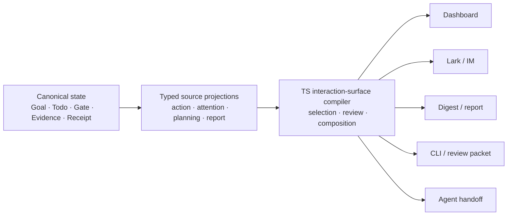

# RFC: Intelligent Review and Dynamic Presentation Surfaces v0

- Status: Draft, under maintainer review
- Proposed by: LoopX maintainers
- Date: 2026-09-01
- Scope: a provider-neutral typed interaction projection that selects,
  presents, reviews, and reports material control-plane changes, plus a bounded
  presentation plan for cards, comparisons, graphs, reports, dashboards, and
  living documents; no new source store, authority grant, provider effect,
  notification scheduler, universal renderer, or required model dependency
- Source baseline: LoopX `546bf6967`
- Tracking issue: [#3786](https://github.com/huangruiteng/loopx/issues/3786)
- Related direction: [#3244](https://github.com/huangruiteng/loopx/issues/3244)
- First vertical example: [#3785](https://github.com/huangruiteng/loopx/pull/3785)
- Language note: the
  [Chinese version](./intelligent-review-presentation-surfaces-v0.zh-CN.md)
  and this English version are semantic mirrors. A difference between them is
  a defect.

---

## 0. Executive example

An operator clicks the stop icon beside an active Goal. Stopping is reversible,
Goal-local, initiated by an explicit click, and backed by a typed preview,
optimistic rollback, verified readback, and receipt. Asking the operator to
click a second generic confirmation button adds attention without adding a new
decision.

The desired path is:

```text
explicit operator intent
  -> typed preview and current-state fingerprint
  -> ready + reversible + bounded + readback-capable
  -> apply directly
  -> optimistic projection
  -> verified readback and receipt
  -> lightweight visible feedback
```

If the state changes between preview and apply, the same path must not continue
silently:

```text
apply discovers stale state or a protected gate
  -> rollback optimistic projection
  -> upgrade to repair or explicit review
  -> show the exact changed fact and safe next step
```

Resume and permanent deletion are not automatically equivalent to stop. They
may preserve review-first behavior because they change runtime consumption or
artifact availability. The distinction must come from typed facts and policy,
not from a frontend list of button labels.

This example is only the first vertical slice. The same architecture must also
help an operator review a replan, understand an acceptance gap, receive a
stage report, inspect a failed settlement, or decide a scoped gate without
reading raw state or every Agent conversation.

## 1. Product thesis

LoopX optimizes a joint objective:

```text
maximize useful Agent output
while minimizing Human Attention
without hiding risk, authority, or degraded outcomes
```

Minimizing attention does not mean minimizing information or removing human
judgment. It means maximizing the decision value of each interruption and each
visible screen:

- routine, reversible, verified work should stay quiet or complete directly;
- material progress should be legible without demanding a decision;
- actual human judgment should arrive as one bounded decision frame;
- protected authority must remain explicit;
- incomplete, stale, or contradictory state must become repair, not confident
  UI prose;
- every committed effect must have a proportionate receipt and recovery path.

An intelligent surface is therefore not a dashboard with more model-generated
summaries. It is a typed compiler from canonical control-plane facts to a
role-aware, channel-aware interaction and presentation plan. The same facts
may deserve a comparison table during a decision, a dependency graph during a
replan, a milestone report for a weekly review, or a living Wiki page for
durable shared context.

## 2. Problem and existing assets

Main already contains most of the semantic ingredients:

| Existing owner | Current value | Missing composition |
| --- | --- | --- |
| status `attention_queue` and Goal Channel projection | bounded operator-visible Goal state | shared salience, delivery, and disclosure vocabulary across sinks |
| typed Chat action proposal | preview/apply, fingerprint, validation evidence, gate, receipt | typed presentation mode and review frame |
| planning inventory, action portfolio, planning horizon | coherent Agent-facing frontier and strategic context | reuse of facts/completeness in operator review without a second Todo worldview |
| `review_batch_v0` | deterministic cold-path ranking and exact decision-digest binding | hot-path per-item interaction policy |
| Human Attention Wishlist | optional, non-blocking human leverage | general selection and presentation policy |
| periodic report | material stage trigger, bounded report, audience routing | shared digest/attention delivery vocabulary |
| Effect Program and domain settlement reducers | effect identity, order, failure, replay, receipt | operator-facing interpretation of settlement state |
| Dashboard, Lark, CLI, review packet | working presentation sinks | one semantic plan rendered at different densities |

Without a shared interaction boundary, separately reasonable implementations
drift:

1. a reversible action and an irreversible action can receive the same generic
   confirmation UI;
2. a recommended action can be shown without alternatives, fallback, evidence
   gaps, or the planning horizon needed to judge it;
3. `needs attention`, `needs a decision`, `needs authority`, and `notify now`
   can be conflated;
4. unchanged or superseded state can repeatedly consume attention;
5. channel-specific summaries can omit different facts without declaring
   completeness;
6. a success message can obscure whether the effect was proposed, attempted,
   committed, read back, or reconciled;
7. model-generated language can accidentally be treated as risk or authority
   classification.

## 3. Decision

LoopX will define a provider-neutral `interaction_surface_plan_v0` read model.
It compiles existing authoritative facts into bounded surface items with four
responsibilities:

1. **selection** — decide which material deltas are candidates for attention;
2. **presentation** — choose the smallest truthful summary and a real detail
   path;
3. **review** — select a closed interaction mode and decision frame;
4. **feedback** — describe receipt, readback, rollback, and repair state after
   interaction.
5. **composition** — recommend an abstract presentation form, persistence
   lifecycle, and deterministic fallback without choosing a provider or
   performing an external write.

The compiler is a pure, typed TypeScript reducer at the control-plane read
boundary. It receives already-normalized facts; it performs no provider call,
external write, authority consumption, Goal/Todo transition, or effect
settlement.



Different sinks may render different density, layout, and locale from the same
plan. They may not change its authority, completeness, interaction mode, or
subject identity.

## 4. Vocabulary

### 4.1 Surface item

A surface item is one revision-bound unit of operator or Agent attention. It is
not a copy of canonical state and cannot be edited as project truth.

Examples:

- a proposed Goal lifecycle action;
- a material replan delta;
- an evidence-backed acceptance gap;
- a newly released successor after monitor change;
- a periodic milestone result;
- an effect settlement that needs repair.

### 4.2 Material delta

A material delta explains what changed relative to the last acknowledged or
delivered revision. A snapshot without a comparison boundary is insufficient
for interruption policy.

The delta must carry:

- stable subject and source revision;
- changed facts;
- relevant facts explicitly known to be unchanged;
- supersession or lineage when applicable;
- observation time and freshness;
- completeness and omitted count.

### 4.3 Attention kind

`attention_kind` describes why a fact might deserve attention, not what the
user must do:

```ts
type AttentionKind =
  | "progress"
  | "decision"
  | "authority"
  | "optional_leverage"
  | "anomaly"
  | "acceptance_gap"
  | "settlement"
  | "terminal";
```

For example, `authority` normally maps to an explicit gate, while `progress`
normally maps to inform/digest. The kinds remain separate from delivery and
interaction mode so a digest item cannot accidentally become a gate.

### 4.4 Interaction mode

v0 defines a closed set:

| Mode | Meaning | User action |
| --- | --- | --- |
| `silent` | no new decision or material display value | none |
| `inform` | verified material result or change | none; inspect on demand |
| `direct_with_receipt` | explicit intent may apply a ready bounded action directly | one initiating action only |
| `compact_review` | one focused judgment is needed | choose, revise, defer, or reject |
| `protected_gate` | canonical scoped authority is missing | explicit gate resolution |
| `repair_escalation` | stale, incomplete, contradictory, or failed readback | inspect/repair/retry |

These modes are presentation obligations, not permission grants. The compiler
may require more review than a domain minimum. It may never weaken a domain
gate.

### 4.5 Presentation density

Density is independent of interaction mode:

```ts
type PresentationDensity = "glance" | "compact" | "expanded" | "diagnostic";
```

A protected gate can have a compact mobile card and an expanded desktop view
without changing authority. A direct action can show only a glance receipt by
default while retaining a diagnostic detail path.

### 4.6 Presentation intent and form

Density answers how much to show. Presentation intent answers what the
audience needs to understand, while form answers which abstract visual or
document structure best carries that meaning:

```ts
type PresentationIntent =
  | "glance"
  | "decide"
  | "compare"
  | "trace_change"
  | "understand_dependencies"
  | "verify_evidence"
  | "review_milestone"
  | "monitor_live_state"
  | "build_shared_context";

type PresentationForm =
  | "status_glance"
  | "decision_card"
  | "comparison_table"
  | "timeline"
  | "dependency_graph"
  | "evidence_matrix"
  | "milestone_report"
  | "interactive_dashboard"
  | "linear_document"
  | "living_wiki";
```

The planner chooses an abstract form, not a provider. `living_wiki` might be
rendered through Lark Wiki, a repository document, or another provider that
implements the required artifact contract. `milestone_report` may render as
Markdown, HTML, a Lark document, or a compact card. Provider selection and
external effects remain separate.

Form selection is dynamic but bounded. It uses typed content shape, audience,
decision intent, relation density, change history, expected lifetime,
interactivity need, and channel capability. It must publish reason codes and a
deterministic fallback; it must not let a model emit arbitrary executable UI.

## 5. Typed contract

### 5.1 Shared facts

```ts
type SurfaceSubject = {
  kind:
    | "goal_action"
    | "todo_transition"
    | "replan"
    | "gate"
    | "monitor_change"
    | "report"
    | "settlement"
    | "acceptance";
  id: string;
  revision: string;
  goalId?: string;
  agentId?: string;
};

type RiskFacts = {
  reversibility: "reversible" | "compensatable" | "irreversible" | "unknown";
  blastRadius: "view_local" | "goal_local" | "project_local" | "external" | "unknown";
  authority: "not_required" | "already_scoped" | "missing" | "unknown";
  privacyChange: boolean | "unknown";
  stateFreshness: "current" | "stale" | "unknown";
};

type EvidenceEnvelope = {
  status: "complete" | "partial" | "missing" | "conflicting";
  refs: string[];
  observedAt?: string;
  freshness: "current" | "stale" | "unknown";
};

type DisclosurePlan = {
  density: PresentationDensity;
  summaryFields: string[];
  detailRef?: string;
  complete: boolean;
  omittedCount: number;
  truncationReasons: string[];
};

type PresentationPlan = {
  intent: PresentationIntent;
  preferredForm: PresentationForm;
  fallbackForm: PresentationForm;
  reasonCodes: string[];
  requiredSemanticBlocks: string[];
  persistence: "ephemeral" | "session" | "durable_artifact" | "living_document";
  updateMode: "replace" | "patch" | "append" | "supersede";
};
```

Risk and evidence values must come from domain contracts, canonical policy, or
validated source projections. A renderer or model must not infer them from a
title, button name, free-form summary, or substring list.

### 5.2 Make unsafe combinations hard to express

The mode-specific contract is a discriminated union rather than a bag of
optional booleans:

```ts
type InteractionDecision =
  | {
      mode: "silent";
      reason: "unchanged" | "superseded" | "non_material";
    }
  | {
      mode: "inform";
      delivery: "surface" | "piggyback" | "digest";
    }
  | {
      mode: "direct_with_receipt";
      initiation: "explicit_operator_intent";
      actionRef: string;
      rollback: { available: true; strategy: string };
      readback: { required: true; contract: string };
    }
  | {
      mode: "compact_review";
      decisionFrame: DecisionFrame;
    }
  | {
      mode: "protected_gate";
      gateRef: string;
      requiredScope: string;
      decisionFrame: DecisionFrame;
    }
  | {
      mode: "repair_escalation";
      failureKind: "stale" | "incomplete" | "conflict" | "readback_failed";
      recoveryActions: string[];
    };
```

`direct_with_receipt` deliberately requires explicit operator initiation,
available rollback, and required readback in v0. Background autonomy remains
under existing quota, scheduler, capability, and authority contracts; this RFC
does not create a generic auto-execution lane.

### 5.3 Decision frame

```ts
type DecisionOption = {
  id: string;
  label: string;
  consequence: string;
  authorityEffect: "none" | "consume_scoped_decision";
};

type DecisionFrame = {
  question: string;
  recommendedOptionId?: string;
  recommendationBasis: string[];
  options: DecisionOption[];
  safeFallback?: {
    summary: string;
    remainsRunnable: boolean;
  };
  evidenceGap?: string;
};
```

A recommendation is not an obligation. Machine-enforced obligations and
canonical gates must be named as such. If the recommended option cannot run,
the frame must include a safe fallback or explain why no fallback exists.

### 5.4 Complete item

```ts
type InteractionSurfaceItem = {
  schemaVersion: "interaction_surface_item_v0";
  surfaceItemId: string;
  subject: SurfaceSubject;
  audience: "operator" | "agent" | "reviewer";
  attentionKind: AttentionKind;
  materialDelta: {
    changed: string[];
    unchanged: string[];
    supersedes?: string[];
  };
  risk: RiskFacts;
  evidence: EvidenceEnvelope;
  disclosure: DisclosurePlan;
  presentation: PresentationPlan;
  interaction: InteractionDecision;
  sourceRefs: string[];
};
```

The public wire format will use snake case. The TypeScript shape above shows
the intended associations and illegal-state boundary, not a final serialization
spelling decision.

## 6. Compiler precedence and invariants

The compiler must use explicit precedence, not an opaque aggregate score:

1. invalid schema, stale subject revision, conflicting state, incomplete
   required evidence, or failed required readback -> `repair_escalation`;
2. missing or unknown required authority, irreversible/privacy-expanding
   protected action, or canonical gate -> `protected_gate`;
3. real value, direction, priority, acceptance, or route judgment ->
   `compact_review`;
4. explicit operator intent plus all direct-action eligibility facts ->
   `direct_with_receipt`;
5. verified material delta with no decision -> `inform`;
6. unchanged, superseded, or non-material delta -> `silent`.

Direct eligibility is conjunctive:

```text
proposal ready
AND explicit current operator intent
AND state fingerprint current
AND reversibility = reversible
AND blast radius <= configured bounded scope
AND authority in {not_required, already_scoped}
AND privacy change = false
AND rollback available
AND readback contract available
AND no canonical gate
```

Unknown is never equivalent to low risk. A missing fact must move to review,
gate, or repair according to the owning contract.

The first implementation must use named policy rules. A future learned ranker
may order eligible inform/digest items, but cannot override the precedence or
direct/gate eligibility invariants.

## 7. Intelligent selection and delivery

### 7.1 Delta before snapshot

Interruptions should normally be driven by material delta:

- a gate newly opened or changed scope;
- a monitor observed material change and released a successor;
- a bounded stage closed and a report is ready;
- a replan changed strategy, acceptance, or frontier;
- a settlement changed from attempted to verified or failed;
- an acceptance gap remains after Todo exhaustion.

Repeated unchanged monitor polls, already-acknowledged gates, or superseded
recommendations stay silent unless their freshness deadline creates a new
material fact.

### 7.2 Selection is not delivery

An eligible item separately chooses delivery:

```ts
type DeliveryMode =
  | "interrupt"
  | "surface"
  | "piggyback"
  | "digest"
  | "on_demand"
  | "silent";
```

- blocking authority or repair normally interrupts;
- non-blocking decisions may remain on the persistent surface;
- optional leverage piggybacks or enters a digest;
- verified progress enters the surface or periodic report;
- unchanged background state remains on demand or silent.

The interaction plan does not schedule notifications. Existing host, Goal
Channel, and periodic-report lifecycles own actual delivery and receipts.

### 7.3 Deduplication and acknowledgement

Each item needs stable subject revision and material-delta identity. A sink
acknowledgement records that a specific revision was presented or decided; it
does not mutate canonical Goal/Todo truth.

Newer revisions supersede older undecided presentation items but may not erase
an unconsumed canonical gate. Decision writes bind to the exact reviewed
revision/digest and fail stale after supersession.

## 8. Intelligent presentation

### 8.1 Minimum decision-relevant information

The compact first layer should answer:

1. what changed;
2. why it matters now;
3. whether a decision or authority grant is required;
4. what LoopX recommends and on which typed facts;
5. what alternatives or safe fallback exist;
6. what evidence is complete, partial, or missing;
7. what will prove the selected effect committed.

It should not begin with raw event history, every Todo, internal schema names,
or model chain-of-thought.

### 8.2 Progressive disclosure

Every compact item with omitted decision-relevant facts must expose a truthful
detail path. `complete=false` is a protocol fact, not a visual hint.

Recommended layers:

- **glance:** status, delta headline, interaction requirement, receipt state;
- **compact:** decision frame, consequence, fallback, key evidence;
- **expanded:** planning relations, affected Todos/artifacts, alternatives,
  source refs;
- **diagnostic:** fingerprints, receipts, replay/repair details, bounded event
  lineage.

### 8.3 Channel adaptation

| Surface | Default density | Important constraint |
| --- | --- | --- |
| Dashboard first screen | glance/compact | aggregate attention; do not duplicate navigation or canonical state |
| Dashboard drawer/detail | expanded/diagnostic | preserve exact action and receipt identity |
| Lark Goal Channel | compact | one actionable frame; no raw private state; threaded detail link |
| periodic digest/report | compact grouped items | material stage deltas; no implied immediate authority |
| CLI/review packet | expanded/diagnostic | stable machine-readable fields and exact refs |
| Agent handoff | compact strategic | authority, planning horizon, validation, stop condition |

Channel capacity may remove optional display fields. It cannot remove a gate,
change interaction mode, claim completeness, or replace an exact identity with
free-form prose.

### 8.4 Dynamic form selection

The most intelligent representation is not always another card:

| Fact shape and purpose | Preferred abstract form | Typical examples |
| --- | --- | --- |
| one verified state or receipt | `status_glance` | Goal stopped, delivery verified |
| one scoped choice | `decision_card` | approve/revise/defer a route |
| alternatives with shared dimensions | `comparison_table` | replan candidates, provider choices |
| change over time | `timeline` | stage progress, incident recovery, settlement history |
| typed relations and blocking paths | `dependency_graph` | Todo frontier, Explore graph, cross-Agent handoff |
| claims against evidence | `evidence_matrix` | acceptance review, benchmark claim qualification |
| bounded period or stage | `milestone_report` | weekly report, segment closeout |
| frequently changing multi-lane state | `interactive_dashboard` | long-running Goal portfolio |
| stable narrative for later readers | `linear_document` | handoff, design explanation |
| continuously maintained shared context | `living_wiki` | project decisions, current architecture, durable operating knowledge |

Several domain-local precedents already prove parts of this direction:

- Explore presentation recommends canonical-only or dual canonical/executive
  views from typed readability and decision-density signals, preserves source
  digest/revision, and chooses board style independently from evidence truth;
- periodic report normalizes one typed document before Markdown and HTML
  renderers, records renderer lineage, and keeps generation separate from
  publication;
- content-ops defines typed page roles and validates sparse, overcrowded,
  overflowing, colliding, or role-incomplete layouts.

This RFC should reuse those lessons rather than replace each domain renderer
with one universal layout engine. The shared compiler owns communication
intent, required semantic blocks, completeness, abstract form, and fallback.
Domain capabilities own domain meaning. Renderers own concrete layout. Sinks
own provider effects and exact readback.

### 8.5 Reports and living Wiki artifacts

Reports and Wiki pages are not merely large notifications. They are artifacts
with identity and lifecycle:

```ts
type PresentationArtifactPlan = {
  artifactKey: string;
  role: "report" | "shared_context" | "decision_record" | "handoff";
  sourceRevision: string;
  sourceDigest: string;
  persistence: "durable_artifact" | "living_document";
  updateMode: "replace" | "patch" | "append" | "supersede";
  previousArtifactRef?: string;
  requiredReadback: "identity" | "revision" | "content_digest";
};
```

A weekly report normally freezes a bounded period and supersedes or appends a
new artifact. A living Wiki normally patches one stable artifact from current
canonical projections. Neither becomes a second source of truth: it preserves
source revision/digest and points back to canonical evidence.

Creating or updating a Wiki, publishing HTML, or sending a report is an
external effect. The presentation plan may propose that effect, but the actual
provider operation still requires typed preview/apply, exact artifact identity,
idempotency, authority, and readback. A renderer receipt proves generation; a
sink receipt proves delivery. They must not be conflated.

For “do not maintain the same content twice,” the default Wiki strategy is
projection-backed patching: stable semantic block ids map to stable remote
blocks, changed blocks update, removed facts supersede or retire explicitly,
and unchanged blocks remain untouched. Free-form model rewriting of the whole
page is not the default lifecycle.

### 8.6 Adaptive presentation feedback

The system may learn that a form is under- or over-disclosing through bounded
signals such as immediate detail opens, repeated clarification, decision
reversal, layout validation failure, or a renderer reporting overlap. These
signals can change a future form recommendation or density; they cannot change
canonical facts, authority, evidence status, or whether an effect committed.

Adaptive policies must be inspectable and resettable. Their outputs carry
reason codes and preserve a deterministic fallback.

## 9. Coverage across the long-horizon lifecycle

| Phase | Intelligent surface responsibility |
| --- | --- |
| Goal authoring | clarify objective, acceptance, execution boundary, and missing authority without presenting a giant undifferentiated form |
| planning and replan | show strategy/acceptance/frontier delta, affected work, alternatives, and fallback; ordinary successor planning remains Agent-owned |
| execution | keep routine progress quiet; surface bounded session state, artifact delta, and meaningful intervention points |
| monitor and wait | show material observation and newly runnable successor; suppress unchanged polls |
| gate and decision | ask one scoped question, name authority effect, and show independent safe work when available |
| delivery and review | show artifact/evidence readiness, exact protected effect, reviewer role, and revision binding |
| settlement | distinguish proposed, attempted, committed, readback-verified, reconciled, partial, and repair-required states |
| terminal and acceptance | distinguish Todo exhaustion from accepted Goal closure and show remaining evidence gaps or replan requirement |

The compiler may use a shared vocabulary across phases, but domain-specific
facts remain owned by their reducers. Replan ACK, Todo resume, report trigger,
and action apply must not become one generic state machine.

## 10. Model-assisted intelligence

The typed compiler must produce a usable plan without a model. Optional model
advice can improve language and prioritization after the fact set is bounded.

Allowed proposals:

- clearer title or explanation from supplied public-safe facts;
- grouping several related inform items;
- salience ordering among already eligible items;
- audience-calibrated explanation depth;
- a candidate presentation form, semantic grouping, or report/Wiki outline
  selected from the admitted component vocabulary;
- a candidate missing alternative or evidence question for deterministic
  validation.

Forbidden authority:

- setting permission or decision scope;
- declaring evidence complete;
- choosing direct execution for an irreversible or unknown action;
- suppressing a gate, stale state, or failed readback;
- changing subject identity or revision;
- claiming an effect committed;
- ingesting raw transcripts, logs, credentials, or private files outside the
  declared source boundary;
- emitting arbitrary executable UI, script, remote document mutation, or
  provider-specific payload outside admitted renderers.

Model output is an untrusted proposal with input digest, model/profile identity,
bounded output, validator result, and fallback to deterministic copy. Shadow
evaluation must measure both over-escalation and dangerous suppression before
any model advice affects delivery.

## 11. Relationship to existing architecture

### 11.1 Source state and projections

Canonical Goal, Todo, Gate, Evidence, Event, and Receipt state remains the
truth. The interaction plan is a recomputable projection. Dashboard or Lark
acknowledgements may govern surface lifecycle but cannot close a Todo, consume
authority, or settle an effect.

### 11.2 Typed action proposals

Typed Chat action proposals remain the preview/apply, validation, fingerprint,
and receipt boundary. `action_review_plan_v0`, the first subset of this RFC,
will compile how an existing proposal is presented. It does not legalize the
action.

### 11.3 Planning inventory and horizon

Operator surfaces should reuse canonical Todo identity, relations, claim state,
completeness, and detail refs from planning read models. They may select a
different density but must not rebuild runnable/waiting/blocked semantics in
frontend code.

### 11.4 Review batch

`review_batch_v0` is a cold-path multi-candidate composition and exact-decision
binding contract. It can consume surface candidates or serve an expanded
review session. It does not decide whether a single hot-path action is direct,
reviewed, gated, or repair-required.

### 11.5 Human Attention Wishlist

A wish remains optional human leverage, never a gate or notification by itself.
It maps to `optional_leverage` plus piggyback/digest delivery. This RFC does not
replace its authoring, deduplication, or lifecycle contract.

### 11.6 Periodic report

Periodic report remains a capability-owned trigger, document, audience, and
governed delivery lifecycle. A report milestone can produce `inform` surface
items; the interaction compiler does not generate the report or send it.

### 11.7 Effect Program

Effect Program and domain settlement reducers provide effect identity, order,
failure, replay, committed prefix, and receipt facts. The interaction compiler
renders those facts. Effect Program must not become a generic UI decision
engine, and interaction policy must not claim settlement authority.

### 11.8 Capability hooks and providers

An installed capability may contribute bounded provider-neutral projection
candidates through an admitted hook. Core validates the schema and owns final
interaction semantics. A hook gains neither canonical write authority nor the
right to weaken a gate, choose direct execution, or deliver externally.

### 11.9 Domain presentation and artifact lifecycles

Explore presentation, periodic-report renderers, content-ops layout planning,
and Goal artifact lifecycle projections remain their nearest domain owners.
The shared interaction surface consumes their bounded facts and offers a
common abstract form vocabulary. It does not absorb their evidence selection,
document normalization, layout validation, milestone/guard derivation, or sink
protocols.

Durable reports and living documents must additionally carry artifact identity,
source lineage, update mode, renderer receipt, and sink readback. Their content
may be reconstructed from canonical projections; remote presentation state
does not become authority over Goal or Todo state.

## 12. Smallest useful implementation slice

The first PR after this RFC should remain narrow:

1. characterize current Goal lifecycle behavior:
   - ready stop -> direct apply with receipt;
   - stop apply stale/gated -> rollback and escalation;
   - resume/delete -> reviewed;
   - failed readback -> not completed;
2. define a TypeScript `action_review_plan_v0` discriminated union and pure
   compiler for existing typed action proposal facts;
3. encode Goal lifecycle policy through named typed rules, not button text;
4. make Dashboard render the current behavior from the plan;
5. keep Python Chat action preview/apply and Goal lifecycle reducers unchanged;
6. add parity, negative, and mutation tests proving protected, unknown,
   incomplete, or stale proposals cannot become direct;
7. preserve visible feedback, accessibility, mobile operation, and truthful
   detail refs.

This slice turns the useful behavior in #3785 from UI-local policy into a
reusable typed seam. It does not yet generalize attention-queue delivery,
periodic digest, Lark rendering, or model assistance.

## 13. Delivery stages

### Stage 0: inventory and characterization

- catalogue current action, attention, gate, report, replan, and settlement
  surfaces;
- record which owner supplies risk, authority, evidence, and receipt facts;
- identify duplicate frontend state semantics and dishonest detail paths;
- add fixtures before moving policy.

### Stage 1: action review vertical

- ship `action_review_plan_v0` in TypeScript;
- route Goal lifecycle through it;
- retain current backends and renderers;
- publish the protocol and focused tests.

The bounded implementation lives in Dashboard's
`features/personal-workspace/action-review-plan.ts`. `compileActionReviewPlan`
compiles proposals already validated by the Chat transport schema into an internal
`action_review_plan_v0` union; this is not a new public wire contract or legal-action
catalog. The Goal directory consumes `direct` for stop and the existing proposal
drawer consumes the explanation and apply state. Resume and delete remain reviewed;
incomplete, unknown-permission or stale lifecycle proposals offer recheck rather
than direct execution. The shared Chat transport schema requires every validation
evidence item to be non-blank text, preserving the original string. Malformed or
mixed arrays fail parsing and show an execution error without calling apply. The
compiler reuses the same schema for direct invocations; only lifecycle completeness
requires a nonempty array, preserving generic actions with empty evidence arrays.
Backend preview/apply, fingerprint and reducers are unchanged.

This slice also corrects failed-readback presentation: an `applied` proposal without
`projection_verified: true` cannot display completion. Failed direct actions open
the exception details and roll back optimistic display. Other actions keep their
existing reviewed path. Remote SSH lifecycle keeps its own binding/readback contract;
CLI and Lark gain no new entry points. Validation uses Dashboard's
`smoke:action-review-plan`, `smoke:personal-workspace`, and
`smoke:personal-workspace-packaged` scripts.


Lifecycle preview and apply responses are checked against the requested Goal,
operation and proposal identity. Generic deferred actions retain the existing retry
path when the store carries a historical gate. Failure presentation uses Chat error
codes and proposal status instead of classifying translated error messages.

### Stage 2: attention and disclosure plan

Current Dashboard slice: opening a Needs You item shows the reason, evidence,
linked Todo/Agent, declared decision scope, and supersession relationship already
present in the public Todo projection. Only explicit `user_gate` records are
labeled as decisions; other records do not infer reading or authorization from
prose. Selected details refresh from their current source. An item absent from
the current projection, or retained while its source read is failing, is
unavailable rather than completed and no longer offers decision actions. Loading
and failures are scoped to the current source and affected Goal. Replacement
navigation requires an explicit `superseded_by`
target in the same source and Goal. Reading does not resolve a gate; ordinary
items retain their existing governed preview.

This is partial Stage 2 delivery. It does not implement a cross-channel disclosure
compiler, read acknowledgments, authorization classification, or automatic
deduplication. CLI and Lark contracts are unchanged.

- compile material attention-queue deltas;
- separate selection, delivery, interaction, and density;
- reuse planning completeness/detail refs;
- expose stable acknowledgement/supersession identities.

### Stage 3: cross-channel parity

- render the same semantic plan in Dashboard and Lark Goal Channel;
- let periodic reports feed digest items;
- qualify dynamic form selection across card, table, timeline, graph, report,
  dashboard, and document fallbacks;
- add one living-Wiki preview/patch/readback contract without making Wiki a
  canonical source;
- add semantic parity fixtures across different layouts and locales.

### Stage 4: replan, acceptance, and settlement review

- add domain adapters for material replan delta, acceptance gaps, and effect
  repair state;
- keep each domain reducer authoritative;
- qualify meaningful intervention points with model-behavior tests.

### Stage 5: optional model advice

- shadow clearer explanations and eligible-item ranking;
- validate against exact input digests and typed invariants;
- measure false interruption, missed escalation, and user correction;
- keep deterministic fallback and explicit disable/reset.

### Stage 6: bounded personalization

Only after the earlier stages are stable, consider operator preferences for
density, digest cadence, or default review strictness. Preferences must be
portable, inspectable, resettable, privacy-bounded, and unable to weaken
canonical gates.

## 14. Validation

### 14.1 Protocol and reducer

- deterministic output for the same source revisions and surface context;
- stable total order for multiple items;
- exact subject revision/digest binding;
- stale decision and superseded item rejection;
- union-level rejection of illegal direct/gate combinations;
- unknown risk or required evidence never defaults to direct;
- completeness, truncation, and overflow remain explicit;
- public/private boundary rejects raw transcripts, logs, credentials, local
  paths, and unbounded provider payloads.

### 14.2 Vertical behavior

- direct stop still creates a typed preview and exactly one apply;
- optimistic stop rolls back after gate, stale result, or apply failure;
- verified receipt is visible without a confirmation drawer;
- new authority gate becomes explicit review;
- resume and delete remain reviewed;
- duplicate clicks cannot create duplicate effects;
- background reconciliation cannot overwrite a newer optimistic revision;
- keyboard, screen-reader, reduced-motion, narrow-screen, and locale behavior
  remain valid.

### 14.3 Cross-channel parity

- Dashboard, Lark, digest, and CLI share subject, revision, attention kind,
  interaction mode, authority, evidence status, and completeness;
- density differences do not change semantic fields;
- detail refs retrieve information omitted upstream, not only a second copy of
  the same truncated payload;
- delivery receipts identify what was actually displayed or sent.
- presentation-form reason codes and deterministic fallbacks remain stable;
- renderer validation can reject unreadable graph/layout output without
  dropping canonical evidence;
- report and Wiki artifacts bind exact source revisions/digests and preserve
  lineage across patch, append, replace, or supersede;
- a generated artifact never counts as published without an independent sink
  readback receipt.

### 14.4 Product and model evaluation

Measure both attention cost and outcome quality:

- interventions and attention minutes per accepted Goal outcome;
- false interrupts and missed material escalations;
- time from material delta to required decision;
- decision reversal/regret and immediate detail-open rate;
- stale-action and failed-readback recovery;
- user comprehension of changed state and committed effect;
- Agent throughput, acceptance quality, and safety outcomes;
- model-advice override, hallucination, over-escalation, and dangerous
  suppression rates.

Reducing clicks while lowering accepted outcome quality is a regression, not a
success.

## 15. Failure and fallback rules

- compiler unavailable: render existing conservative reviewed surface;
- unknown policy version: fail to review/repair, never direct;
- model advisor unavailable or invalid: deterministic copy/order;
- detail source unavailable: mark incomplete and show recovery, never claim
  full context;
- sink delivery failure: retain canonical item and delivery receipt; do not
  replay the underlying domain effect;
- readback failure: rollback projection when safe and surface repair;
- conflicting source revisions: reject the interaction and refresh.

## 16. Non-goals

- replacing canonical state with frontend state;
- replacing typed domain gates with an AI risk score;
- auto-approving protected effects;
- streaming chain-of-thought, every Agent step, or raw logs;
- making every status item actionable;
- creating a global generic effect executor;
- creating one universal renderer that absorbs Explore, report, content, Wiki,
  and Dashboard domain contracts;
- making models required for control-plane rendering;
- introducing a second Todo, planning, receipt, or notification store;
- shipping personalization, every sink, and every domain adapter in the first
  implementation;
- treating fewer clicks as sufficient evidence of product improvement.

## 17. Open questions

1. Should `action_review_plan_v0` be serialized as a public protocol in its
   first slice, or remain an internal TypeScript read model until a second sink
   consumes it?
2. Which existing action metadata should own reversibility and blast radius,
   and which values require a schema migration?
3. Does surface acknowledgement belong in the existing event ledger or in a
   projection-local delivery ledger with no project-state authority?
4. Which replan deltas are genuinely operator decisions versus informative
   autonomous alignment changes?
5. What is the smallest cross-channel semantic parity fixture that catches
   drift without snapshotting presentation copy?
6. Which operator preference is valuable enough to justify a persisted profile
   after v0, and how is it reset across hosts?
7. Should abstract form selection live in the core interaction compiler or in
   a built-in presentation capability once a second domain caller is proven?
8. What is the first provider-neutral living-document patch contract that can
   serve Lark Wiki and repository docs without assuming either provider's block
   model?

## 18. Acceptance criteria for this RFC

The RFC may move beyond Draft when maintainers agree on:

1. the projection-only authority boundary;
2. the closed interaction modes and precedence;
3. conjunctive direct-action eligibility;
4. reuse boundaries for action proposals, planning inventory, review batch,
   periodic report, Effect Program, and capability hooks;
5. the Stage 1 typed vertical and its negative tests;
6. cross-channel completeness and parity requirements;
7. dynamic form, artifact lineage, renderer, and sink authority boundaries;
8. evaluation metrics that protect both Human Attention and Goal outcomes.
