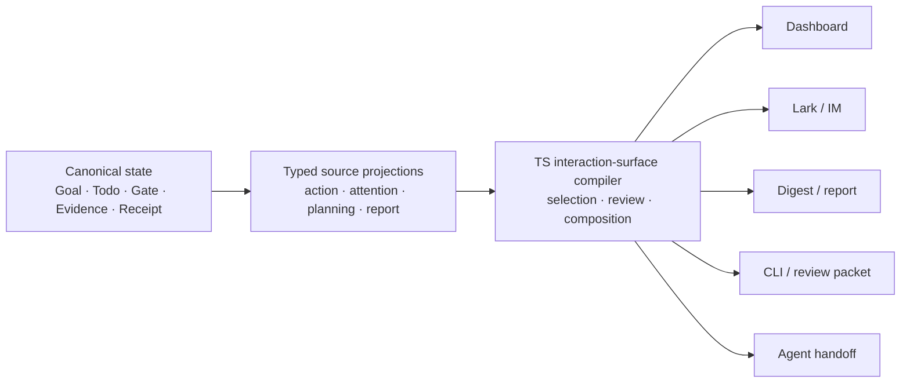

# RFC：智能化审阅与动态展示面 v0

- 状态：Draft，等待 Maintainer 审阅
- 提案人：LoopX Maintainers
- 日期：2026-09-01
- 范围：定义一个 provider-neutral 的 typed interaction projection，用于筛选、展示、审阅和反馈控制面的重要变化，并为卡片、对比、图、报告、Dashboard 与持续演进的文档提供有界 presentation plan；不新增 source store、authority grant、provider effect、通知调度器、万能 renderer，也不要求必须依赖模型
- Source baseline：LoopX `546bf6967`
- Tracking issue：[#3786](https://github.com/huangruiteng/loopx/issues/3786)
- 相关技术方向：[#3244](https://github.com/huangruiteng/loopx/issues/3244)
- 第一个垂直案例：[#3785](https://github.com/huangruiteng/loopx/pull/3785)
- 语言说明：[英文版](./intelligent-review-presentation-surfaces-v0.md) 与本中文版是语义镜像；两者有语义差异即视为缺陷。

---

## 0. 直观案例

Operator 点击一个 active Goal 左侧的停止按钮。停止是可逆的、作用域限于当前 Goal、由用户显式点击触发，并且已有 typed preview、optimistic rollback、readback 验证和 receipt。此时再要求用户点击一次通用“确认执行”，增加了 attention cost，却没有引入新的判断。

理想路径是：

```text
用户显式操作意图
  -> typed preview + 当前状态 fingerprint
  -> ready + 可逆 + 有界 + 可 readback
  -> 直接 apply
  -> optimistic projection
  -> readback 验证 + receipt
  -> 轻量但明确的可见反馈
```

如果 preview 和 apply 之间状态发生变化，同一条路径不得继续静默执行：

```text
apply 发现 stale state 或 protected gate
  -> 回滚 optimistic projection
  -> 升级为 repair 或显式审阅
  -> 展示具体变化的事实和安全下一步
```

恢复与永久删除不应被自动视为和停止等价。恢复可能重新开启运行消耗，删除会影响 artifact 可用性，因此可以继续 review-first。区别应来自 typed facts 和 policy，而不是前端维护一份按钮文案名单。

这个例子只是第一个垂直切片。同一套架构还应帮助 Operator 审阅 replan、理解 acceptance gap、接收阶段报告、检查 settlement 失败，或者在无需阅读原始状态和全部 Agent 对话的情况下处理 scoped gate。

## 1. 产品判断

LoopX 优化的是一个联合目标：

```text
最大化有价值的 Agent 产出
同时最小化 Human Attention
但不能隐藏风险、authority 或退化的结果
```

最小化 attention 不等于最小化信息，也不等于删除人的判断。它意味着最大化每次打扰、每块可见界面的决策价值：

- 日常、可逆、可验证的工作应安静进行或直接完成；
- 重要进展应清晰可见，但不应伪装成需要决策；
- 真正需要人判断时，应投影成一个有边界的 decision frame；
- protected authority 必须始终显式；
- 不完整、过期或矛盾的状态必须进入 repair，而不是生成自信的 UI 文案；
- 每个已提交 effect 都应有与风险相称的 receipt 和恢复路径。

因此，“智能化的界面”不是一个多写几段 AI 总结的 Dashboard，而是把 canonical control-plane facts 编译成 role-aware、channel-aware interaction 与 presentation plan 的 typed compiler。同一组 facts 在做决策时可能最适合对比表，在 replan 时可能最适合依赖图，在每周回顾时可能最适合 milestone report，在长期协作中也可能最适合持续更新的 Wiki。

## 2. 当前问题与已有基础

Main 已经具备大部分语义组件：

| 现有 Owner | 当前价值 | 尚缺的组合层 |
| --- | --- | --- |
| status `attention_queue` 与 Goal Channel projection | 有界的 Operator 可见 Goal 状态 | 跨 sink 统一的显著性、delivery 与 disclosure 词汇 |
| typed Chat action proposal | preview/apply、fingerprint、validation evidence、gate、receipt | typed presentation mode 与 review frame |
| planning inventory、action portfolio、planning horizon | 一致的 Agent-facing frontier 与战略上下文 | Operator 审阅复用相同 facts/completeness，避免第二套 Todo 世界观 |
| `review_batch_v0` | 确定性的冷路径排序与精确 decision digest 绑定 | 热路径单个 item 的 interaction policy |
| Human Attention Wishlist | 可选、非阻塞的人类增益 | 通用的选择与展示策略 |
| periodic report | 重要阶段触发、有界报告、audience routing | 共享的 digest/attention delivery 词汇 |
| Effect Program 与 domain settlement reducers | effect identity、顺序、失败、replay、receipt | 面向 Operator 的 settlement 状态解释 |
| Dashboard、Lark、CLI、review packet | 已工作的 presentation sinks | 在不同密度下渲染同一份 semantic plan |

缺少共享的 interaction boundary 时，各自合理的实现会逐渐漂移：

1. 可逆动作和不可逆动作可能收到同样的通用确认 UI；
2. recommended action 可能没有同时展示 alternatives、fallback、evidence gap，或者做判断所需的 planning horizon；
3. `needs attention`、`needs a decision`、`needs authority`、`notify now` 容易被混为一谈；
4. unchanged 或 superseded 状态会重复消耗注意力；
5. 各 channel 可以遗漏不同事实，却不声明 completeness；
6. success 文案可能模糊 effect 到底只是 proposed、attempted、committed、readback verified，还是已经 reconciled；
7. 模型生成的自然语言可能被错误当成风险或 authority 分类。

## 3. 决策

LoopX 将定义 provider-neutral 的 `interaction_surface_plan_v0` read model。它从现有 authoritative facts 编译出有界 surface items，承担四项职责：

1. **选择（selection）**：判断哪些 material delta 值得成为 attention candidate；
2. **展示（presentation）**：选择最小但真实的摘要，并提供真正可展开的 detail path；
3. **审阅（review）**：选择封闭的 interaction mode 和 decision frame；
4. **反馈（feedback）**：描述交互后的 receipt、readback、rollback 与 repair 状态。
5. **编排（composition）**：推荐抽象 presentation form、持久化 lifecycle 与 deterministic fallback，但不选择 provider，也不执行 external write。

Compiler 位于 control-plane read boundary，是一个 pure、typed TypeScript reducer。它只接收已经归一化的 facts，不执行 provider call、external write、authority consumption、Goal/Todo transition 或 effect settlement。



不同 sink 可以从同一份 plan 渲染不同密度、布局和语言，但不得改变 authority、completeness、interaction mode 或 subject identity。

## 4. 核心词汇

### 4.1 Surface item

Surface item 是一个绑定 revision 的 Operator 或 Agent attention 单元。它不是 canonical state 的副本，也不能作为项目真相被编辑。

典型例子包括：

- 一个拟议的 Goal lifecycle action；
- 一个 material replan delta；
- 一个 evidence-backed acceptance gap；
- monitor 变化后刚被释放的 successor；
- 一个 periodic milestone 结果；
- 一个需要 repair 的 effect settlement。

### 4.2 Material delta

Material delta 描述相对于上一次已确认或已投递 revision，哪些事实发生了变化。没有比较边界的 snapshot 不足以决定是否打扰用户。

Delta 必须携带：

- 稳定的 subject 与 source revision；
- changed facts；
- 与本次判断相关、且明确 unchanged 的 facts；
- 必要时的 supersession 或 lineage；
- observation time 与 freshness；
- completeness 与 omitted count。

### 4.3 Attention kind

`attention_kind` 说明某条事实为什么可能值得注意，而不是用户必须做什么：

```ts
type AttentionKind =
  | "progress"
  | "decision"
  | "authority"
  | "optional_leverage"
  | "anomaly"
  | "acceptance_gap"
  | "settlement"
  | "terminal";
```

例如，`authority` 通常映射为显式 gate，`progress` 通常映射为 inform/digest。Attention kind 必须与 delivery、interaction mode 分离，避免一个 digest item 意外变成 gate。

### 4.4 Interaction mode

v0 定义一组封闭模式：

| Mode | 含义 | 用户动作 |
| --- | --- | --- |
| `silent` | 没有新的决策或重要展示价值 | 无 |
| `inform` | 已验证的重要结果或变化 | 无；按需查看 |
| `direct_with_receipt` | 用户显式意图可直接 apply 一个 ready、有界动作 | 只有最初那次操作 |
| `compact_review` | 需要一个聚焦的判断 | 选择、修改、defer 或 reject |
| `protected_gate` | 缺少 canonical scoped authority | 显式解决 gate |
| `repair_escalation` | stale、不完整、矛盾或 readback 失败 | 查看、修复或重试 |

这些 mode 是 presentation obligation，不是 permission grant。Compiler 可以比 domain minimum 要求更多审阅，但永远不能削弱 domain gate。

### 4.5 Presentation density

Density 与 interaction mode 相互独立：

```ts
type PresentationDensity = "glance" | "compact" | "expanded" | "diagnostic";
```

同一个 protected gate 可以在手机端显示 compact card、在桌面端显示 expanded view，而不改变 authority。Direct action 默认只显示 glance receipt，也可以保留 diagnostic detail path。

### 4.6 Presentation Intent 与 Form

Density 回答“展示多少”，presentation intent 回答“需要帮助 audience 理解什么”，form 回答“哪一种抽象视觉或文档结构最适合表达”：

```ts
type PresentationIntent =
  | "glance"
  | "decide"
  | "compare"
  | "trace_change"
  | "understand_dependencies"
  | "verify_evidence"
  | "review_milestone"
  | "monitor_live_state"
  | "build_shared_context";

type PresentationForm =
  | "status_glance"
  | "decision_card"
  | "comparison_table"
  | "timeline"
  | "dependency_graph"
  | "evidence_matrix"
  | "milestone_report"
  | "interactive_dashboard"
  | "linear_document"
  | "living_wiki";
```

Planner 选择 abstract form，而不是 provider。`living_wiki` 可以通过 Lark Wiki、仓库文档或另一个实现 artifact contract 的 provider 渲染。`milestone_report` 可以渲染为 Markdown、HTML、Lark 文档或 compact card。Provider selection 与 external effect 始终分离。

Form selection 可以动态，但必须有界。它基于 typed content shape、audience、decision intent、relation density、change history、expected lifetime、interactivity need 与 channel capability，并输出 reason codes 和 deterministic fallback；不能允许模型产生任意 executable UI。

## 5. Typed contract

### 5.1 共享 Facts

```ts
type SurfaceSubject = {
  kind:
    | "goal_action"
    | "todo_transition"
    | "replan"
    | "gate"
    | "monitor_change"
    | "report"
    | "settlement"
    | "acceptance";
  id: string;
  revision: string;
  goalId?: string;
  agentId?: string;
};

type RiskFacts = {
  reversibility: "reversible" | "compensatable" | "irreversible" | "unknown";
  blastRadius: "view_local" | "goal_local" | "project_local" | "external" | "unknown";
  authority: "not_required" | "already_scoped" | "missing" | "unknown";
  privacyChange: boolean | "unknown";
  stateFreshness: "current" | "stale" | "unknown";
};

type EvidenceEnvelope = {
  status: "complete" | "partial" | "missing" | "conflicting";
  refs: string[];
  observedAt?: string;
  freshness: "current" | "stale" | "unknown";
};

type DisclosurePlan = {
  density: PresentationDensity;
  summaryFields: string[];
  detailRef?: string;
  complete: boolean;
  omittedCount: number;
  truncationReasons: string[];
};

type PresentationPlan = {
  intent: PresentationIntent;
  preferredForm: PresentationForm;
  fallbackForm: PresentationForm;
  reasonCodes: string[];
  requiredSemanticBlocks: string[];
  persistence: "ephemeral" | "session" | "durable_artifact" | "living_document";
  updateMode: "replace" | "patch" | "append" | "supersede";
};
```

Risk 与 evidence 值必须来自 domain contracts、canonical policy 或经过验证的 source projections。Renderer 或模型不得根据标题、按钮名、free-form summary 或 substring list 自行推断。

### 5.2 让不安全组合难以表达

Mode-specific contract 应使用 discriminated union，而不是一袋 optional booleans：

```ts
type InteractionDecision =
  | {
      mode: "silent";
      reason: "unchanged" | "superseded" | "non_material";
    }
  | {
      mode: "inform";
      delivery: "surface" | "piggyback" | "digest";
    }
  | {
      mode: "direct_with_receipt";
      initiation: "explicit_operator_intent";
      actionRef: string;
      rollback: { available: true; strategy: string };
      readback: { required: true; contract: string };
    }
  | {
      mode: "compact_review";
      decisionFrame: DecisionFrame;
    }
  | {
      mode: "protected_gate";
      gateRef: string;
      requiredScope: string;
      decisionFrame: DecisionFrame;
    }
  | {
      mode: "repair_escalation";
      failureKind: "stale" | "incomplete" | "conflict" | "readback_failed";
      recoveryActions: string[];
    };
```

v0 中，`direct_with_receipt` 有意要求 explicit operator initiation、available rollback 和 required readback。后台自治继续由现有 quota、scheduler、capability 与 authority contracts 治理；本 RFC 不创建通用 auto-execution lane。

### 5.3 Decision frame

```ts
type DecisionOption = {
  id: string;
  label: string;
  consequence: string;
  authorityEffect: "none" | "consume_scoped_decision";
};

type DecisionFrame = {
  question: string;
  recommendedOptionId?: string;
  recommendationBasis: string[];
  options: DecisionOption[];
  safeFallback?: {
    summary: string;
    remainsRunnable: boolean;
  };
  evidenceGap?: string;
};
```

Recommendation 不是 obligation。机器强制的 obligation 与 canonical gate 必须明确命名。如果 recommended option 当前无法执行，frame 必须提供 safe fallback，或解释为什么不存在 fallback。

### 5.4 完整 Item

```ts
type InteractionSurfaceItem = {
  schemaVersion: "interaction_surface_item_v0";
  surfaceItemId: string;
  subject: SurfaceSubject;
  audience: "operator" | "agent" | "reviewer";
  attentionKind: AttentionKind;
  materialDelta: {
    changed: string[];
    unchanged: string[];
    supersedes?: string[];
  };
  risk: RiskFacts;
  evidence: EvidenceEnvelope;
  disclosure: DisclosurePlan;
  presentation: PresentationPlan;
  interaction: InteractionDecision;
  sourceRefs: string[];
};
```

公共 wire format 会使用 snake case。上面的 TypeScript shape 表达预期的关联关系和 illegal-state boundary，不代表序列化字段拼写已经最终确定。

## 6. Compiler 优先级与不变量

Compiler 必须采用显式优先级，而不是一个不透明 aggregate score：

1. schema 非法、subject revision stale、状态矛盾、required evidence 不完整或 required readback 失败 -> `repair_escalation`；
2. required authority 缺失或 unknown、不可逆/扩大隐私边界的 protected action，或 canonical gate -> `protected_gate`；
3. 真正涉及价值、方向、优先级、acceptance 或路线的判断 -> `compact_review`；
4. explicit operator intent 且满足全部 direct-action eligibility facts -> `direct_with_receipt`；
5. 已验证 material delta 且不需决策 -> `inform`；
6. unchanged、superseded 或 non-material delta -> `silent`。

Direct eligibility 是合取条件：

```text
proposal ready
AND 当前用户显式意图
AND state fingerprint current
AND reversibility = reversible
AND blast radius <= 已配置的有界 scope
AND authority in {not_required, already_scoped}
AND privacy change = false
AND rollback available
AND readback contract available
AND no canonical gate
```

Unknown 永远不等于低风险。缺失 fact 必须根据 owning contract 进入 review、gate 或 repair。

第一版实现必须使用命名的 policy rules。未来 learned ranker 可以对已 eligible 的 inform/digest items 排序，但不能覆盖上述优先级或 direct/gate eligibility 不变量。

## 7. 智能化选择与 Delivery

### 7.1 Delta 优先于 Snapshot

打扰通常应由 material delta 驱动：

- gate 新打开或 scope 变化；
- monitor 观察到 material change 并释放 successor；
- bounded stage 关闭且 report ready；
- replan 改变 strategy、acceptance 或 frontier；
- settlement 从 attempted 变为 verified 或 failed；
- Todo 耗尽后 acceptance gap 仍然存在。

重复的 unchanged monitor poll、已经 acknowledged 的 gate 或 superseded recommendation 应保持 silent，除非 freshness deadline 本身产生了新 material fact。

### 7.2 Selection 不等于 Delivery

Eligible item 还需要独立选择 delivery：

```ts
type DeliveryMode =
  | "interrupt"
  | "surface"
  | "piggyback"
  | "digest"
  | "on_demand"
  | "silent";
```

- blocking authority 或 repair 通常 interrupt；
- non-blocking decision 可保留在 persistent surface；
- optional leverage 进入 piggyback 或 digest；
- verified progress 进入 surface 或 periodic report；
- unchanged background state 保持 on-demand 或 silent。

Interaction plan 不负责调度通知。现有 host、Goal Channel 和 periodic-report lifecycle 继续拥有实际 delivery 与 receipt。

### 7.3 Deduplication 与 Acknowledgement

每个 item 需要稳定的 subject revision 和 material-delta identity。Sink acknowledgement 只记录某个 revision 已经展示或决策，不会修改 canonical Goal/Todo truth。

较新 revision 可以 supersede 较旧、尚未决策的 presentation item，但不能抹掉未消费的 canonical gate。Decision write 必须绑定到精确的 reviewed revision/digest，并在 supersession 后 fail stale。

## 8. 智能化展示

### 8.1 最小决策相关信息

Compact 第一层应回答：

1. 什么发生了变化；
2. 为什么此刻重要；
3. 是否需要 decision 或 authority grant；
4. LoopX 推荐什么，以及推荐基于哪些 typed facts；
5. 有哪些 alternatives 或 safe fallback；
6. 哪些 evidence 完整、部分或缺失；
7. 什么能证明所选 effect 已经 committed。

第一层不应从 raw event history、全部 Todo、内部 schema 名或模型 chain-of-thought 开始。

### 8.2 Progressive disclosure

任何遗漏了 decision-relevant facts 的 compact item，都必须提供真实的 detail path。`complete=false` 是 protocol fact，不是视觉提示。

建议层级：

- **glance**：状态、delta headline、interaction requirement、receipt state；
- **compact**：decision frame、consequence、fallback、关键 evidence；
- **expanded**：planning relations、受影响 Todos/artifacts、alternatives、source refs；
- **diagnostic**：fingerprints、receipts、replay/repair 细节、有界 event lineage。

### 8.3 Channel adaptation

| Surface | 默认密度 | 关键约束 |
| --- | --- | --- |
| Dashboard first screen | glance/compact | 聚合 attention；不重复导航或复制 canonical state |
| Dashboard drawer/detail | expanded/diagnostic | 保留精确 action 与 receipt identity |
| Lark Goal Channel | compact | 一个可行动 frame；不暴露 raw private state；提供 threaded detail link |
| periodic digest/report | compact grouped items | 重要阶段 delta；不暗示即时 authority |
| CLI/review packet | expanded/diagnostic | 稳定 machine-readable fields 与精确 refs |
| Agent handoff | compact strategic | authority、planning horizon、validation、stop condition |

Channel capacity 可以移除可选 display fields，但不能移除 gate、改变 interaction mode、虚报 completeness，或用 free-form prose 替换精确 identity。

### 8.4 动态 Form Selection

最智能的表达不一定是再增加一张卡片：

| Fact 形态与目的 | 首选抽象 form | 典型例子 |
| --- | --- | --- |
| 一个已验证状态或 receipt | `status_glance` | Goal 已停止、delivery 已验证 |
| 一个 scoped choice | `decision_card` | approve/revise/defer 路线 |
| 具有共同维度的 alternatives | `comparison_table` | replan candidates、provider choices |
| 随时间变化 | `timeline` | 阶段进展、incident recovery、settlement history |
| typed relations 与 blocking paths | `dependency_graph` | Todo frontier、Explore graph、cross-Agent handoff |
| claims 对 evidence | `evidence_matrix` | acceptance review、benchmark claim qualification |
| 有边界的周期或阶段 | `milestone_report` | 周报、segment closeout |
| 高频变化的 multi-lane state | `interactive_dashboard` | 长程 Goal portfolio |
| 供后续读者阅读的稳定叙事 | `linear_document` | handoff、design explanation |
| 持续维护的共享上下文 | `living_wiki` | 项目决策、当前架构、长期 operating knowledge |

仓库里已有几个 domain-local precedent，证明这条方向并非空中楼阁：

- Explore presentation 根据 typed readability 与 decision-density signals 推荐 canonical-only 或 canonical/executive dual view，保留 source digest/revision，并让 board style 与 evidence truth 分离；
- periodic report 先归一化同一份 typed document，再交给 Markdown 与 HTML renderers，记录 renderer lineage，并把 generation 与 publication 分开；
- content-ops 定义 typed page roles，并能拒绝 sparse、overcrowded、overflowing、colliding 或 role-incomplete layouts。

本 RFC 应复用这些经验，而不是用一个 universal layout engine 取代各 domain renderer。Shared compiler 拥有 communication intent、required semantic blocks、completeness、abstract form 与 fallback；domain capability 拥有 domain meaning；renderer 拥有 concrete layout；sink 拥有 provider effect 与 exact readback。

### 8.5 周报与 Living Wiki Artifact

周报和 Wiki 不是“大号通知”，而是有 identity 与 lifecycle 的 artifact：

```ts
type PresentationArtifactPlan = {
  artifactKey: string;
  role: "report" | "shared_context" | "decision_record" | "handoff";
  sourceRevision: string;
  sourceDigest: string;
  persistence: "durable_artifact" | "living_document";
  updateMode: "replace" | "patch" | "append" | "supersede";
  previousArtifactRef?: string;
  requiredReadback: "identity" | "revision" | "content_digest";
};
```

周报通常冻结一个有边界 period，并 append 或 supersede 新 artifact；Living Wiki 通常基于当前 canonical projections patch 同一个稳定 artifact。二者都不成为第二 source of truth：必须保留 source revision/digest，并反向链接 canonical evidence。

创建或更新 Wiki、发布 HTML、发送周报都是 external effect。Presentation plan 可以提出 effect，但真正 provider operation 仍需要 typed preview/apply、精确 artifact identity、idempotency、authority 与 readback。Renderer receipt 证明 generation，sink receipt 证明 delivery，两者不能混为一谈。

为了“不重复维护同一份内容”，Wiki 默认采用 projection-backed patch：稳定 semantic block id 映射稳定 remote block；变化的 block 更新；删除的 facts 显式 supersede 或 retire；unchanged block 不触碰。模型每次自由重写整页不应成为默认 lifecycle。

### 8.6 Adaptive Presentation Feedback

系统可以通过有界 signals 感知 form 是否 under-disclosing 或 over-disclosing，例如用户立即打开 detail、重复 clarification、decision reversal、layout validation failure，或者 renderer 报告 overlap。它们可以影响未来 form recommendation 或 density，但不能改变 canonical facts、authority、evidence status 或 effect 是否 committed。

Adaptive policy 必须 inspectable、resettable，其输出携带 reason codes，并始终保留 deterministic fallback。

## 9. 覆盖长程工作的完整生命周期

| 阶段 | 智能化界面的职责 |
| --- | --- |
| Goal authoring | 澄清 objective、acceptance、execution boundary 和缺失 authority，而不是展示一个巨大且无差别的表单 |
| planning 与 replan | 展示 strategy/acceptance/frontier delta、受影响工作、alternatives 与 fallback；普通 successor planning 仍归 Agent 所有 |
| execution | 日常进展保持安静；展示有界 session state、artifact delta 和有意义的干预点 |
| monitor 与 wait | 展示 material observation 和新变为 runnable 的 successor；抑制 unchanged polls |
| gate 与 decision | 提出一个 scoped question，说明 authority effect，并在存在时展示独立 safe work |
| delivery 与 review | 展示 artifact/evidence readiness、精确 protected effect、reviewer role 与 revision binding |
| settlement | 区分 proposed、attempted、committed、readback-verified、reconciled、partial 与 repair-required |
| terminal 与 acceptance | 区分 Todo 耗尽和 Goal acceptance，展示剩余 evidence gap 或 replan requirement |

Compiler 可以在不同阶段复用词汇，但 domain-specific facts 继续由各 reducer 所有。Replan ACK、Todo resume、report trigger 和 action apply 不应被合成一个通用状态机。

## 10. Model-assisted Intelligence

Typed compiler 在没有模型时也必须生成可用 plan。可选模型只能在 fact set 已被限制后改善语言和排序。

允许模型提出：

- 基于已提供 public-safe facts 的更清晰标题或解释；
- 对多个相关 inform items 分组；
- 在已经 eligible 的 items 之间做 salience ordering；
- 适应 audience 的解释深度；
- 从 admitted component vocabulary 中提出 candidate presentation form、semantic grouping 或 report/Wiki outline；
- 提出可能缺失的 alternative 或 evidence question，交给 deterministic validation。

禁止模型拥有：

- permission 或 decision scope；
- evidence completeness；
- 为 irreversible 或 unknown action 选择 direct execution；
- 抑制 gate、stale state 或 failed readback；
- 修改 subject identity 或 revision；
- 声称 effect 已 committed；
- 在声明的 source boundary 外读取 raw transcript、log、credential 或 private file；
- 在 admitted renderer 外生成任意 executable UI、script、remote document mutation 或 provider-specific payload。

Model output 是 untrusted proposal，需携带 input digest、model/profile identity、有界输出、validator result，并可 fallback 到 deterministic copy。任何 model advice 影响 delivery 前，shadow evaluation 必须同时度量过度升级和危险抑制。

## 11. 与现有架构的关系

### 11.1 Source state 与 Projections

Canonical Goal、Todo、Gate、Evidence、Event 与 Receipt state 继续是真相。Interaction plan 是可重建 projection。Dashboard 或 Lark acknowledgement 可以管理 surface lifecycle，但不能关闭 Todo、消费 authority 或 settle effect。

### 11.2 Typed Action Proposal

Typed Chat action proposal 继续拥有 preview/apply、validation、fingerprint 与 receipt boundary。作为本 RFC 第一个子集的 `action_review_plan_v0` 只负责编译现有 proposal 如何展示，不会让 action 变得合法。

### 11.3 Planning Inventory 与 Horizon

Operator surface 应复用 planning read models 中的 canonical Todo identity、relations、claim state、completeness 与 detail refs。它可以选择不同 density，但不能在前端重新实现 runnable/waiting/blocked 语义。

### 11.4 Review Batch

`review_batch_v0` 是冷路径 multi-candidate composition 与 exact-decision binding contract。它可以消费 surface candidates，也可以服务 expanded review session；但不决定单个热路径 action 是 direct、reviewed、gated 还是 repair-required。

### 11.5 Human Attention Wishlist

Wish 继续是 optional human leverage，本身永远不是 gate 或 notification。它映射为 `optional_leverage` 加 piggyback/digest delivery。本 RFC 不替代其 authoring、deduplication 或 lifecycle contract。

### 11.6 Periodic Report

Periodic report 继续拥有 capability-owned trigger、document、audience 和 governed delivery lifecycle。Report milestone 可以产生 `inform` surface items；interaction compiler 不生成或发送 report。

### 11.7 Effect Program

Effect Program 与 domain settlement reducers 提供 effect identity、顺序、failure、replay、committed prefix 和 receipt facts。Interaction compiler 只渲染这些 facts。Effect Program 不应成为通用 UI decision engine，interaction policy 也不能声称 settlement authority。

### 11.8 Capability Hooks 与 Providers

已安装 capability 可以通过 admitted hook 提供有界 provider-neutral projection candidate。Core 验证 schema 并拥有最终 interaction semantics。Hook 不获得 canonical write authority，也不能削弱 gate、选择 direct execution 或外部 delivery。

### 11.9 Domain Presentation 与 Artifact Lifecycle

Explore presentation、periodic-report renderers、content-ops layout planning 与 Goal artifact lifecycle projection 继续留在最近的 domain owner。Shared interaction surface 消费其有界 facts，并提供通用 abstract form vocabulary；它不会吸收这些 domain 的 evidence selection、document normalization、layout validation、milestone/guard derivation 或 sink protocols。

Durable report 与 living document 还必须携带 artifact identity、source lineage、update mode、renderer receipt 和 sink readback。内容可以从 canonical projections 重建；remote presentation state 不会获得对 Goal 或 Todo state 的 authority。

## 12. 最小可用实现切片

本 RFC 后的第一个 PR 应保持有界：

1. Characterize 当前 Goal lifecycle behavior：
   - ready stop -> direct apply with receipt；
   - stop apply stale/gated -> rollback 并升级；
   - resume/delete -> reviewed；
   - failed readback -> not completed；
2. 为现有 typed action proposal facts 定义 TypeScript `action_review_plan_v0` discriminated union 与 pure compiler；
3. 通过命名 typed rules 编码 Goal lifecycle policy，而不是按钮文案；
4. 让 Dashboard 从 plan 渲染当前 behavior；
5. 保持 Python Chat action preview/apply 与 Goal lifecycle reducers 不变；
6. 增加 parity、negative 与 mutation tests，证明 protected、unknown、incomplete 或 stale proposal 不能变成 direct；
7. 保留可见 feedback、accessibility、mobile operation 与真实 detail refs。

这个切片会把 #3785 的有价值行为从 UI-local policy 变成可复用 typed seam，但暂不泛化 attention-queue delivery、periodic digest、Lark rendering 或 model assistance。

## 13. 交付阶段

### Stage 0：Inventory 与 Characterization

- 盘点当前 action、attention、gate、report、replan 与 settlement surfaces；
- 记录由哪个 owner 提供 risk、authority、evidence 与 receipt facts；
- 找出重复的前端状态语义和不真实的 detail path；
- 在迁移 policy 前先建立 fixtures。

### Stage 1：Action Review 垂直切片

- 用 TypeScript 交付 `action_review_plan_v0`；
- 让 Goal lifecycle 经过该 plan；
- 保持当前 backend 与 renderer；
- 发布 protocol 与聚焦测试。

当前有界实现位于 Dashboard 的 `features/personal-workspace/action-review-plan.ts`。
`compileActionReviewPlan` 从已通过 Chat transport schema 的 proposal 编译内部
`action_review_plan_v0` union；它不是新的公开 wire contract 或合法动作目录。
Goal 列表的暂停入口消费 `direct`，现有动作抽屉消费解释与可执行状态。
恢复与删除仍需 review；不完整、未知权限或 stale 的生命周期提案停止直接执行，
提供重新检查入口。共享 Chat transport schema 要求每条 validation evidence
均为非空白字符串，保留原文本；无效或混合证据数组拒绝解析并显示执行失败，
不会触发 apply。编译器复用同一 schema 校验直接调用的输入；仅生命周期直接
执行额外要求数组非空，其他动作原有的空数组审阅路径保持兼容。
后端 preview/apply、fingerprint 与 reducer 不变。

本切片同时修正失败读回的展示：`applied` 但无 `projection_verified: true`
不能显示已完成，直接操作也会打开异常详情并回滚乐观显示。其他动作保留原有
reviewed 路径；远端 SSH 生命周期入口仍使用其自身的绑定与读回契约。CLI、Lark
没有新增入口。验证入口为 Dashboard 的 `smoke:action-review-plan`、
`smoke:personal-workspace` 与 `smoke:personal-workspace-packaged`。


生命周期 preview/apply 返回值会核对请求的 Goal、操作与 proposal 身份。
其他动作暂缓后即使保留历史 gate，仍保持原有重试入口。失败展示使用 Chat
错误码和提案状态，不再按错误文案推测 stale 状态。

### Stage 2：Attention 与 Disclosure Plan

当前 Dashboard 切片：从「需要你」进入事项详情，可查看已有 Todo 投影中的原因、证据、
目标 Todo/Agent、声明的决策范围和替代关系。只有明确的 `user_gate` 显示为需要决定；
其他事项不从文案推断阅读或授权含义。已选详情随当前来源更新；来源已无该事项时显示
不可用；来源读取中或失败时保留的历史事项同样不能视为当前有效，也不再提供决定
操作。来源与 Goal 的失效状态不会传播到其他健康来源或 Goal。仅当同一来源、同一 Goal 中有明确的
`superseded_by` 目标时提供跳转。阅读不会关闭 gate。现有普通事项仍沿用受控预览。

此切片尚未实现跨渠道披露编译器、已读回执、授权分类或自动去重，属于 Stage 2 的部分
交付。CLI 和 Lark 契约保持不变。

- 编译 material attention-queue deltas；
- 分离 selection、delivery、interaction 与 density；
- 复用 planning completeness/detail refs；
- 暴露稳定 acknowledgement/supersession identity。

### Stage 3：Cross-channel Parity

- 在 Dashboard 与 Lark Goal Channel 渲染同一 semantic plan；
- 允许 periodic report 提供 digest items；
- 验证 card、table、timeline、graph、report、dashboard 与 document fallback 之间的动态 form selection；
- 增加一个 living-Wiki preview/patch/readback contract，但不让 Wiki 成为 canonical source；
- 为不同 layout 与 locale 添加 semantic parity fixtures。

### Stage 4：Replan、Acceptance 与 Settlement Review

- 为 material replan delta、acceptance gap 和 effect repair state 增加 domain adapters；
- 每个 domain reducer 继续保持 authoritative；
- 用 model-behavior tests 验证有意义的干预点。

### Stage 5：可选 Model Advice

- Shadow 更清晰的解释和 eligible-item ranking；
- 对照精确 input digest 与 typed invariants 验证；
- 度量 false interruption、missed escalation 和 user correction；
- 保留 deterministic fallback 和显式 disable/reset。

### Stage 6：有界个性化

只有前面阶段稳定后，才考虑 Operator 对 density、digest cadence 或 default review strictness 的偏好。Preference 必须 portable、inspectable、resettable、privacy-bounded，且不能削弱 canonical gate。

## 14. 验证

### 14.1 Protocol 与 Reducer

- 相同 source revisions 与 surface context 产生 deterministic output；
- 多 item 使用稳定 total order；
- 精确绑定 subject revision/digest；
- 拒绝 stale decision 与 superseded item；
- union 层拒绝非法 direct/gate 组合；
- unknown risk 或 required evidence 不会默认 direct；
- completeness、truncation 与 overflow 始终显式；
- public/private boundary 拒绝 raw transcript、log、credential、local path 和无界 provider payload。

### 14.2 垂直行为

- direct stop 仍创建 typed preview，且只 apply 一次；
- optimistic stop 遇到 gate、stale result 或 apply failure 会 rollback；
- verified receipt 无需 confirmation drawer 也保持可见；
- 新 authority gate 升级为显式 review；
- resume 与 delete 保持 reviewed；
- 重复点击不会创建重复 effects；
- background reconciliation 不会覆盖更新的 optimistic revision；
- keyboard、screen reader、reduced motion、narrow screen 和 locale behavior 继续有效。

### 14.3 Cross-channel Parity

- Dashboard、Lark、digest 与 CLI 共享 subject、revision、attention kind、interaction mode、authority、evidence status 与 completeness；
- density 差异不改变 semantic fields；
- detail refs 可以获取 upstream 已遗漏的信息，而不是同一份 truncated payload 的另一个副本；
- delivery receipt 标识实际展示或发送了什么。
- presentation-form reason codes 与 deterministic fallback 保持稳定；
- renderer validation 可以拒绝不可读的 graph/layout output，但不能删除 canonical evidence；
- report 与 Wiki artifact 绑定精确 source revision/digest，并在 patch、append、replace 或 supersede 中保留 lineage；
- generated artifact 在缺少独立 sink readback receipt 时，永远不能算作 published。

### 14.4 产品与模型评估

Attention cost 与 outcome quality 必须同时度量：

- 每个 accepted Goal outcome 的 interventions 与 attention minutes；
- false interrupts 与 missed material escalations；
- material delta 到 required decision 的时间；
- decision reversal/regret 与立即打开 detail 的比例；
- stale-action 与 failed-readback recovery；
- 用户对“什么变了”和“effect 是否 committed”的理解；
- Agent throughput、acceptance quality 与 safety outcomes；
- model-advice override、hallucination、over-escalation 与 dangerous suppression rate。

减少点击但降低 accepted outcome quality 是回归，不是成功。

## 15. Failure 与 Fallback Rules

- compiler 不可用：渲染现有 conservative reviewed surface；
- policy version unknown：fail to review/repair，绝不 direct；
- model advisor 不可用或非法：使用 deterministic copy/order；
- detail source 不可用：标记 incomplete 并展示恢复路径，不声称 full context；
- sink delivery failure：保留 canonical item 与 delivery receipt，不 replay underlying domain effect；
- readback failure：在安全时 rollback projection，并 surface repair；
- source revisions 冲突：拒绝 interaction 并 refresh。

## 16. Non-goals

- 用 frontend state 替代 canonical state；
- 用 AI risk score 替代 typed domain gates；
- 自动批准 protected effects；
- 流式展示 chain-of-thought、每个 Agent step 或 raw logs；
- 让每条 status item 都变得 actionable；
- 创建 global generic effect executor；
- 创建一个吸收 Explore、report、content、Wiki 与 Dashboard domain contract 的万能 renderer；
- 让模型成为 control-plane rendering 的必需依赖；
- 引入第二套 Todo、planning、receipt 或 notification store；
- 在第一版同时交付 personalization、全部 sink 和全部 domain adapter；
- 把“点击更少”当作产品提升的充分证据。

## 17. 开放问题

1. `action_review_plan_v0` 应在第一阶段就序列化成 public protocol，还是等第二个 sink 使用后再从 internal TypeScript read model 晋升？
2. 哪些现有 action metadata 应拥有 reversibility 与 blast radius，哪些值需要 schema migration？
3. Surface acknowledgement 应进入现有 event ledger，还是进入没有 project-state authority 的 projection-local delivery ledger？
4. 哪些 replan delta 真正需要 Operator 决策，哪些只是 informative autonomous alignment changes？
5. 什么是最小 cross-channel semantic parity fixture，既能捕获漂移，又不会 snapshot presentation copy？
6. v0 之后，哪一种 Operator preference 值得持久化 profile，以及它如何跨 host reset？
7. Abstract form selection 应位于 core interaction compiler，还是等第二个 domain caller 成立后进入 built-in presentation capability？
8. 第一个 provider-neutral living-document patch contract 应如何同时服务 Lark Wiki 与 repository docs，而不假设任一 provider 的 block model？

## 18. RFC 验收条件

当 Maintainers 对以下内容达成一致时，本 RFC 才可离开 Draft：

1. projection-only authority boundary；
2. 封闭的 interaction modes 与优先级；
3. 合取式 direct-action eligibility；
4. action proposal、planning inventory、review batch、periodic report、Effect Program 与 capability hooks 的复用边界；
5. Stage 1 typed vertical 及其 negative tests；
6. cross-channel completeness 与 parity 要求；
7. dynamic form、artifact lineage、renderer 与 sink authority boundary；
8. 同时保护 Human Attention 与 Goal outcome 的评估指标。
