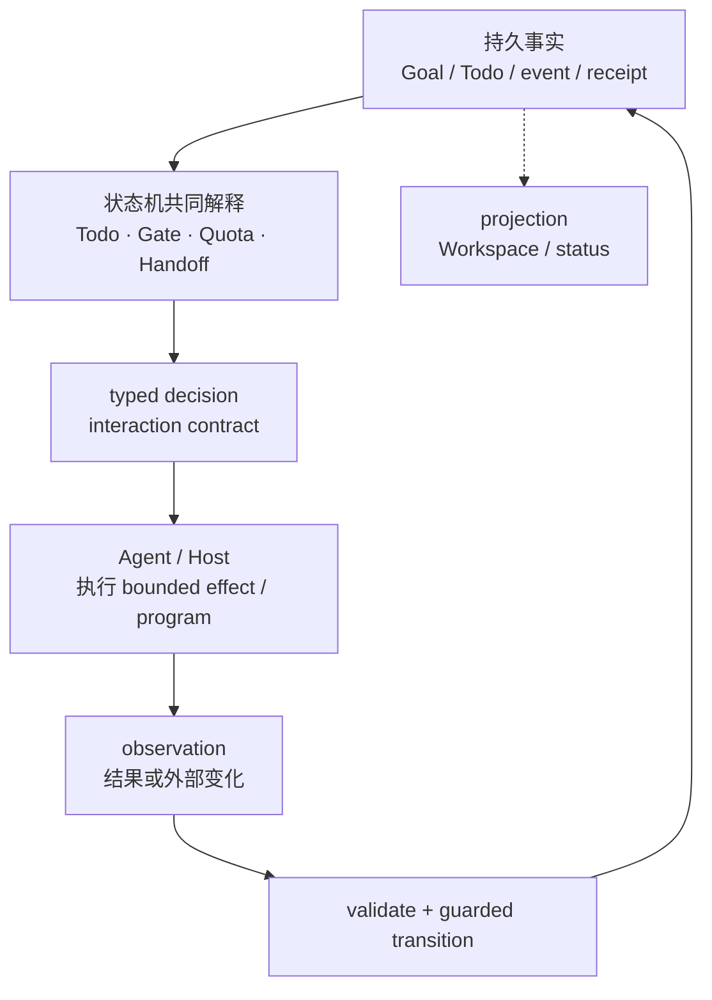
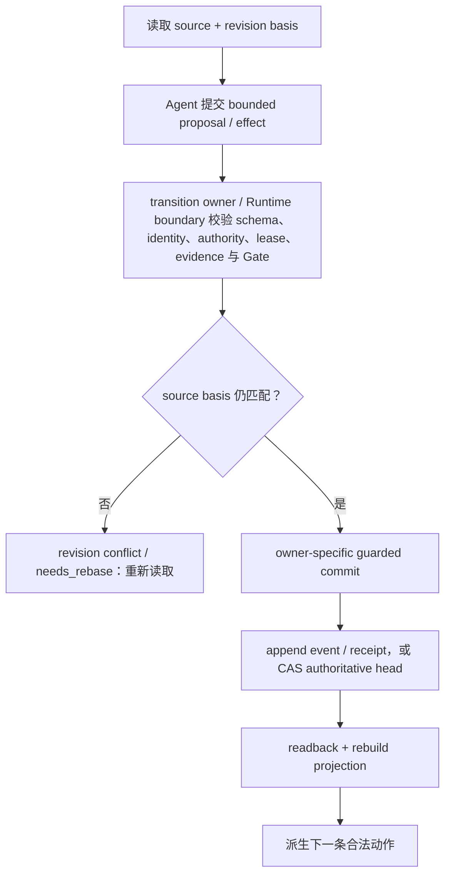
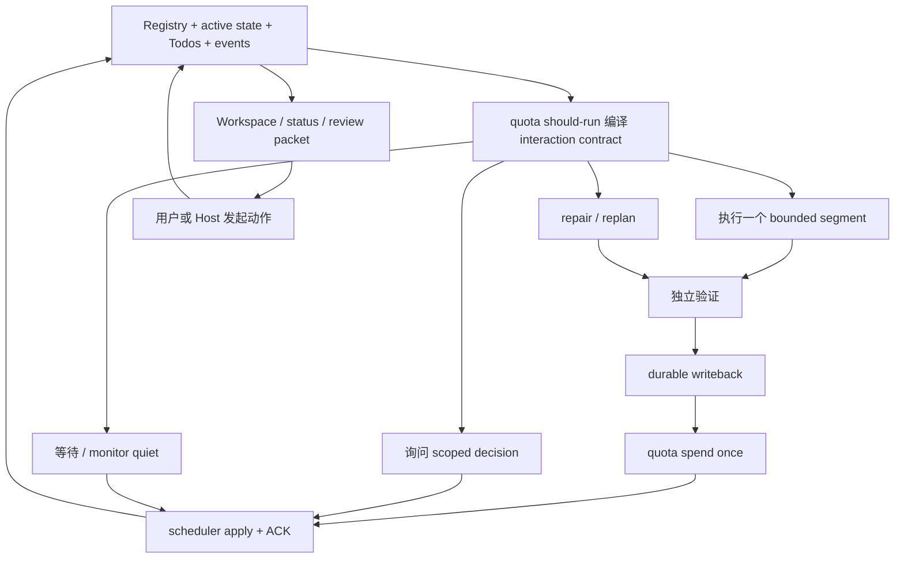
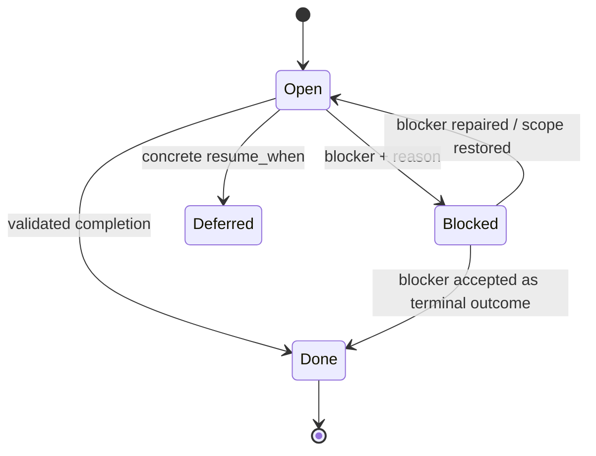
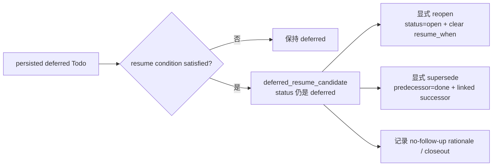
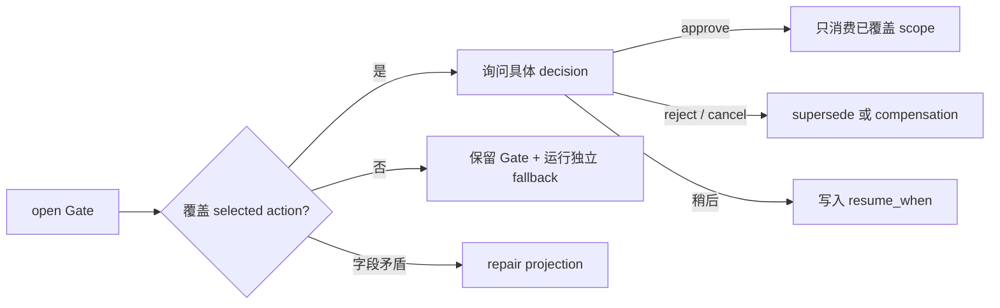
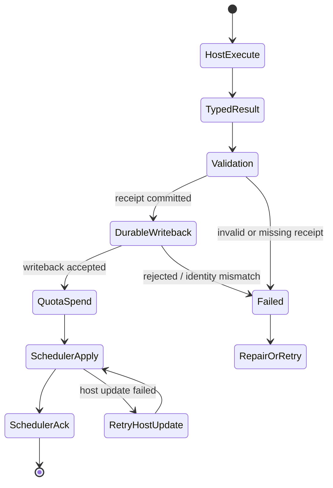
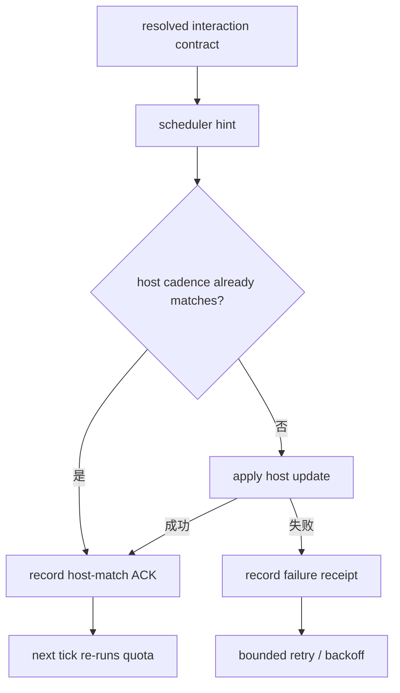
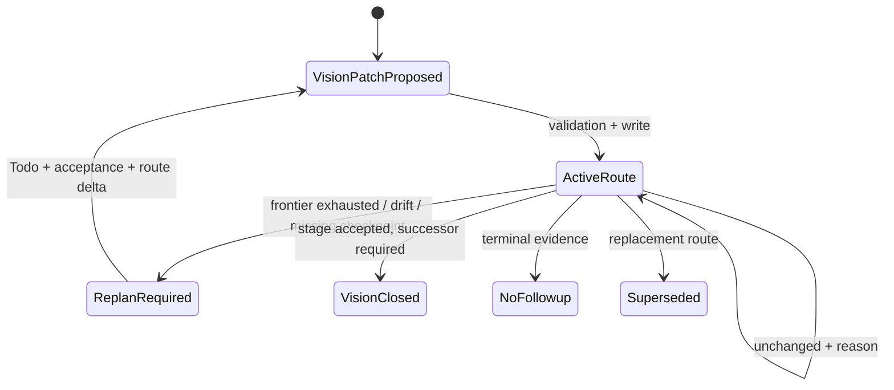
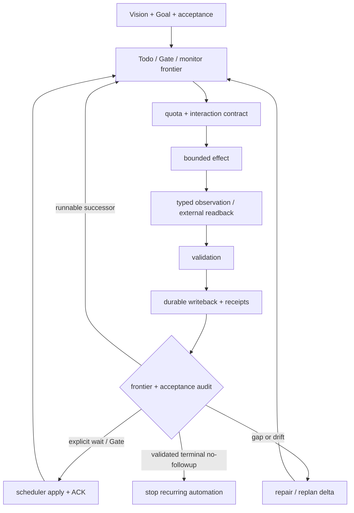

# 主要状态机与状态流转

先给结论：**LoopX 确实由多组状态机协作驱动；但最高一层不是
“九台机器互相发消息”，而是一条 effectful Agent Loop。** Harness 解释 Agent 或 Host 提出的
effect request，再由 Todo、Gate、Quota、Settlement、Scheduler 等领域状态机判断这一小段流程的
合法动作。它们通过持久事实、typed contract、guarded transition 和 receipt 衔接，而不是直接
覆盖彼此的状态。

LoopX 不靠一个巨型状态机推进 Goal。它把持久工作、单轮决策、证据结算、调度和界面投影
交给有明确 owner 的协作状态机。本章先建立名词和抽象层级，再解释为什么这样设计，随后看
协作总图，最后才逐组展开状态机。这样你可以先理解主线，再按需深入某一组规则。

## 先读哪一层：一条 Loop、三层抽象、九组状态机

同一套实现可以从三个抽象层级理解。先确定自己正在读哪一层，不要把不同层的名词混在一起：

- **外层 — Agent Loop**：问“一轮怎样接到下一轮？”最小模型是
  `effect request -> interpretation -> effect -> observation -> next effect`。
- **中层 — 控制面协议**：问“谁决定、谁执行、怎样证明？”关注 source facts、derived decision、
  guarded writeback、receipt 和 projection。
- **内层 — 领域状态机**：问“这个 bounded context 有哪些合法状态和边？”Todo、Gate、Quota、
  Handoff 等各自维护一张 interpretation table。

所以“LoopX 是多状态机系统”在内层是对的；在外层，更准确的说法是：**一条 Agent Loop 由
多组有边界的状态机共同解释和约束。** 状态机是 Harness 内部的决策表，不是九个平级微服务，
也不是九个 Agent。

## 先认识名词：把“事实、判断、动作、证明”分开

下面这些词会反复出现。第一次阅读只需记住“它是什么”和“它不是什么”：

先把一轮读成一句白话：**Goal 给出长期边界，frontier 给出当前工作，控制面派生本轮 decision，
Agent / Host 执行 effect，observation 经验证后写回事实，receipt 与 projection 再把下一轮接起来。**

- **目标与工作 — Goal、Todo、frontier、Vision / replan**：Goal 是长期 identity 与边界；Todo
  是工作项；frontier 是当前可继续的工作边界；Vision / replan 保存路线和改道依据。它们不是一个
  可整体覆盖的大 Goal 对象，“一条 Todo 完成”也不等于“Goal 完成”。
- **事实与视图 — source / authoritative fact、derived decision、projection**：source 是 owner
  可持久写入的事实；decision 是规则算出的本轮判断；projection 是给 Agent、Host 或人看的视图。
  页面显示的字段不一定可写，projection 也不是第二套事实源。
- **动作与证明 — effect request / proposal、observation、transition、evidence、receipt**：proposal
  请求动作；observation 报告外部事实；transition 接受合法变化；evidence 支撑判断；receipt 证明
  有 identity 的提交已经发生。Agent 的请求不等于授权，工具返回也不自动等于完成。
- **约束与运行 — Gate、lease、quota、Scheduler / heartbeat、Host / Runtime**：它们分别限定
  决定范围、临时执行权、本轮计算资格、再次唤醒时间和 effect 执行；不是五种同义的全局锁。

### 先分清三种“状态”

控制面里显示为状态的字段，不一定都能直接写入。最重要的第一步，是按所有权分层：

- **Source state** 是可持久、可回放的事实，例如 Todo `status`、`claimed_by`、Goal
  `activation_state`、event 和 scheduler receipt；只有对应 write API 或 owner service 能改变。
- **Derived decision** 是 facts 经规则编译出的本轮判断，例如 quota `eligible`、`operator_gate`、
  handoff `cleared_with_successor` 和 `interaction_contract`；不能直接改，要改 source 后重算。
- **Projection** 是给人或 Host 读取的视图，例如 Workspace 卡片、status、review packet 和
  scheduler hint；它可重建，用户动作仍须回到 write API。

最常见的错误，是把派生结果当成可写事实。例如 Todo 并没有持久的 `running` 状态；运行中由
当前 quota selection、lease 和 run history 共同推导。Workspace 中把卡片拖到“完成”，也不能绕过
Todo completion、evidence 和 receipt 的 owner。

## 为什么这样设计，而不是一个大状态机？

拆分不是为了增加名词，而是因为这些状态天然有不同的变化原因：

1. **寿命不同**：Todo 和 evidence 要跨会话保存；quota decision 只对当前 Turn 有效；projection 随时可以重建。
2. **权限不同**：Agent 可以提出 effect；Host 可以执行 effect；只有对应 transition owner 能接受事实变化。
3. **失败恢复不同**：网络调用需要 reconcile，Todo 冲突需要 rebase，显示漂移只需重新 projection。
4. **并发边界不同**：Goal identity、Todo snapshot、lease 和 provider revision 不能伪装成一个全局整数版本。
5. **审计问题不同**：系统必须分别回答“为什么选择它”“实际发生了什么”“谁接受了结果”“下一轮为何继续”。

如果把它们压进一个 `Goal.status` 或允许 Agent 整体覆盖 `GoalState`，一次写入就可能误删其他
Agent 的进展；一次网络超时也无法判断该重试、回读还是补偿；界面字段还会反向变成事实源。

协作不等于互相发消息。九组状态机主要通过四种稳定接口连接：

1. **Source facts**：Todo、event、lease、Vision 和 receipt 供 reducer / interpreter 只读。
2. **Typed decision / effect**：`interaction_contract`、selected action 和 scheduler hint 告诉 Agent
   或 Host 执行哪个 bounded action。
3. **Guarded transition**：owner 校验 proposal、identity、revision basis 和 evidence 后，提交 event、
   receipt 或 CAS。
4. **Readback / projection**：committed facts 与 operation receipt 重建 Workspace/status，并派生下一轮 effect。

## 先看协作骨架：状态机通过事实与协议接力

这张图只画主循环，不展开任何一组内部状态。它回答“多组状态机怎样一起驱动”：左侧的状态机
读取共同事实并参与解释，本轮只产生一个有界 effect 或有序 effect program；外部 observation 必须经过验证与写回，才能
成为下一轮可读的事实。



这不是“状态机 A 调用状态机 B”的时序图。真正接力的是 source facts、typed decision、effect、
observation 和 receipt；每个状态机只负责自己的 decision table 与合法 transition。

## 从 L0 到 L4：用这些名词回答五个架构问题

### L0：为什么需要 LoopX？

长程 Agent 的模型上下文适合推理，却不适合独自承担 execution state。上下文会被压缩、切换或
重启；外部 effect、权限、多人协作、等待条件和验收证据的寿命通常比一次会话更长。若把这些事实
只留在对话里，下一轮就无法可靠回答“什么已经发生、谁获准继续、是否应当重试、Goal 是否完成”。

因此 LoopX 把控制面放在模型上下文之外：状态持久化、变化可回放、写入受 guard 约束，再把当前
需要的 bounded view 投影给 Agent。模型负责判断和提出动作；控制面负责保存事实、约束流转并在
下一轮重新派生合法动作。

### L1：控制面有哪些组件？

| 组件 | 职责 | 在 LoopX 中的典型载体 |
| --- | --- | --- |
| **Goal** | 提供要推进的目标语义与 identity；当前实现并未把全部 intent 收进一个 typed owner | registry identity、active state、Agent Vision 与 Todo frontier |
| **Authoritative state** | 保存可恢复的执行事实 | registry、Todo/event source、run history、receipt |
| **Evidence** | 证明结果、阻塞或外部 effect 的真实状态 | artifact ref、validation/readback、rollout/rollback event |
| **Transition** | 校验并提交一次合法状态变化 | Todo/Goal write API、settlement、scheduler ACK |
| **Projection** | 把 facts 编译成面向 Agent、Host 或人的视图 | quota/status、Workspace、review packet |
| **Runtime** | 解释本轮 decision 并执行有界 effect | Codex App/CLI、heartbeat、extension provider |

这些组件不是一条由 Runtime 随意覆盖的 JSON。Runtime 是 effect executor；authoritative state 与
transition owner 才决定事实是否真的改变。

### L2：authoritative state 长什么样？

为了理解，可以先把理想的 Goal 控制面想象成下面的**概念聚合视图**。它描述希望一次读取能够
回答的问题，不是 LoopX 1.0 已经提供的统一 schema：

```yaml
GoalControlSnapshot:                 # desired read model，不是当前唯一可写 schema
  identity:
    goal_id: ...
    activation_state: active | stopped
  intent:
    objective: ...
    acceptance: ...
    terminal_conditions: ...
  frontier:
    completed_requirements: [...]
    pending_requirements: [...]
    todos: [...]
    gates_and_blockers: [...]
  outcome:
    artifacts: [...]
    evidence_refs: [...]
  basis:
    revision_basis: state_event_log | markdown_active_state | canonical_todo_snapshot
    state_event_basis_sequence: ...
    source_basis_digest: ...
    todo_basis:                      # canonical Todo snapshot 单独的 revision basis
      source_authority: file_v0
      provider_revision: ...
      records_sha256: ...
```

LoopX 1.0 **没有一个可以整体覆盖的 `GoalState` 大对象**。更重要的是，`objective`、non-goals、
acceptance、permissions 和 terminal conditions 目前还没有统一的 typed canonical storage；上面的
`intent` 是目标模型，不应被描述成已经落地的 authoritative envelope。当前 shared Goal alignment 是
只读聚合：它从 event log、Markdown active state 或 canonical Todo snapshot 取得 source basis，并用
独立 `todo_basis` 标识 Todo/lease snapshot，再投影 drift 与 conflict：

| 常见抽象字段 | LoopX 的实际表达 |
| --- | --- |
| `goal_id` | registry 与所有 goal-scoped event 的稳定 identity |
| `phase` | Goal activation 只有 `active | stopped`；阶段路线属于 Agent Vision / Todo，而不是通用 Goal phase |
| `objective` / `acceptance` / `permissions` / terminal conditions | 目前分散在项目材料、Vision、Todo 与运行约束中；没有统一 typed canonical intent revision |
| `completed_requirements` / `pending_requirements` | 由可用的 Todo、Vision checkpoint、acceptance gap 和 frontier facts 聚合；不是独立可写列表 |
| `artifacts` / `evidence` / `blockers` | 保存在 Todo、run、event 和 receipt 中的引用与 typed facts |
| `version` | 按 owner 使用 event `append_sequence`、source checksum 或 opaque provider revision；不存在全局 Goal version |

这就是前述 owner 分离在当前实现中的具体形状：读时可以聚合，写时仍回到各自的 authority。

### L3：Agent 怎样修改 authoritative state？

Agent 提交的是 proposal 或 typed effect，不是“我认为新状态应该长这样”的全量覆盖：



这里的“CAS”是并发控制原则，不是假装全仓只有一个整数 `version`：

- event-sourced Todo 会比对 validation 时的 checksum、last event 与 append sequence，匹配后追加事件；
- shared authority store 以 opaque `expected_provider_revision`（file provider 中对应 generation）做真正的 compare-and-swap；`authority_revision` 和 `lease_epoch` 不能代替它；
- local-state correctness 模块会在 dry-run/shadow 中构造 `expected_revision`、per-Goal lock、lease 与 idempotency envelope；它明确不代表当前 apply path 已执行这些保证，实际 lock、write 与 event 仍由 caller 负责；
- settlement 再以 `goal_id + agent_id + turn_instance_id` 绑定 writeback、spend 与 scheduler receipt。

对应的源码锚点分别是
[`event_writeback.py`](https://github.com/huangruiteng/loopx/blob/main/loopx/control_plane/todos/event_writeback.py)、
[`local_state_write_correctness.py`](https://github.com/huangruiteng/loopx/blob/main/loopx/control_plane/runtime/local_state_write_correctness.py)、
[`authority_store.ts`](https://github.com/huangruiteng/loopx/blob/main/loopx/control_plane/coordination/authority_store.ts)、
[`coordination/executor.py`](https://github.com/huangruiteng/loopx/blob/main/loopx/control_plane/coordination/executor.py)
和 [`settlement.py`](https://github.com/huangruiteng/loopx/blob/main/loopx/control_plane/turn_driver/settlement.py)。

所以正确流程是“读 basis -> 提案 -> 验证/guard -> guarded commit -> 事件或 receipt -> 回读”，而不是
Agent 直接覆盖一份看似完整的状态。

### L4：Agent 判断错了怎么办？

控制面把“判断错误”和“外部副作用已经发生”分开恢复：

| 错误位置 | 保护或恢复方式 | 不能做什么 |
| --- | --- | --- |
| proposal 本身不合法 | schema、authority、Gate、evidence validation 拒绝写入 | 先写再补理由 |
| 读取后 source 已变化 | revision conflict / `needs_rebase`，重新读取并 replan | 静默覆盖新事实 |
| 外部 effect 仍为 `running` 或结果未知 | 用同一 invocation / idempotency identity `reconcile` | 重复启动同一个 effect |
| 受 settlement journal 管理的 provider step 已 prepared，但 writeback 中断 | 用同一 `effect_ref` 回读：`committed` 复用结果，`absent` 才执行，`unknown` fail closed | 未证明 absent 就重做 provider step |
| 已提交的 effect 后来证明错误 | 追加 rollback / compensation evidence，并生成 successor 或 replan | 删除旧 event、伪造从未发生 |
| projection 与 source 不一致 | 修 source 或 projection builder 后重新投影 | 直接改 dashboard 当作修复 |

这也是为什么 side effect 必须独立建模：模型可以改主意，外部世界却不能靠改一段上下文回滚。
LoopX 通过 validation、版本/identity guard、reconcile、补偿事件和 replan，把错误变成下一条可验证
transition，而不是让它成为一段失去来路的聊天结论。这里的幂等恢复保证有明确边界：它适用于带
持久 journal、`effect_ref` 和 provider readback resolver 的 settlement step；不能外推成“任意外部工具
调用都会自动去重”。resolver 缺失、报错或返回未知状态时，settlement 会 fail closed。

## 九组状态机怎样组成一条 Loop

现在再看状态图。维护者级地图把控制面拆成九组协作状态机；“九”是当前核心规则的教学地图，
不是一个要求所有 extension 都注册九台 runtime service 的协议常量。本书按读者任务把它们组织为四层：

| 层 | 主要机器 | 回答的问题 |
| --- | --- | --- |
| 持久工作与权限 | Todo lifecycle、Gate decision scope、Owner route / handoff | 做什么、谁能做、什么决定仍缺失？ |
| 单轮执行与结算 | Quota / runtime、Evidence / rollout / rollback | 这一轮能否运行，什么结果可以写回并计费？ |
| 长程连续性 | Scheduler / heartbeat、Agent Vision / replan | 何时再唤醒，何时必须改路线而不是重复？ |
| 接入与呈现 | Projection sink、Agent onboarding / automation enablement | Goal 怎样进入运行面，状态怎样安全显示？ |



图中没有从 projection 直接连回 decision 的写入捷径。界面只能发起受治理动作；真正的 state
transition 仍由 write API、validation 和 receipt 完成。箭头表示事实和 contract 的依赖关系，
不是状态机之间的进程消息。

## 1. 持久工作：Todo、Gate 与 Handoff

### Todo lifecycle：只有四个持久 status

[`loopx/control_plane/todos/contract.py`](https://github.com/huangruiteng/loopx/blob/main/loopx/control_plane/todos/contract.py)
定义 Todo 的持久状态：

```text
open | done | blocked | deferred
```

`claimed_by`、`resume_when`、`superseded_by`、`unblocks_todo_id` 和 `no_followup` 是正交字段，
不是更多 status。它们共同决定下一条合法路径。



`done` 与 `deferred` 都属于 terminal status，但“恢复条件满足”本身不会改写 status。它先产生一个
派生候选，再要求显式选择后续 lifecycle 动作：



| Source / derived field | 所有权 | 正确理解 |
| --- | --- | --- |
| `status` | Todo contract | 持久 lifecycle；不要发明第五个 status |
| `claimed_by` | Todo metadata | routing signal，不是分布式锁 |
| task lease | lease lifecycle | 有时限的执行权；过期后可恢复 |
| `Running` | quota + lease + run history 派生 | 当前有 bounded attempt，不应写回 Todo status |
| `superseded_by` | Todo relation | 保留历史并指向 replacement，不等于删除旧 Todo |
| `resume_when` | Todo relation | deferred 的可验证恢复条件，不是模糊的“以后再看” |

禁止的流转包括：没有 completion evidence 就把 `open` 改成 `done`；仅凭 claim 就宣称任务正在
执行；把条件满足当成自动 `deferred -> open`；删除被 supersede 的历史；把“等用户看看”写成没有
machine-readable 条件的 deferred。`supersede` 也不是简单的 `deferred -> done` 边：命令会把 predecessor
记为 `done`、写入 `note=superseded`，并创建和链接 successor。

### Gate：约束 decision scope，不冻结整个 Goal

Gate 的 source 是 `task_class=user_gate`、`decision_scope`、`required_decision_scopes`、
`global_gate` 和 agent blocking fields。它先回答“这个决定覆盖哪条 action/lane”，再决定本轮是
询问用户还是运行独立 fallback。



因此 `user_channel.action_required=true` 和 `agent_channel.must_attempt=true` 可以同时成立。前者要求
呈现 owner-held decision；后者只授权不依赖该 decision 的明确工作。

### Handoff：clear 不等于路线完整

[`handoff_gate.py`](https://github.com/huangruiteng/loopx/blob/main/loopx/control_plane/todos/handoff_gate.py)
从 Todo relation 派生六种 handoff state：

| 派生状态 | 含义 | 下一步 |
| --- | --- | --- |
| `blocking` | 当前 Agent 仍被 owner route 阻塞 | quiet wait 或呈现具体 Gate |
| `cleared_with_successor` | blocker 已完成，且 successor 已存在 | 路由到 successor |
| `cleared_without_successor` | blocker 已完成，但没有 successor / no-follow-up | 先做 successor replan |
| `cleared_no_followup` | owner 明确结束后续 | closeout |
| `superseded` | replacement Todo 已存在 | 跟随 replacement |
| `deferred` | resume condition 尚未满足 | 等待或观察条件 |

这些值是 projection，不应被手工写入。修复 `cleared_without_successor` 的方式是新增合法 successor、
重开工作或记录 `no_followup`，而不是把显示值改成 `cleared_with_successor`。

## 2. 单轮执行：Quota、Interaction Contract 与 Settlement

### Quota runtime：先判定行为，再考虑 spend

[`loopx/control_plane/quota/states.py`](https://github.com/huangruiteng/loopx/blob/main/loopx/control_plane/quota/states.py)
固定了 quota runtime state 的判定优先级：

```text
1. blocked_health
2. operator_gate
3. focus_wait
4. eligible
5. waiting
6. throttled
7. paused
```

这是 reducer 在多个条件同时出现时使用的 precedence，不是 `blocked_health` 会依次流转到 `paused`
的状态图。每轮都从当前 source facts 重新判定。

| Runtime state | 本轮合法动作 | 常见恢复路径 |
| --- | --- | --- |
| `blocked_health` | 在 authority 允许时修 registry、projection、workspace 或 capability | 验证 repair 后重新计算 |
| `operator_gate` | 呈现具体 owner decision | approve / reject / defer 后重新计算 |
| `focus_wait` | 只恢复指定 outcome 或 fresh evidence | 写 recovery evidence 或 compact blocker |
| `eligible` | 执行唯一 selected bounded action | 进入 settlement |
| `waiting` | 观察明确 external handle，或 quiet wait | material observation / condition satisfied |
| `throttled` | 不执行交付 | 等待 quota window 或 owner adjustment |
| `paused` | 不执行自动 Turn | 显式 resume；`active/stopped` 由 Goal activation owner 管理 |

Quota state 不是单独的授权。`interaction_contract` 还会给出 user、agent、CLI channel、workspace
guard、capability gate、selected Todo、execution obligation 和 scheduler hint。Agent 必须执行的是
`must_attempt_work` 是布尔 obligation：为 `true` 时，本轮必须尝试 bounded work 并写回；它本身不选择
动作。需要选择 Todo 时先执行 `selection_command`，否则执行 capability packet 或
`next_cli_actions[0]` 指定的动作。Quota guard、选择、refresh、spend 和 scheduler settlement 必须复用
同一个 `turn_instance_id`；不能从 `NOTIFY`（只控制用户输出）或孤立的 `should_run` 自行推断动作。

### Settlement：成功必须按事务顺序落地

[`turn_transaction_contract.json`](https://github.com/huangruiteng/loopx/blob/main/loopx/control_plane/turn_transaction_contract.json)
定义完整 Turn 的阶段：

```text
host_execute
  -> typed_result
  -> validation
  -> durable_writeback
  -> quota_spend
  -> scheduler_apply
  -> scheduler_ack
```



Settlement identity 绑定 `goal_id + agent_id + turn_instance_id`，再且仅再绑定一个 Todo 或一个
autonomous replan obligation。它防止旧 Turn、其他 Agent 或其他工作项的 receipt 被误用。

必须保持三条不变量：

1. validation receipt 缺失时不能 durable writeback；
2. durable writeback 缺失或被拒绝时不能 spend；
3. scheduler apply 没有 ACK 或 fail receipt 时不能假装 Host 已更新。

失败不是删掉 transaction。`receipt_missing`、`identity_mismatch`、`writeback_rejected`、
`quota_spend_rejected` 等失败种类会把控制权交给 repair/retry，并保留 effect identity 以实现幂等。
如果 journal 留下 prepared provider effect，恢复器必须先按相同 `effect_ref` 做 provider readback：
只有 `absent` 可以重新执行，`committed` 直接采用已提交 payload；resolver 不存在、抛错或返回未知
状态都会 fail closed。这项保证只覆盖由 settlement journal 与 resolver 管理的步骤。

### Evidence / rollout / rollback：追加补偿事实，不改写历史

Evidence machine 决定“这次流转是否可信”，而不决定用户希望系统做什么。它把一项假设推进为
可接受事实，或保留为明确 blocker：

```text
hypothesis
  -> evidence bundle
  -> validated snapshot | blocker evidence
  -> rollout event + mutation anchor
  -> optional rollback / compensation event
  -> successor
```

artifact ref、test/build 结果、外部 readback、commit/PR/doc revision 都可以成为 mutation anchor。
Rollback 不删除原 evidence 或 rollout event；它追加一个补偿事实，并通常创建或解锁 successor。
因此“把旧状态改回去但不记录原因”不是合法恢复，也无法证明后续 projection 基于哪条事实。

## 3. 长程连续性：Scheduler、Monitor 与 Vision

### Scheduler / heartbeat：决定何时再看，不决定能否做事

Scheduler hint 从已确定的 quota 和 interaction contract 派生。常见 action 包括立即运行、等待用户、
等待 reassignment、等待 material transition、等待 fresh evidence、等待任意 state change，以及停止或
return-to-owner。停止不只来自 Goal 闭环：Goal `stopped`、quota paused 和 peer coordination blocked
也会停止轮询或把控制权交回 owner；只有 `terminal_no_followup` 表达“因已验证 Goal closure 而停止”。
具体 cadence 由 runtime profile 和 scheduler owner 决定。



`reset_token` 或 identity 改变时，cadence 回到初始档；同一 unchanged identity 才逐步 backoff。调度
变化本身不 spend，也不能把一个 paused/blocked Goal 变成 eligible。

### Continuous Monitor：观察也是有界状态机

Monitor Todo 必须带 bounded stop/resume 信息，例如 `expires_at`、`resume_when` 或有界 no-change
策略。一次 poll 只写 compact observation：`last_checked_at`、`result_hash`、
`consecutive_no_change` 与是否 material change。外部网络 poll、quota settlement 和显示投影是独立
effect；外部结果必须先成为 typed observation，才能进入 Monitor 写事务。

- 未到 `next_due_at`：quiet no-op，不 poll、不 spend；
- 到期但无变化：写 no-change receipt，按策略 backoff；
- material change：写 observation，并按显式 intent 生成独立 successor / Gate，再重新计算 quota；
- 到达 expiry 或 stop condition：完成 Monitor，并连接 successor 或 `no_followup`。

对于已经显式提升到 shared authority 的 Goal，
[`todo_monitor_poll.ts`](https://github.com/huangruiteng/loopx/blob/main/loopx/control_plane/coordination/todo_monitor_poll.ts)
会在同一个 canonical revision、同一次 CAS 和同一 durable operation receipt 中提交**无 lease 的
observation 与它请求的独立 successor**。事务先校验 actor 注册、claim/binding/exclusion、Monitor
仍处于 active 状态，以及 material-change generation 确实前进；任何校验失败都不会写入任一半。
相同 operation 的重试回放原 receipt 和原 successor，相同 evidence 不能借一个新的
`material_change=true` 再生成重复工作；no-change observation 只更新观察状态和下次 cadence，不创建
交付 Todo。

这里的“原子”有明确边界：它不包含外部网络 poll、quota spend 或 Markdown/dashboard delivery。
canonical commit 成功后，projection 仍可能处于 `pending`；outbox 只重试显示投影，
`retry_business_mutation=false`，不能再次执行已经提交的 observation/successor。没有提升 authority 的
Goal 仍走 legacy writer，因此这项保证不能外推成“整个 Goal 的所有状态已统一迁移”。

把 future `next_due_at` 当作 advancement frontier 是错误的：它只说明何时观察，不能替代“下一步
怎样推进 Goal”。

### Agent Vision / replan：路线改变必须成为 state delta

Vision 是 per-Agent 的有界可执行路线，不是 scratchpad。正常延续可以提交
`vision_unchanged_reason`；假设、scope、acceptance 或 route 发生 material change 时，必须提交
bounded Vision patch，并同步 Todo / acceptance delta。



`vision_closed` 关闭当前阶段但要求 successor；`no_followup`、`retired` 或 `superseded` 才表达对应
的收尾含义。只回复“已 replan”而没有 Vision、Todo、acceptance 或 no-follow-up delta，是
`replan_noop`，不能清除 obligation。

## 4. 接入与呈现：Activation、Onboarding 与 Projection

### Goal activation 不等于 automation 已启用

Goal activation 的 typed source 只有 `active` 与 `stopped`。`active` 表示控制面允许继续评估，
不证明已经安装 Host heartbeat，也不证明当前有 eligible work。完整 onboarding 还要经过：

```text
project registered
  -> registry/global visibility
  -> quota can resolve Goal + Agent
  -> optional Host consent and installation
  -> first real tick verified
```

相反，`stopped` 会把 automatic Turn 投影为 paused；删除 Goal 还要求单独的 lifecycle precondition，
不能把 stop、disable automation 和 delete 混成一个动作。

### Projection sink 只读事实，不拥有事实

Workspace、status、frontstage、review packet 和外部 dashboard 都是 projection sink：

```text
canonical source -> projection builder -> read-only view
                                      -> projection gap
```

projection gap 的正确恢复是修 source 或 builder，然后 read back。直接改 dashboard row 会制造第二
事实源；让公共 sink 读取 private raw document、credentials、transcript 或本地路径，会破坏
public/private boundary。

## LoopX 怎样体现“闭环”

LoopX 的闭环不是“Agent 做了一件事”，也不是 `Todo=done`。更准确的定义是：**一次 effect 的结果
经过验证后写回负责该事实的 authoritative source，并且控制面能据此派生出下一条合法动作，或证明
应当停止。**
如果结果只留在聊天、工作区文件、远端系统或 dashboard 文案里，没有 readback、durable writeback
和 frontier audit，这条链仍然是开环的。

LoopX 用四个嵌套层次完成这个反馈：

| 闭环层次 | 需要闭合的链 | 闭合证据 | 未闭合时的机器动作 |
| --- | --- | --- | --- |
| Effect 闭环 | request -> external effect -> observation / readback | exact revision、provider receipt、验证结果或明确失败 | reconcile、retry、rollback 或 blocker |
| Turn 闭环 | decision -> execute -> validate -> writeback -> spend -> scheduler ACK | 同一 settlement identity 下的有序 receipts；prepared effect 有 provider readback | 对受 journal 管理的 step 从失败 phase 恢复；未知 readback fail closed |
| Work-graph 闭环 | Todo -> outcome -> successor / Gate / monitor / `no_followup` | completion evidence 与可运行、可等待或明确终止的下一节点 | 暴露 succession / handoff / replan gap |
| Goal 闭环 | Vision + acceptance -> 多轮证据 -> frontier audit -> terminal | acceptance、Todo source、monitor、successor、handoff、replan 和 readback 全部闭合 | 继续、等待、询问、replan 或 repair，不能假装完成 |



### 闭环不等于一次成功：四个检查点

1. **结果回来了没有？** 外部 effect 必须有 typed observation 或 readback；“命令退出 0”不能替代
   provider、PR、文件 revision 或部署状态的权威回读。
2. **结果落盘了吗？** validation 通过后，evidence、Todo outcome、Vision checkpoint 和 Next Action
   必须通过 owner write API 持久化；聊天总结不是 writeback。
3. **下一步有归宿吗？** 完成一个 Todo 后必须存在 runnable successor、明确 Gate、带
   `resume_when` / `next_due_at` 的等待、repair/replan obligation，或者有证据的 `no_followup`。
4. **Host 知道继续还是停止吗？** scheduler apply 必须有 ACK 或 failure receipt；下一次唤醒重新读取
   canonical source。`terminal_no_followup` 是因 Goal 完成而停止 recurring automation 的依据。Goal
   `stopped`、quota paused 或 peer coordination blocked 也可能产生 stop/return-to-owner，但这些不能
   反证 Goal 已闭环。

### Terminal 是严格合取，不是“队列看起来空了”

[`loopx/control_plane/goals/goal_frontier/terminal.py`](https://github.com/huangruiteng/loopx/blob/main/loopx/control_plane/goals/goal_frontier/terminal.py)
中的 `goal_frontier_is_terminal_no_followup` 不接受一个手写的 terminal flag。它要求 Todo source
完整且闭合，并且 advancement、monitor、successor、handoff、replan、acceptance、autonomy blocker
等 frontier 均无未解决项；同时还需要结构化的 `no_followup` intent。

因此下列情况都**没有**闭环：

- PR 已创建，但没有 exact-head CI / review readback，也没有 monitor 或 successor；
- Todo 已标记 done，但 acceptance 仍未满足，或 Vision checkpoint 缺失；
- 外部操作成功，但 durable writeback 或 matching spend receipt 缺失；
- 所有可见 Todo 都为空，但仍有 due monitor、blocked successor、Gate 或 retryable sink；
- heartbeat 调整了 cadence，但 Host 没有 ACK，控制面却声称调度已生效。

真正的闭环也不要求结果一定是“成功”。经验证的 blocker、负向证据、rollback、retired 或
coverage-backed `no_followup` 都可以诚实收口；关键是结果可追溯、状态已回写，而且下一步或终止
条件由机器可验证。

## 一轮完整流转示例

假设一个 Agent 要补充公开文档，同时发布首页仍等待用户批准：

1. **读取 source：** 文档 Todo 为 `open` 且 claimable；首页 Gate 只覆盖 publication scope。
2. **编译 decision：** quota 为 `eligible`；user channel 呈现首页 Gate，agent channel 选择独立的
   文档 Todo。
3. **绑定 identity：** Turn 绑定当前 Goal、Agent、Todo 与唯一 `turn_instance_id`。
4. **执行：** Agent 在正确 worktree 完成一个 bounded doc change。
5. **验证：** 双语 smoke、strict build 和 boundary scan 产生 validation receipt。
6. **写回：** Todo evidence 记录 revision、验证和 next action；如果完成则创建 successor 或
   `no_followup`。
7. **计费：** writeback 成功后只 spend 一次。
8. **调度：** 重新计算后，若只剩首页 Gate，则选择 human-gate backoff；Host apply 并 ACK。
9. **投影：** Workspace 显示文档已完成、首页仍待决定。界面没有吞掉或扩大 Gate scope。

如果第 5 步失败，流转停在 validation；如果第 6 步失败，不得进入 spend；如果第 8 步 Host 更新
失败，记录 failure receipt 并有界重试，而不是宣称 cadence 已生效。

## 从症状定位 owner

| 症状 | 先检查 | 不要做 | 恢复动作 |
| --- | --- | --- | --- |
| UI 显示 running，但没有实际执行 | quota selection、lease、run history | 给 Todo 发明 `running` status | 修 projection 或 stale lease |
| Gate 让整个 Goal 停住 | decision scope 与 selected fallback | 删除 Gate 或默认 approve | 修 scope，重新计算 contract |
| blocker 已清除但 Agent 仍空转 | handoff state 与 successor relation | 手改 `gate_state` | 建 successor、reopen 或 `no_followup` |
| 已 spend，但找不到产物 | settlement receipt 与 durable writeback | 补一段聊天说明 | repair/compensation，并修 spend path |
| heartbeat 越等越久 | reset token、identity、ACK/failure receipt | 无条件缩短 cadence | 修 stale scheduler state |
| Monitor 一直 poll | `next_due_at`、result hash、stop condition | 把每次 poll 当 delivery | 写 bounded no-change / closeout |
| Monitor 有 observation，但没有期望的 successor | authority mode、operation receipt、material-change generation、projection outbox | 重跑 business mutation 或手改投影 | 回放同一 operation；只重试 pending projection，或用新 evidence 新建一代 |
| replan 后路线没变 | Vision/Todo/acceptance delta | 用“已重新规划”清 obligation | 写 material patch 或 unchanged reason |
| dashboard 与 CLI 冲突 | canonical source 与 projection freshness | 把 dashboard 当 source | 修 builder/source 后 readback |

## 源码领读入口

| 机器 | 首要事实或语义 owner | 深入阅读 |
| --- | --- | --- |
| Todo lifecycle | `loopx/control_plane/todos/contract.py` | [工作图、权限与 Peer 协作](./work-graph-and-authority.md) |
| Gate / handoff | `todos/contract.py`、`todos/handoff_gate.py` | [Control-Plane Course 第 5 讲](/loopx/docs/development/control-plane-course/05-work-graph-and-peers/) |
| Quota / interaction | `loopx/control_plane/quota/`、`loopx/quota.py` facade | [一轮受治理的工作](./03-one-turn.md) |
| Settlement | `effect_program.ts`、`turn_transaction_contract.json` | [Control-Plane Course 第 6 讲](/loopx/docs/development/control-plane-course/06-quota-decision-kernel/) |
| Scheduler / heartbeat / Monitor | `control_plane/scheduler/`、`coordination/todo_monitor_poll.ts` | [第 7 讲](/loopx/docs/development/control-plane-course/07-host-scheduler-and-heartbeat/) |
| Vision / replan | `control_plane/goals/goal_vision_*`、`work_items/*replan*` | [长程收敛专题](/loopx/docs/development/control-plane-course/topic-long-horizon-convergence/) |
| Activation / onboarding | `control_plane/goals/activation.py`、project bootstrap/connect | [连接你的 Git 项目](./05-connect-existing-project.md) |
| Projection | 对应 status/frontstage/Workspace builder | [持久状态与只读投影](./state-substrate.md) |

完整维护者级九机状态表见
[State Machines](/loopx/docs/product/core-control-plane/state-machine/)。修改规则时，不要从本章的教学图
反向复制实现；先确认当前 typed owner、协议 schema、characterization fixture 和 migration boundary。
