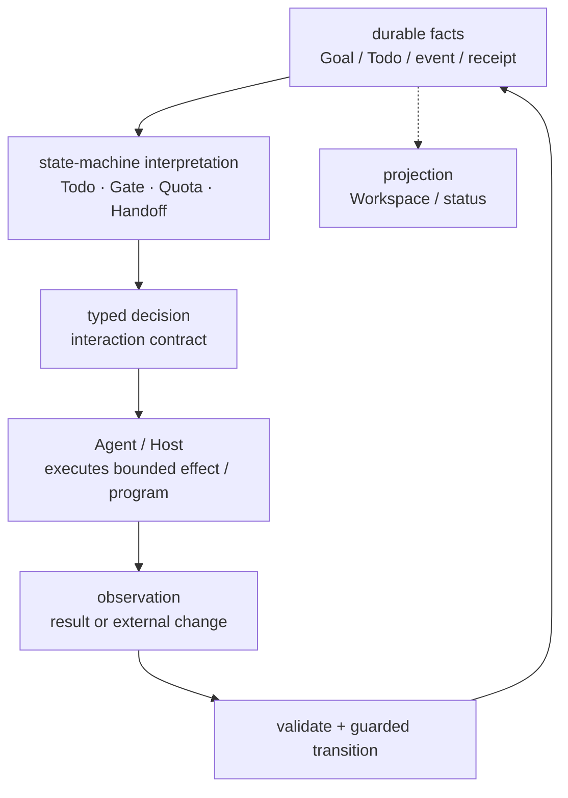
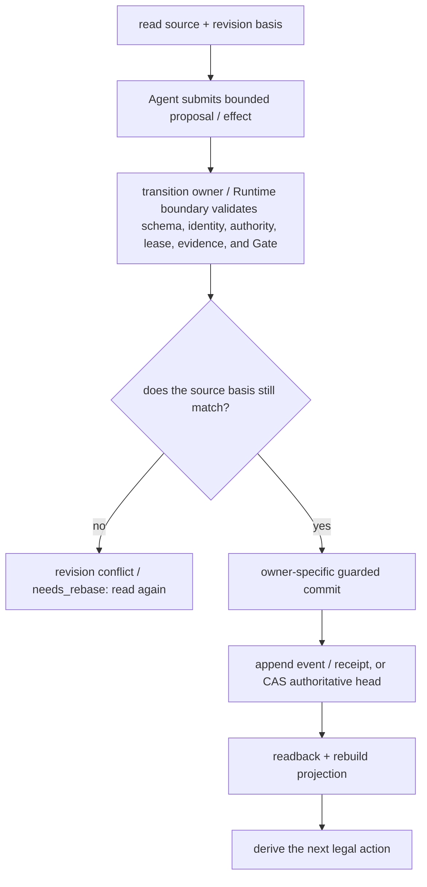
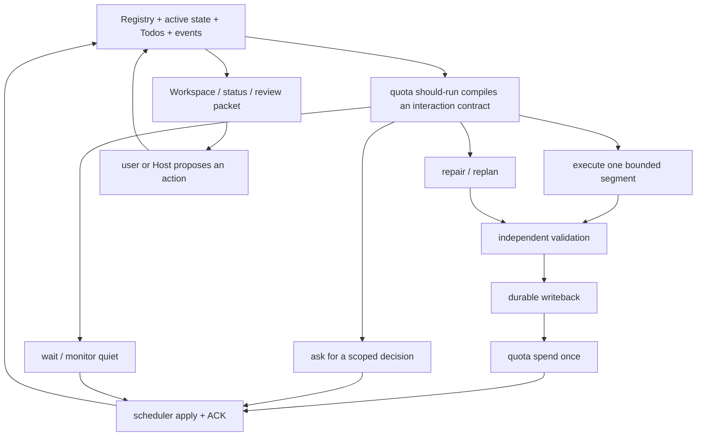
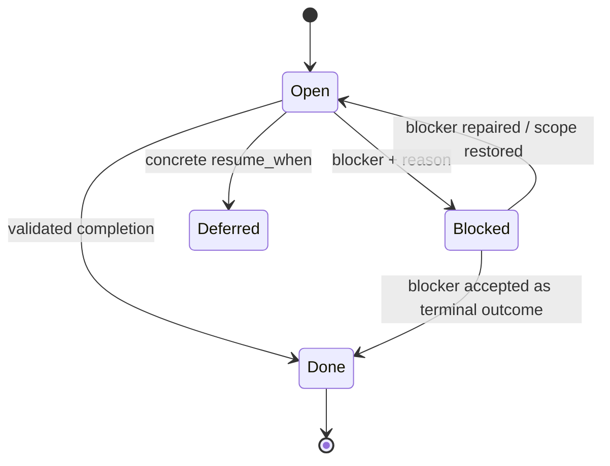
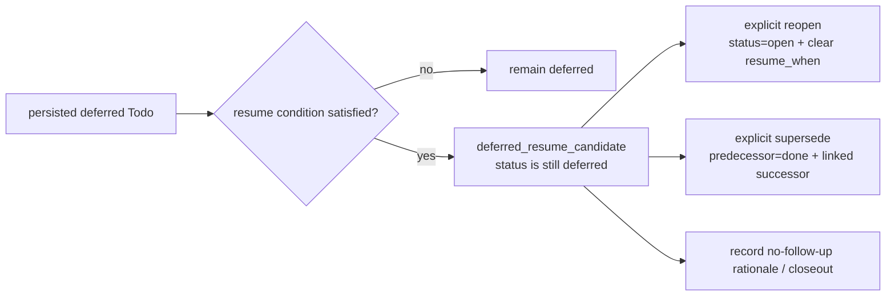
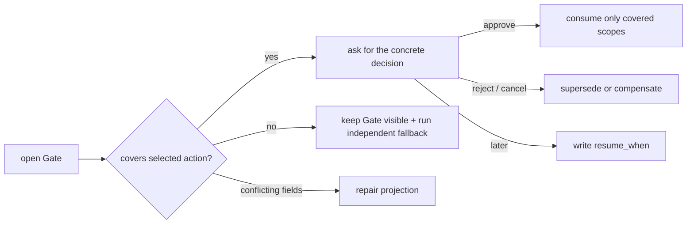
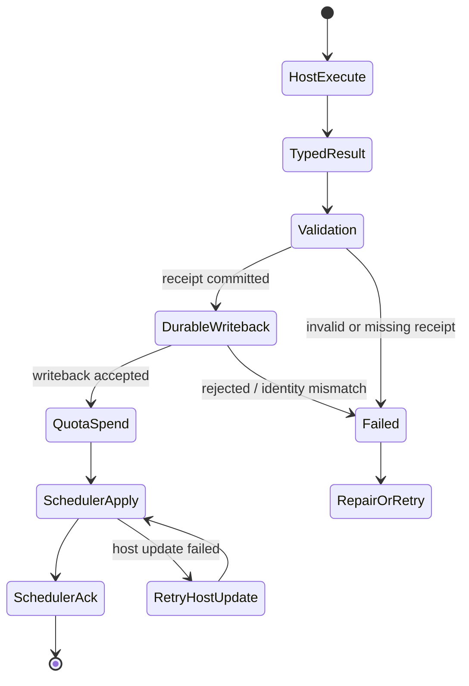
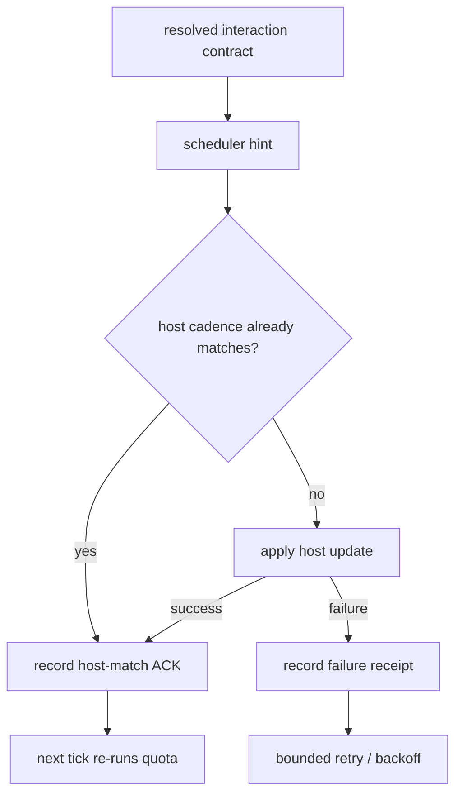
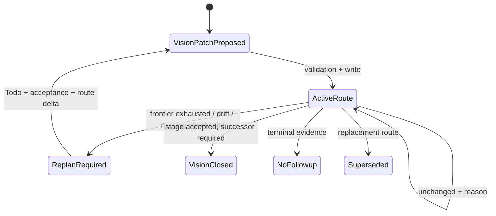
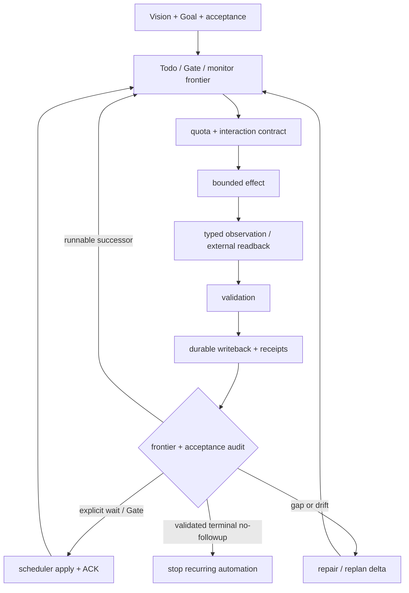

# Core state machines and transitions

The short answer is: **LoopX is driven by cooperating state-machine families, but its highest-level model
is not “nine machines messaging one another.” It is one
effectful Agent Loop.** The Harness interprets effect requests from an Agent or Host; bounded state
machines such as Todo, Gate, Quota, Settlement, and Scheduler then determine the legal action for their
part of the flow. They connect through durable facts, typed contracts, guarded transitions, and receipts
instead of overwriting each other's state.

LoopX does not advance a Goal through one giant state machine. It assigns durable work, turn decisions,
evidence settlement, scheduling, and UI projection to state machines with explicit owners. This chapter
establishes vocabulary and abstraction levels first, explains why the design is split this way, shows the
cooperation loop, and only then expands each state-machine family. You can understand the main path before
drilling into one rule family.

## Choose the level first: one Loop, three abstraction levels, nine state-machine families

The same implementation can be understood at three abstraction levels. First decide which level you are
reading; do not mix terms from all three:

- **Outer — Agent Loop** asks “how does one turn lead to another?” Its minimal model is
  `effect request -> interpretation -> effect -> observation -> next effect`.
- **Middle — control-plane protocol** asks “who decides, who executes, and how is it proved?” It focuses
  on source facts, derived decisions, guarded writeback, receipts, and projections.
- **Inner — domain state machine** asks “which states and edges are legal in this bounded context?” Todo,
  Gate, Quota, Handoff, and others each own an interpretation table.

So “LoopX is a multi-state-machine system” is correct at the inner level. At the outer level, the more
precise statement is: **one Agent Loop is interpreted and constrained by multiple bounded state-machine
families.** The machines are decision tables inside the Harness, not nine peer microservices or nine Agents.

## Vocabulary first: separate facts, decisions, actions, and proof

These terms recur throughout the chapter. On a first read, remember only what each one is and is not:

First read one turn in plain language: **the Goal supplies the long-running boundary; the frontier supplies
current work; the control plane derives this turn's decision; the Agent / Host executes an effect; a
validated observation becomes durable fact; and the receipt plus projection connects the next turn.**

- **Goal and work — Goal, Todo, frontier, Vision / replan**: Goal is the long-running identity and boundary;
  Todo is a work item; frontier is the viable-work boundary; Vision / replan preserves route and the basis
  for changing direction. They are not one whole-object Goal state, and one completed Todo is not Goal completion.
- **Facts and views — source / authoritative fact, derived decision, projection**: source is durable
  owner-written fact; decision is the current rule result; projection is a view for an Agent, Host, or person.
  Not every displayed field is writable, and projection is not a second source of truth.
- **Action and proof — effect request / proposal, observation, transition, evidence, receipt**: proposal
  requests an action; observation reports external fact; transition accepts legal change; evidence supports
  a judgment; receipt proves an identified commit. A request is not authority, and a tool result is not
  automatically completion.
- **Constraints and runtime — Gate, lease, quota, Scheduler / heartbeat, Host / Runtime**: these respectively
  scope decisions, grant temporary execution rights, determine turn eligibility, schedule the next wake,
  and execute effects. They are not five names for one global lock.

### First separate three kinds of state

Not every field displayed as state is directly writable. The most important first step is to classify it
by ownership:

- **Source state** is durable, replayable fact such as Todo `status`, `claimed_by`, Goal `activation_state`,
  events, and scheduler receipts. Only the corresponding write API or owner service may change it.
- **Derived decision** is a current-turn judgment compiled from facts, such as quota `eligible`,
  `operator_gate`, handoff `cleared_with_successor`, and `interaction_contract`. Change source and recompute it.
- **Projection** is a view for a person or Host, such as Workspace cards, status, review packet, and scheduler
  hint. It is rebuildable, and user actions still return to a write API.

A common mistake is treating a derived result as writable truth. A Todo has no durable `running` status;
running is derived from current quota selection, a lease, and run history. Moving a Workspace card to
done also cannot bypass the owners of Todo completion, evidence, and receipts.

## Why this design instead of one large state machine?

The split does not exist to create terminology. These states change for fundamentally different reasons:

1. **Different lifetimes**: Todos and evidence survive sessions; a quota decision is valid for one Turn; a projection can always be rebuilt.
2. **Different authority**: an Agent may propose an effect, a Host may execute it, and only the transition owner may accept a fact change.
3. **Different recovery**: a network call needs reconciliation, a Todo conflict needs rebase, and display drift only needs reprojection.
4. **Different concurrency boundaries**: Goal identity, Todo snapshot, lease, and provider revision cannot be disguised as one global integer version.
5. **Different audit questions**: the system must separately answer why an action was chosen, what happened, who accepted it, and why another turn should run.

Collapsing these concerns into `Goal.status` or allowing an Agent to replace `GoalState` wholesale could
erase another Agent's progress. A network timeout would no longer say whether to retry, read back, or
compensate. Display fields would also drift into becoming sources of truth.

Cooperation does not mean direct messaging. The nine state-machine families connect primarily through
four stable interfaces:

1. **Source facts**: reducers / interpreters read Todo, event, lease, Vision, and receipt facts.
2. **Typed decision / effect**: `interaction_contract`, the selected action, and the scheduler hint tell an
   Agent or Host which bounded action to perform.
3. **Guarded transition**: the owner validates proposal, identity, revision basis, and evidence before
   committing an event, receipt, or CAS.
4. **Readback / projection**: committed facts and the operation receipt rebuild Workspace/status and derive
   the next effect.

## See the cooperation skeleton first: facts and protocols connect the machines

This diagram shows only the main loop, not the internal states of any family. It answers how multiple
state machines drive one system: the machines on the left read shared facts and participate in
interpretation; one turn emits one bounded effect or ordered effect program; and an external observation must be validated and
written back before it becomes fact for the next turn.



This is not a sequence diagram in which state machine A calls state machine B. Source facts, typed
decisions, effects, observations, and receipts are what pass between stages. Each machine owns only its
decision table and legal transitions.

## L0 through L4: use the vocabulary to answer five architecture questions

### L0: Why does LoopX need to exist?

A long-running Agent's model context is useful for reasoning, but it cannot be the sole owner of execution
state. Context may be compacted, switched, or restarted, while external effects, permissions, collaboration,
wait conditions, and acceptance evidence often outlive one session. If those facts exist only in a
conversation, the next turn cannot reliably answer what happened, who may continue, whether to retry, or
whether the Goal is complete.

LoopX therefore keeps the control plane outside model context: state is durable, changes are replayable,
writes are guarded, and a bounded current view is projected back to the Agent. The model reasons and
proposes actions; the control plane preserves facts, constrains transitions, and derives the next legal
action on the following turn.

### L1: Which components make up the control plane?

| Component | Responsibility | Typical LoopX carrier |
| --- | --- | --- |
| **Goal** | Supplies the objective semantics and identity to advance; the current implementation does not place all intent under one typed owner | registry identity, active state, Agent Vision, and the Todo frontier |
| **Authoritative state** | Preserves recoverable execution facts | registry, Todo/event source, run history, receipts |
| **Evidence** | Proves an outcome, blocker, or external effect state | artifact refs, validation/readback, rollout/rollback events |
| **Transition** | Validates and commits one legal state change | Todo/Goal write APIs, settlement, scheduler ACK |
| **Projection** | Compiles facts into views for an Agent, Host, or person | quota/status, Workspace, review packet |
| **Runtime** | Interprets the turn decision and executes a bounded effect | Codex App/CLI, heartbeat, extension provider |

These components are not one JSON document that a Runtime may overwrite. The Runtime executes effects;
authoritative-state and transition owners decide whether facts actually changed.

### L2: What does authoritative state look like?

For orientation, first imagine the desired Goal control plane as this **conceptual aggregate view**. It
describes the questions one read should answer, not a unified schema already implemented in LoopX 1.0:

```yaml
GoalControlSnapshot:                 # desired read model, not the one writable schema
  identity:
    goal_id: ...
    activation_state: active | stopped
  intent:
    objective: ...
    acceptance: ...
    terminal_conditions: ...
  frontier:
    completed_requirements: [...]
    pending_requirements: [...]
    todos: [...]
    gates_and_blockers: [...]
  outcome:
    artifacts: [...]
    evidence_refs: [...]
  basis:
    revision_basis: state_event_log | markdown_active_state | canonical_todo_snapshot
    state_event_basis_sequence: ...
    source_basis_digest: ...
    todo_basis:                      # separate revision basis for the canonical Todo snapshot
      source_authority: file_v0
      provider_revision: ...
      records_sha256: ...
```

LoopX 1.0 does **not** expose one `GoalState` object that may be replaced wholesale. More importantly,
`objective`, non-goals, acceptance, permissions, and terminal conditions do not yet have unified typed
canonical storage. The `intent` block above is a target model; it must not be presented as an implemented
authoritative envelope. Today's shared Goal alignment is a read-only aggregate: it obtains a source basis
from the event log, Markdown active state, or canonical Todo snapshot; identifies the Todo/lease snapshot
through a separate `todo_basis`; and then projects drift and conflict:

| Common abstract field | Actual LoopX expression |
| --- | --- |
| `goal_id` | Stable identity in the registry and every goal-scoped event |
| `phase` | Goal activation is only `active | stopped`; stage routing belongs to Agent Vision / Todo, not a universal Goal phase |
| `objective` / `acceptance` / `permissions` / terminal conditions | Currently distributed across project material, Vision, Todos, and runtime constraints; there is no unified typed canonical intent revision |
| `completed_requirements` / `pending_requirements` | Aggregated from available Todo, Vision-checkpoint, acceptance-gap, and frontier facts; not independently writable lists |
| `artifacts` / `evidence` / `blockers` | References and typed facts held by Todos, runs, events, and receipts |
| `version` | Owner-specific event `append_sequence`, source checksum, or opaque provider revision; no global Goal version exists |

This is the concrete form of the owner separation described above: reads may aggregate, while writes still
return to the appropriate authority.

### L3: How does an Agent modify authoritative state?

An Agent submits a proposal or typed effect, not a wholesale “the new state should look like this” value:



Here, “CAS” is a concurrency-control principle, not a claim that the entire repository has one integer
`version`:

- event-sourced Todo writes compare the validation checksum, last event, and append sequence before appending;
- the shared authority store performs its real compare-and-swap with the opaque `expected_provider_revision` (a generation in the file provider); neither `authority_revision` nor `lease_epoch` may substitute for it;
- the local-state correctness module builds an `expected_revision`, per-Goal lock, lease, and idempotency envelope in dry-run/shadow mode; it explicitly does not mean that the current apply path enforces those guarantees, because the caller still owns the actual lock, write, and event;
- settlement binds writeback, spend, and scheduler receipts to `goal_id + agent_id + turn_instance_id`.

The matching source anchors are
[`event_writeback.py`](https://github.com/huangruiteng/loopx/blob/main/loopx/control_plane/todos/event_writeback.py),
[`local_state_write_correctness.py`](https://github.com/huangruiteng/loopx/blob/main/loopx/control_plane/runtime/local_state_write_correctness.py),
[`authority_store.ts`](https://github.com/huangruiteng/loopx/blob/main/loopx/control_plane/coordination/authority_store.ts),
[`coordination/executor.py`](https://github.com/huangruiteng/loopx/blob/main/loopx/control_plane/coordination/executor.py),
and [`settlement.py`](https://github.com/huangruiteng/loopx/blob/main/loopx/control_plane/turn_driver/settlement.py).

The real pattern is “read basis -> propose -> validate/guard -> guarded commit -> event or receipt ->
readback,” not direct replacement of a state object that merely looks complete.

### L4: What if the Agent is wrong?

The control plane recovers a bad judgment separately from an external side effect that has already happened:

| Where the error occurs | Protection or recovery | What must not happen |
| --- | --- | --- |
| The proposal is invalid | Schema, authority, Gate, and evidence validation reject the write | Write first and invent justification later |
| Source changes after it was read | Revision conflict / `needs_rebase`; reread and replan | Silently overwrite newer facts |
| External effect is `running` or its result is unknown | `reconcile` the same invocation / idempotency identity | Start the same effect again |
| A provider step governed by the settlement journal was prepared when writeback was interrupted | Read back with the same `effect_ref`: reuse `committed`, execute only when `absent`, and fail closed on `unknown` | Redo the provider step before proving it absent |
| A committed effect later proves wrong | Append rollback / compensation evidence and create a successor or replan | Delete the old event or pretend it never happened |
| Projection disagrees with source | Repair the source or projection builder and project again | Edit the dashboard and call it repaired |

This is why side effects are modeled separately: a model can change its mind, but the external world cannot
be rolled back by editing context. Validation, version/identity guards, reconciliation, compensation events,
and replanning turn the error into another verifiable transition instead of an untraceable chat conclusion.
This idempotent-recovery guarantee has a precise boundary: it applies to settlement steps with a durable
journal, an `effect_ref`, and a provider readback resolver. It is not a promise that every external tool
call is automatically deduplicated. Settlement fails closed when the resolver is missing, raises, or
returns an unknown state.

## How nine state-machine families compose one Loop

Now the state map is useful. The maintainer-level map separates the control plane into nine cooperating
state-machine families. “Nine” is the current teaching map for core rules, not a protocol constant that
requires every extension to register nine runtime services. This book groups them into four reader-oriented
layers:

| Layer | Main machines | Question answered |
| --- | --- | --- |
| Durable work and authority | Todo lifecycle, Gate decision scope, Owner route / handoff | What should run, who may run it, and which decision is missing? |
| Turn execution and settlement | Quota / runtime, Evidence / rollout / rollback | May this turn run, and which result may be written and charged? |
| Long-horizon continuity | Scheduler / heartbeat, Agent Vision / replan | When should the system wake again, and when must it change route instead of repeat? |
| Onboarding and presentation | Projection sink, Agent onboarding / automation enablement | How does a Goal enter a runtime, and how is its state shown safely? |



There is no direct write shortcut from a projection back into the decision. A UI can propose a governed
action; the actual transition still goes through a write API, validation, and a receipt. The arrows are
fact and contract dependencies, not process messages between state machines.

## 1. Durable work: Todo, Gate, and Handoff

### Todo lifecycle: only four durable statuses

[`loopx/control_plane/todos/contract.py`](https://github.com/huangruiteng/loopx/blob/main/loopx/control_plane/todos/contract.py)
defines the durable Todo statuses:

```text
open | done | blocked | deferred
```

`claimed_by`, `resume_when`, `superseded_by`, `unblocks_todo_id`, and `no_followup` are orthogonal
fields, not additional statuses. Together they determine the next legal route.



Both `done` and `deferred` are terminal statuses, but satisfying a resume condition does not itself rewrite
the status. It first produces a derived candidate and then requires an explicit lifecycle choice:



| Source / derived field | Owner | Correct interpretation |
| --- | --- | --- |
| `status` | Todo contract | Durable lifecycle; do not invent a fifth status |
| `claimed_by` | Todo metadata | A routing signal, not a distributed lock |
| task lease | lease lifecycle | Time-bounded execution right; recoverable after expiry |
| `Running` | Derived from quota + lease + run history | A bounded attempt exists; do not write it as Todo status |
| `superseded_by` | Todo relation | Preserve history and point to a replacement; do not delete the old Todo |
| `resume_when` | Todo relation | A verifiable recovery condition for deferred work, not “look later” |

Illegal transitions include marking `open` as `done` without completion evidence, claiming that a task is
running solely because it is claimed, treating a satisfied condition as an automatic `deferred -> open`,
deleting superseded history, or deferring “until the user checks” without a machine-readable condition.
`supersede` is not a simple `deferred -> done` edge either: the command records the predecessor as `done`,
writes `note=superseded`, and creates and links the successor.

### Gate: constrain a decision scope, not the entire Goal

The Gate source consists of `task_class=user_gate`, `decision_scope`, `required_decision_scopes`,
`global_gate`, and agent-blocking fields. It first asks which action or lane the decision covers, then
decides whether this turn should ask the user or run an independent fallback.



This is why `user_channel.action_required=true` and `agent_channel.must_attempt=true` can both hold. The
first exposes an owner-held decision; the second authorizes only explicitly selected work independent of
that decision.

### Handoff: cleared does not mean the route is complete

[`handoff_gate.py`](https://github.com/huangruiteng/loopx/blob/main/loopx/control_plane/todos/handoff_gate.py)
derives six handoff states from Todo relations:

| Derived state | Meaning | Next step |
| --- | --- | --- |
| `blocking` | An owner route still blocks the current Agent | Quiet wait or expose the concrete Gate |
| `cleared_with_successor` | The blocker is done and a successor exists | Route to the successor |
| `cleared_without_successor` | The blocker is done without a successor or no-follow-up | Run successor replan first |
| `cleared_no_followup` | The owner explicitly ended the route | Close out |
| `superseded` | A replacement Todo exists | Follow the replacement |
| `deferred` | The resume condition is not satisfied | Wait for or observe the condition |

These values are projections and must not be edited by hand. Repair `cleared_without_successor` by adding
a valid successor, reopening work, or recording `no_followup`, not by changing the displayed value to
`cleared_with_successor`.

## 2. Turn execution: Quota, Interaction Contract, and Settlement

### Quota runtime: decide behavior before considering spend

[`loopx/control_plane/quota/states.py`](https://github.com/huangruiteng/loopx/blob/main/loopx/control_plane/quota/states.py)
fixes the decision precedence of quota runtime states:

```text
1. blocked_health
2. operator_gate
3. focus_wait
4. eligible
5. waiting
6. throttled
7. paused
```

This is reducer precedence when several conditions coexist, not a transition graph in which
`blocked_health` advances through each state until `paused`. Every turn decides again from current source
facts.

| Runtime state | Legal action this turn | Typical recovery |
| --- | --- | --- |
| `blocked_health` | Repair registry, projection, workspace, or capability when authority allows | Validate the repair, then recompute |
| `operator_gate` | Expose the concrete owner decision | Recompute after approve / reject / defer |
| `focus_wait` | Recover only the named outcome or fresh evidence | Write recovery evidence or a compact blocker |
| `eligible` | Execute the one selected bounded action | Enter settlement |
| `waiting` | Observe a concrete external handle, or wait quietly | Material observation / satisfied condition |
| `throttled` | Do not deliver | Wait for the quota window or owner adjustment |
| `paused` | Do not run an automatic Turn | Explicit resume; the Goal activation owner controls `active/stopped` |

A quota state alone is not authorization. The `interaction_contract` also supplies user, Agent, and CLI
channels, workspace guards, capability gates, the selected Todo, execution obligations, and a scheduler
hint. `must_attempt_work` is a boolean obligation: when it is `true`, the Agent must attempt bounded work
and write back in this turn; it does not select the action. Run `selection_command` when Todo selection is
required; otherwise follow the capability packet or `next_cli_actions[0]`. Reuse the same
`turn_instance_id` across the quota guard, selection, refresh, spend, and scheduler settlement. Do not
infer the action from `NOTIFY` (which controls user output only) or from `should_run` in isolation.

### Settlement: success lands in transaction order

[`turn_transaction_contract.json`](https://github.com/huangruiteng/loopx/blob/main/loopx/control_plane/turn_transaction_contract.json)
defines the phases of a complete Turn:

```text
host_execute
  -> typed_result
  -> validation
  -> durable_writeback
  -> quota_spend
  -> scheduler_apply
  -> scheduler_ack
```



Settlement identity binds `goal_id + agent_id + turn_instance_id`, plus exactly one Todo or exactly one
autonomous replan obligation. This prevents receipts from an old Turn, another Agent, or another work
item from being reused.

Three invariants must hold:

1. no durable writeback without a validation receipt;
2. no spend when durable writeback is missing or rejected;
3. no claim that the Host changed without an ACK or failure receipt for scheduler apply.

A failure does not erase the transaction. Failure kinds such as `receipt_missing`, `identity_mismatch`,
`writeback_rejected`, and `quota_spend_rejected` return control to repair or retry while preserving the
effect identity for idempotence.
When the journal retains a prepared provider effect, recovery must first read the provider with the same
`effect_ref`: only `absent` permits execution, while `committed` reuses the committed payload. A missing
resolver, an exception, or an unknown result fails closed. This guarantee covers only steps governed by
the settlement journal and resolver.

### Evidence / rollout / rollback: append compensation; do not rewrite history

The evidence machine decides whether a transition is trustworthy, not what the user wants the system to
do. It advances a hypothesis into an acceptable fact or preserves it as a concrete blocker:

```text
hypothesis
  -> evidence bundle
  -> validated snapshot | blocker evidence
  -> rollout event + mutation anchor
  -> optional rollback / compensation event
  -> successor
```

Artifact references, test or build results, external readbacks, and commit, PR, or document revisions can
all serve as mutation anchors. Rollback does not delete the original evidence or rollout event. It appends
a compensating fact and usually creates or unlocks a successor. “Changing the old state back” without
recording why is not a legal recovery and cannot prove which fact a later projection used.

## 3. Long-horizon continuity: Scheduler, Monitor, and Vision

### Scheduler / heartbeat: decide when to look again, not whether work is allowed

A scheduler hint is derived from the resolved quota and interaction contract. Common actions include run
now, wait for the user, wait for reassignment, wait for a material transition, wait for fresh evidence,
wait for any state change, and stop or return to the owner. Stops do not come only from Goal closure: a
stopped Goal, paused quota, or blocked peer coordination can also stop polling or return control. Only
`terminal_no_followup` means “stop because validated Goal closure was derived.” The runtime profile and
scheduler owner determine the actual cadence.



When a `reset_token` or identity changes, cadence returns to its initial interval. Only an unchanged
identity advances through backoff. A schedule change does not spend quota and cannot turn a paused or
blocked Goal into an eligible one.

### Continuous Monitor: observation is also a bounded state machine

A Monitor Todo must carry bounded stop or resume information such as `expires_at`, `resume_when`, or a
bounded no-change policy. A poll writes only compact observation facts: `last_checked_at`, `result_hash`,
`consecutive_no_change`, and whether the change is material. The external network poll, quota settlement,
and display projection are separate effects. An external result must first become a typed observation before
it can enter the Monitor write transaction.

- Before `next_due_at`: quiet no-op; do not poll or spend.
- Due with no change: write a no-change receipt and back off according to policy.
- Material change: write the observation and create an independent successor / Gate from explicit intent, then recompute quota.
- Expiry or stop condition reached: complete the Monitor and connect a successor or `no_followup`.

For a Goal explicitly promoted to shared authority,
[`todo_monitor_poll.ts`](https://github.com/huangruiteng/loopx/blob/main/loopx/control_plane/coordination/todo_monitor_poll.ts)
commits a **lease-free observation and its requested independent successors** against one canonical revision,
with one CAS and one durable operation receipt. The transaction first validates actor registration,
claim/binding/exclusion, an active Monitor, and a genuinely advanced material-change generation. Any failed
guard writes neither half. Retrying the same operation replays the original receipt and successors. The same
evidence cannot generate duplicate work merely through a fresh `material_change=true` assertion. A no-change
observation updates observation state and cadence without creating a delivery Todo.

“Atomic” has a precise boundary here: it excludes the external network poll, quota spend, and
Markdown/dashboard delivery. After the canonical commit, projection delivery may still be `pending`; its
outbox retries display projection only, with `retry_business_mutation=false`, and must not repeat the committed
observation/successor mutation. Goals not promoted to shared authority still use the legacy writer, so this guarantee
must not be generalized into “all Goal state has migrated to one store.”

Treating a future `next_due_at` as an advancement frontier is wrong. It says when to observe, not how to
advance the Goal.

### Agent Vision / replan: a route change must become a state delta

Vision is a bounded executable route per Agent, not a scratchpad. Routine continuation can submit a
`vision_unchanged_reason`. A material change in assumptions, scope, acceptance, or route requires a
bounded Vision patch plus a corresponding Todo or acceptance delta.



`vision_closed` closes the current stage but requires a successor. `no_followup`, `retired`, or
`superseded` expresses the corresponding closeout semantics. Answering “replanned” without a Vision,
Todo, acceptance, or no-follow-up delta is `replan_noop` and cannot clear the obligation.

## 4. Onboarding and presentation: Activation, Onboarding, and Projection

### Goal activation does not mean automation is enabled

The typed Goal activation source has only `active` and `stopped`. `active` means that the control plane
may continue evaluation; it does not prove that a Host heartbeat is installed or that eligible work
currently exists. Complete onboarding still proceeds through:

```text
project registered
  -> registry/global visibility
  -> quota can resolve Goal + Agent
  -> optional Host consent and installation
  -> first real tick verified
```

Conversely, `stopped` projects automatic Turns as paused. Deleting a Goal has a separate lifecycle
precondition. Do not collapse stop, disable automation, and delete into one action.

### A projection sink reads facts; it does not own them

Workspace, status, frontstage, review packets, and external dashboards are projection sinks:

```text
canonical source -> projection builder -> read-only view
                                      -> projection gap
```

Repair a projection gap in the source or builder, then read back. Editing a dashboard row directly
creates a second source of truth. Making a public sink depend on a private raw document, credentials, a
transcript, or a local path breaks the public/private boundary.

## What makes LoopX a closed loop

Closed-loop operation in LoopX is not “the Agent did something,” and it is not the same as `Todo=done`.
A more precise definition is: **the result of an effect is validated and written back to the authoritative
source that owns that fact, so the control plane can derive either the next legal action or a proven stop.**
If the result remains
only in chat, a workspace file, an external system, or dashboard prose without readback, durable writeback,
and a frontier audit, the path is still open-loop.

LoopX closes this feedback path at four nested levels:

| Closure level | Chain that must close | Closure evidence | Machine action while open |
| --- | --- | --- | --- |
| Effect loop | request -> external effect -> observation / readback | Exact revision, provider receipt, validation result, or explicit failure | Reconcile, retry, roll back, or record a blocker |
| Turn loop | decision -> execute -> validate -> writeback -> spend -> scheduler ACK | Ordered receipts under one settlement identity; provider readback for prepared effects | Resume a journal-governed step from the failed phase; fail closed on unknown readback |
| Work-graph loop | Todo -> outcome -> successor / Gate / monitor / `no_followup` | Completion evidence and a next node that is runnable, explicitly waiting, or explicitly terminal | Expose a succession, handoff, or replan gap |
| Goal loop | Vision + acceptance -> multi-turn evidence -> frontier audit -> terminal | Acceptance, Todo sources, monitors, successors, handoffs, replans, and readbacks all close | Continue, wait, ask, replan, or repair; never pretend completion |



### Closure is more than one successful action: four checks

1. **Did the result come back?** An external effect needs a typed observation or readback. An exit code of
   zero cannot replace authoritative provider, PR, file-revision, or deployment-state readback.
2. **Was the result persisted?** After validation, evidence, the Todo outcome, the Vision checkpoint, and
   the Next Action must go through the owning write API. A chat summary is not writeback.
3. **Does the next step have a home?** Completing a Todo must leave a runnable successor, a concrete Gate,
   a wait with `resume_when` / `next_due_at`, a repair or replan obligation, or evidence-backed
   `no_followup`.
4. **Does the Host know whether to continue or stop?** Scheduler apply needs an ACK or failure receipt, and
   the next wake-up rereads canonical source. `terminal_no_followup` is the basis for stopping recurring
   automation because the Goal is complete. A stopped Goal, paused quota, or blocked peer coordination may
   also produce a stop or return-to-owner action, but none of those proves Goal closure.

### Terminal is a strict conjunction, not “the queue looks empty”

`goal_frontier_is_terminal_no_followup` in
[`loopx/control_plane/goals/goal_frontier/terminal.py`](https://github.com/huangruiteng/loopx/blob/main/loopx/control_plane/goals/goal_frontier/terminal.py)
does not accept a handwritten terminal flag. It requires complete and closed Todo sources; no unresolved
advancement, monitor, successor, handoff, replan, acceptance, or autonomy-blocker frontier; and a structured
`no_followup` intent.

The following situations are therefore **not** closed-loop:

- A PR exists, but no exact-head CI or review readback, monitor, or successor exists.
- A Todo is marked done while acceptance is unmet or the Vision checkpoint is missing.
- An external operation succeeded, but durable writeback or the matching spend receipt is missing.
- Visible Todos are empty while a due monitor, blocked successor, Gate, or retryable sink remains.
- A heartbeat changed cadence, the Host never ACKed it, yet the control plane claims scheduling succeeded.

A closed loop does not require a positive result. A validated blocker, negative evidence, rollback, retired
path, or coverage-backed `no_followup` can close honestly. What matters is traceability, durable state, and
machine-verifiable continuation or termination.

## One complete transition trace

Suppose an Agent is updating public documentation while homepage publication still waits for user
approval:

1. **Read source:** the documentation Todo is `open` and claimable; the homepage Gate covers only the
   publication scope.
2. **Compile decision:** quota is `eligible`; the user channel exposes the homepage Gate, while the Agent
   channel selects the independent documentation Todo.
3. **Bind identity:** the Turn binds the current Goal, Agent, Todo, and unique `turn_instance_id`.
4. **Execute:** the Agent completes one bounded documentation change in the correct worktree.
5. **Validate:** bilingual smoke, strict builds, and a boundary scan produce a validation receipt.
6. **Write back:** Todo evidence records the revision, validation, and next action; completion creates a
   successor or records `no_followup`.
7. **Account:** spend exactly once after successful writeback.
8. **Schedule:** after recomputation, if only the homepage Gate remains, choose human-gate backoff; the
   Host applies and ACKs it.
9. **Project:** Workspace shows documentation complete and the homepage decision still open. The UI has
   neither swallowed nor widened the Gate scope.

If step 5 fails, the transition stops at validation. If step 6 fails, it must not reach spend. If the
Host update in step 8 fails, record a failure receipt and retry within bounds instead of claiming that
the cadence took effect.

## Trace symptoms to owners

| Symptom | Inspect first | Do not | Recovery |
| --- | --- | --- | --- |
| UI says running, but no execution exists | quota selection, lease, run history | Invent a Todo `running` status | Repair projection or stale lease |
| One Gate stops the whole Goal | decision scope and selected fallback | Delete the Gate or approve by default | Repair scope and recompute contract |
| Blocker cleared, but Agent still loops | handoff state and successor relation | Edit `gate_state` | Add successor, reopen, or record `no_followup` |
| Spend exists without an artifact | settlement receipt and durable writeback | Add a chat explanation | Repair or compensate, then fix the spend path |
| Heartbeat waits longer and longer | reset token, identity, ACK/failure receipt | Shorten cadence unconditionally | Repair stale scheduler state |
| Monitor polls forever | `next_due_at`, result hash, stop condition | Count each poll as delivery | Write bounded no-change / closeout |
| Monitor has an observation but the expected successor is missing | authority mode, operation receipt, material-change generation, projection outbox | Rerun the business mutation or edit the projection | Replay the same operation; retry only pending projection, or use new evidence for a new generation |
| Replan leaves the route unchanged | Vision/Todo/acceptance delta | Clear obligation with “replanned” | Write a material patch or unchanged reason |
| Dashboard conflicts with CLI | canonical source and projection freshness | Treat dashboard as source | Repair builder/source, then read back |

## Source walkthrough entry points

| Machine | Primary fact or semantic owner | Continue reading |
| --- | --- | --- |
| Todo lifecycle | `loopx/control_plane/todos/contract.py` | [Work graphs, authority, and peers](./work-graph-and-authority.md) |
| Gate / handoff | `todos/contract.py`, `todos/handoff_gate.py` | [Control-Plane Course Lesson 5](/loopx/docs/development/control-plane-course/05-work-graph-and-peers/) |
| Quota / interaction | `loopx/control_plane/quota/`, the `loopx/quota.py` facade | [One governed turn](./03-one-turn.md) |
| Settlement | `effect_program.ts`, `turn_transaction_contract.json` | [Control-Plane Course Lesson 6](/loopx/docs/development/control-plane-course/06-quota-decision-kernel/) |
| Scheduler / heartbeat / Monitor | `control_plane/scheduler/`, `coordination/todo_monitor_poll.ts` | [Lesson 7](/loopx/docs/development/control-plane-course/07-host-scheduler-and-heartbeat/) |
| Vision / replan | `control_plane/goals/goal_vision_*`, `work_items/*replan*` | [Long-horizon convergence](/loopx/docs/development/control-plane-course/topic-long-horizon-convergence/) |
| Activation / onboarding | `control_plane/goals/activation.py`, project bootstrap/connect | [Connect an existing Git project](./05-connect-existing-project.md) |
| Projection | The corresponding status/frontstage/Workspace builder | [Durable state and read-only projections](./state-substrate.md) |

See the complete maintainer-level nine-machine table in
[State Machines](/loopx/docs/product/core-control-plane/state-machine/). When changing a rule, do not copy
an implementation backward from this teaching diagram. Confirm the current typed owner, protocol schema,
characterization fixture, and migration boundary first.
