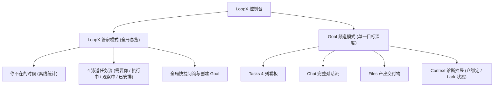

# LoopX 个人工作区控制台（Personal Workspace Console）使用指南

LoopX 控制台是为工程师与 Agent 深度协作打造的统一本地工作台。它将分散在不同会话、话题与后台运行中的 Agent 任务统一汇聚，提供**「LoopX 管家全局总览」**、**「Goal 4 列任务看板」**、**「轻量悬浮会话托盘」**、**「先预览后确认安全门禁」**与**「Lark / 飞书话题直连」**。

---

## 🎬 30 秒产品发布演示视频

<video controls width="100%" poster="https://huangruiteng.github.io/loopx/docs/assets/personal-workspace/guide_manager_overview.png" style="border-radius: 12px; box-shadow: 0 8px 30px rgba(0,0,0,0.12);">
  <source src="https://huangruiteng.github.io/loopx/docs/assets/personal-workspace/loopx-dashboard-launch.mp4" type="video/mp4">
  您的浏览器暂不支持直接播放视频，可下载 <a href="https://huangruiteng.github.io/loopx/docs/assets/personal-workspace/loopx-dashboard-launch.mp4">MP4 视频文件</a> 进行查看。
</video>

> 💡 **视频高光**：终端一键启动 ➔ 管家 4 泳道任务流 ➔ 快捷指令浮动托盘 ➔ 4 列看板与智能「转为 Task」清洗 ➔ 飞书话题直连 ➔ Brutal 野兽派主题切换。

---

## 🚀 1. 快速启动与访问

在本地仓库或已安装 LoopX 的终端中执行：

```bash
# 启动本地 Dashboard 控制台（默认自动打开浏览器）
loopx dashboard
```

安装版会在同一个进程中启动打包后的工作区、状态投影和 Agent Chat，不需要另开
终端运行 `loopx serve-status`。命令默认自动打开浏览器；无界面启动可使用
`loopx dashboard --no-open`，并访问命令实际打印的 URL。默认地址为
`http://127.0.0.1:8767/chat/`。

可用下面两条命令验证页面和状态投影都来自同一个进程：

```bash
curl -fsS http://127.0.0.1:8767/chat/ >/dev/null
curl -fsS http://127.0.0.1:8767/status.json
```

> 💡 **两种入口可共存**：`loopx dashboard`（浏览器 / PWA）与 Tauri 原生桌面壳
> 都会复用已经在运行且版本匹配的 LoopX Chat 服务。先开 dashboard 再开桌面壳，
> 或先开桌面壳再执行 `loopx dashboard`，两种顺序都可以；当桌面壳已经启动时，
> 也可以直接访问 `http://127.0.0.1:8767/chat/` 使用浏览器 / PWA，无需再启动一套
> 服务。

---

## 🧭 2. 控制台核心架构



---

## 🏠 3.「LoopX 管家」全局总览模式

点击左侧侧边栏顶部的 **「LoopX 管家」**，进入全局总览模式。


### 核心功能区
1. **「你不在的时候」离线概览**：
   - 聚合展示你离开期间所有 Agent 的运行结果：`已完成` 数量、`异常/失败` 数量以及当前 **`等你确认`** 的阻塞项。
2. **4 泳道全局任务流（Swimlanes）**：
   - **🛑 需要你（Needs You）**：高亮展示当前所有正等待你审批、确认或提供输入的问题（如权限审批、环境授权）；
   - **⚡ 执行中（In Progress）**：展示当前正在被自主推进的 Agent Todo 与 Goal；
   - **👀 观察中（Observing）**：展示正在运行的持续监控与定时巡检任务；
   - **📅 已安排（Scheduled）**：展示挂起的周期性计划。
3. **全局快捷指令（Quick Prompts）**：
   - `[询问全局待办 (草稿)]`：一键将「有哪些 Goal 正在等我？优先处理什么？」填入输入框；
   - `[汇总所有 Goal 进展 (立即发送)]`：带有蓝色高亮标识，点击后**立即发送**并在右下角弹出托盘展示全局总结；
   - `[创建新 Goal (草稿)]`：快速填入目标模板草稿。

### 问答中的等待与失败

Codex 上游声明仍会重试时，会话显示「Codex 正在重试」并继续等待最终结果。若上游明确终止，LoopX 保存失败回执，不把已经出现的部分文字当成完整回答。明确的策略拦截、用量限制、频率限制、上下文超限和身份验证失败会保留各自类别；未知错误仍显示通用失败，不从报错正文猜测原因。

策略拦截是本轮已结束，不是仍在安全检查中。LoopX 不会自动重放该请求；重启或重复提交同一个请求编号也会返回原失败回执。界面提示只说明上游给出的类别，不解释其未提供的具体触发原因，也不公开上游原始错误详情。

### 3.1 停止暂时不活跃的 Goal

当 Goal 较多时，主列表只展示仍处于 active 状态的 Goal。点击 Goal 右侧的暂停按钮后，LoopX 会先展示 Typed Action 预览；只有你明确确认，Goal 才会进入 **「已停止」** 折叠区。

- 停止会暂停该 Goal 的自动 Agent Turn，并从「需要你」等活跃聚合中移除；
- 退出 active attention 后，该 Goal 的**有效 quota 会投影为 0**，调度器据此停止 Codex App heartbeat 等宿主自动化；原 quota 配置仍被保留；
- Goal 的 Todo、历史、证据和配置全部保留，不会被标记成「已完成」，也不会删除；
- 展开「已停止」，点击恢复按钮并确认，即可重新获得调度资格；恢复后仍需通过 quota、Gate 和 Todo 约束。

`stop` 与手动设置 `quota.compute=0` 共用同一条自动停机通道，但恢复权限不同：前者只能由显式 Goal `resume` 恢复，后者由显式提高 compute quota 恢复。这样 quota 操作不会意外复活一个被 owner 停止的 Goal。

该操作不会强杀正在执行的工具调用；下一次 `quota should-run` 会返回宿主停机指令，由 Codex App 等宿主暂停或删除当前 heartbeat，阻止后续自动 Turn。

CLI 提供同一套可预览、可验证的生命周期操作：

```bash
# 零写入预览
loopx goal-lifecycle --goal-id <goal-id> --operation stop

# 确认执行，再读取 quota 验证自动推进已暂停
loopx goal-lifecycle --goal-id <goal-id> --operation stop --execute
loopx quota status --goal-id <goal-id>

# 恢复；不会绕过其他运行门禁
loopx goal-lifecycle --goal-id <goal-id> --operation resume --execute
```

执行时，LoopX 会写入权威 source registry、同步全局 registry，并验证两端 readback；任一端未验证成功时不会宣称操作完成。

切换到 SSH 状态来源后，只有来源与本机 OpenSSH 配置中的精确 Host alias 绑定时，
侧边栏才显示停止/恢复按钮。操作通过 SSH 在目标主机执行同一个
`goal-lifecycle` typed contract，并验证远端投影；不会回退修改本机同名 Goal。
手工 URL 以及创建、删除、Todo、会话等其他远端操作继续保持只读。

---

## 🎯 4. Goal 深度工作区

在侧边栏点击具体的 Goal（例如 `Apollo Spacecraft Telemetry Pipeline`），进入该 Goal 的独立工作台。

### 4.1 Tasks 列表与看板视图


- 默认显示四列看板；可切换到分组列表，列表中空分组隐藏、已完成分组默认折叠。
- 看板与列表共享已完成历史（包含归档，排除持续监控任务），按工作 Agent 筛选。列表的已完成组默认折叠；展开并滚动可按需加载，每页 40 条，使用五分钟快照保持翻页稳定。两种视图均只渲染可见区域附近的记录，切换视图保留历史和总数。快照过期可重试，读取失败保留当前记录。只读远端来源不调用本机历史接口。本机历史详情保留 Todo 读取层返回的文本、路径和证据，不额外截断或替换路径；Markdown 读取层原有的 500 字符规范化上限仍适用。
- 初次连接先显示加载状态，不把示例任务当作实时数据。执行会话连接失败时显示重连提示并退避轮询，隐藏页面暂停新的会话查询。
- Files 的“前往会话”进入 Goal 会话；“导出摘要”导出安全摘要 Markdown，不下载原始文件。

- **分组含义**：
  - **待确认（Attention Required）**：需用户决策或授权的卡片（黄色/红色标红，显示等待时间）；
  - **待执行 / 进行中（In Progress）**：按 P0 / P1 优先级排列的 Agent 待办事项；
  - **定时与持续（Scheduled & Continuous）**：绑定的周期性检查与监控；
  - **已完成（Completed）**：已标记完成的工作任务；摘要总数与当前可查询明细的范围分别展示。

- **💬 对话建议一键「转为 Task」**：
  - 看板顶部横幅会展示 Agent 最新的进度报告与下一步建议；
  - 点击 **`[转为 Task]`** 按钮，系统会**自动清洗掉无关客套文案**，将核心行动项智能转换为结构化草稿回填到底部输入框，供你确认后创建！


---

## 💬 5. 悬浮会话托盘（ManagerConversationTray）

无论你在浏览总览还是在处理看板，只要点击带有 **`立即发送`** 标识的快捷指令，页面右下角都会弹出抽屉式的轻量对话托盘：


- **非侵入式体验**：托盘浮出时不会打乱或覆盖主看板的浏览位置；
- **即时交互**：阅读完毕后点击托盘右上角的 `[×]` 即可随手收起。

---

## 🔍 6. Goal 诊断与 Lark / 飞书话题连接抽屉

点击页面右上角的 **`[Goal 详情]`** 按钮，可从右侧滑出元数据诊断抽屉：


- **执行健康度**：展示 Session ID、是否可继续以及当前 Agent 状态；
- **代码仓只读绑定**：明确展示当前绑定的 GitHub / 本地仓库、生效分支及只读隔离属性；
- **自适应子代理执行**：按 Goal 展示当前开关、可选的 `task_domain` 限制与最多子代理数；
- **Lark / 飞书话题连接**：
  - 展示当前绑定的飞书群组与 Topic 话题；
  - **Capture scope**：可选择只接收明确 @ / 回复 App 的消息，或接收该 Goal Topic
    的全部消息；这只改变捕获范围，不扩大 Agent 权限；
  - **Agent ingress**：为 Goal 当前已注册的目标 Agent 选择一种明确的收信方式：
    - **Steering (`live_steering`)**：投递到该 Agent 当前精确的活跃 Turn；没有匹配的
      活跃 Turn、Session 已过期或运行时不支持原生 steering 时安全拒绝；
    - **Queuing (`session_queue`)**：写入同一精确 Agent Session 的有界 FIFO，当前
      Turn 完成后按顺序处理，并支持重启恢复；
    - **Async inbox (`async_inbox`)**：写入该 Agent 的本地私有收件箱，等待后续显式
      `lark-inbox drain`；投递本身不会创建内联 Session，也不会提前回复或 ACK；
  - **Reply mode**：回复仍限定在来源 Topic 内，避免跨群或跨 Goal 投递。

### 6.1 按 Goal 体验自适应子代理执行

该控制面默认不对外暴露。先在 Goal 所在主机上显式启动带权威 opt-in 的本地
Dashboard；不带此参数启动时，配置 API、状态字段和界面卡片都会保持缺失：

```bash
loopx dashboard --enable-goal-subagent-configuration
```

然后要为一个 Goal 开启运行时能力：

1. 进入该 Goal，点击 **`Goal 详情`**；
2. 在「自适应子代理执行」中选择最多子代理数。任务领域限制是可选项：全部不选表示
   不按领域过滤；需要进一步收窄时，再从当前 Goal 开放 advancement Todo 已声明的
   `task_domain` 中多选。每个选项会显示当前匹配的开放 Todo 数量。控制台优先读取
   完整 Todo index，压缩的 Goal 卡片 Todo 仅作兼容回退；
3. 点击开关。此时只生成零写入预览；检查领域限制与并发上限后，再点击「确认」；
4. 界面只有在 source registry 写入、共享 registry 同步和读回校验都成功后，才把
   开关显示为「开启」。

可在终端读取同一权威配置和运行时决策：

```bash
loopx configure-goal --goal-id <goal-id>
loopx quota should-run --goal-id <goal-id>
```

要撤销 Dashboard 配置面的 opt-in，停止当前 Dashboard 后不带
`--enable-goal-subagent-configuration` 重新启动。这个启动参数只暴露本机 loopback
上的 preview-locked 配置合同，不授予 Agent 新的 Goal、仓库、凭证、发布或生产权限。

关闭时再次点击开关、检查预览并确认；也可以使用同一配置入口：

```bash
loopx configure-goal \
  --goal-id <goal-id> \
  --multi-subagent-feature off \
  --execute
```

如果当前没有开放 advancement Todo 声明 `task_domain`，界面会显示说明性空状态，
但不会阻止开启。此时只是不增加领域过滤，Todo 仍必须通过状态、依赖、quota、能力、
仓库、写入范围和冲突检查。选择了一个或多个领域后，未声明或不匹配领域的 Todo 会被
拒绝。控制台不会从 Todo 文本猜测领域，也不会提供与真实 Todo 无关的固定候选列表；
已保存但当前匹配数为 0 的领域仍会显示，方便审阅或移除既有边界。

这个开关只给运行时增加有界的临时子代理容量，不会强制并行，不会创建持久 Agent
层级，也不会绕过 Todo 归属、quota、能力、Gate 或写入范围。SSH 状态来源保持只读，
必须在 Goal 所在主机上修改。所选 `allowed_domains` 会进入 Goal 配置，不要填写凭证、
客户名或其他私密信息。完整执行语义见
[Codex sub-agent orchestration](../integrations/codex-subagent-orchestration.md)。

在「通知设置 → Lark / 飞书 → Connections」中选择 Goal、Target Agent、群聊、
Capture scope 与 Agent ingress，保存后可在同一页读回当前模式、Session 绑定状态、
监听状态和最近事件结果。Steering 与 Queuing 要求该 Goal / Agent 已有工作 Session；
Async inbox 不要求活跃 Turn，适合后台 Agent 稍后处理。发送一条新的 @ 消息验证所选
模式；若选择 Async inbox，可用以下命令读回待处理事件：

```bash
loopx lark-inbox drain --goal-id <goal-id> --agent-id <agent-id>
```

要停用该 Goal 的话题入站，在 Connections 中选择 **Disconnect**。断开只移除这个
Goal 的 Topic 路由，不删除 Goal、Agent Session、历史 Todo 或其他 Goal 的连接。

---

## 🎨 7. 双主题切换（温和 Paper ⇄ 硬朗 Brutal）

点击右上角的主题切换按钮，即可在两种主题间无缝流转：

- **默认温和纸质主题 (`Paper`)**：适合日常长时间工作，低饱和度护眼；
- **野兽派主题 (`Brutal`)**：粗黑边框、硬阴影、高对比亮黄与极客风格。


---

## 🛡️ 8. 安全与不可逆操作保护

LoopX 控制台严格遵循 **Human-in-the-Loop（人类介入）安全模型**：
1. **先预览，后确认**：任何会写入 Goal 状态、修改配置或执行外部变更的指令，都会先在界面弹出 **Typed Action 预览卡片**，明确展示影响范围与待填参数；
2. **用户点击确认后才下发**：杜绝 Agent 自行执行未授权的高危操作；
3. **操作回执（Receipt）**：每次操作执行完毕均会生成不可篡改的带时间戳回执，随时可溯源。
